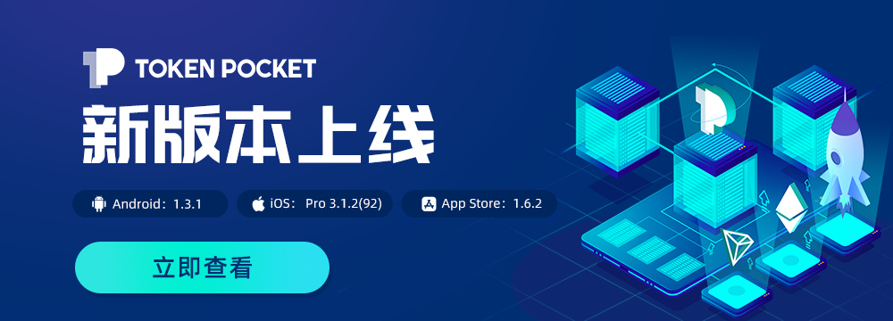
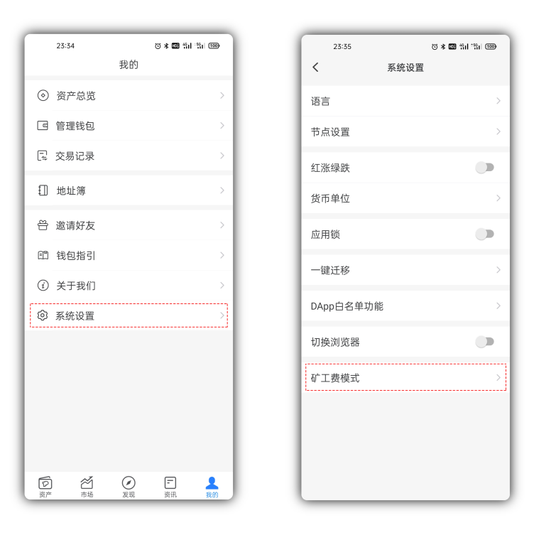
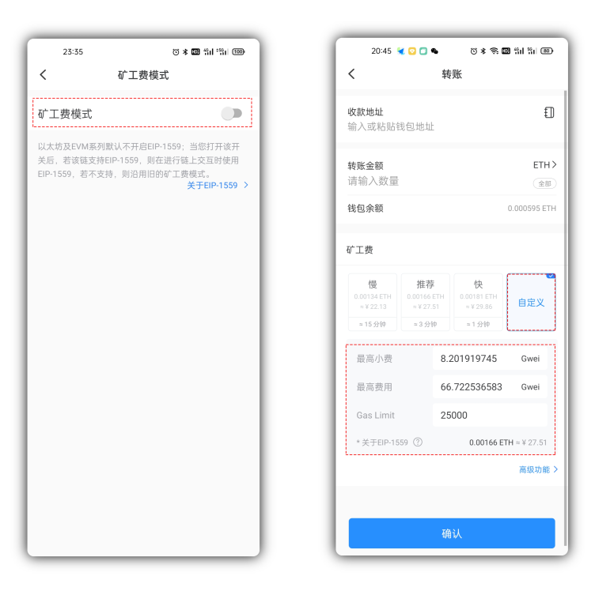

# 版本更新日志（08/05/2021）：支持EIP-1559矿工费模式，更多详情优化

**【版本更新详情】**

Android最新版本号：1.3.1 

iOS最新版本号：pro 3.1.2\(92\) 

App Store 1.6.2

\*\*\*\*

**【主要更新内容】**

‌1、支持以太坊伦敦升级，EIP-1559矿工费模式

2、支持波场钱包创建助记词

3、增强Approve风险提示

**如何使用EIP—1559模式的矿工费？**

1）更新到最新版本后，点击【我的】--【系统设置】--【矿工费模式】--打开勾选即可开启。

**【版本更新方式】**

‌App内提示更新，或官网下载最新版本。（注意：TokenPocket唯一官方网址为：[www.tokenpocket.pro](https://www.tokenpocket.pro/)）

\*\*\*\*

