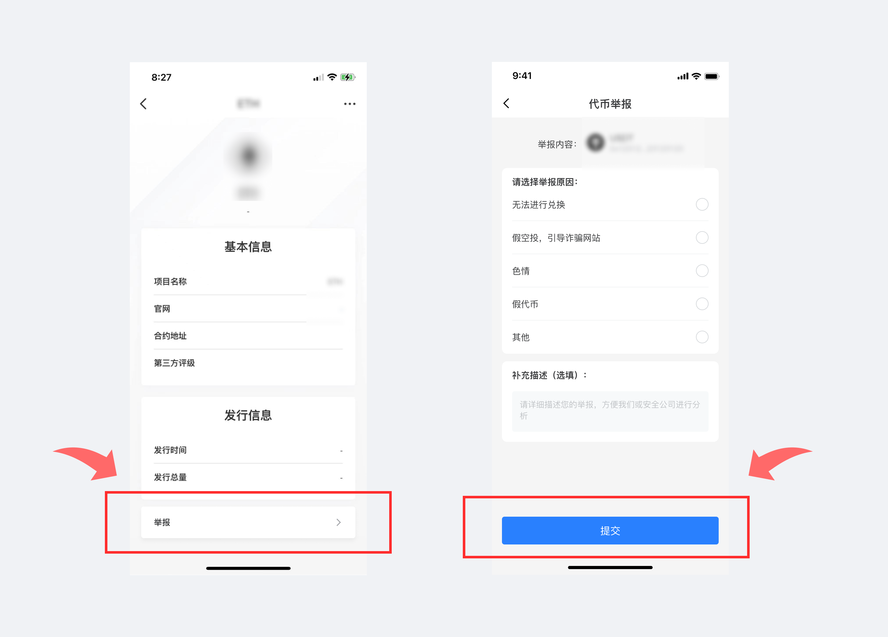

# 版本更新日志（09/03/2021）：首页支持DeFi数据展示、钱包安全提示升级

**【版本更新详情】**

Android最新版本号：1.3.2

iOS最新版本号：pro 3.1.2\(93\)

App Store: 1.6.3

**【版本更新内容】**

1.首页支持DeFi数据展示  
2.钱包安全提示升级  
3.波卡系列支持自定义添加网络  
4.波场支持自定义添加代币  
5.支持DAS域名解析  
6.升级分享功能

**【部分更新内容详解】**

**1、如何查看Defi数据？**

1）更新最新版本后，点击【资产】页面，然后点击【DeFi】，即可查看当前正在使用的DeFi协议相关数据；

2）此处以Pippi Shrimp为例，点击进入【Pippi Shrimp】，即可查看目前资金状态和流动性；

3）点击【进入DApp】，在点击跳转弹框【我知道了】，即可进入Pippi Shrimp官方界面。

2.**钱包安全提示升级更新内容**

1）导出私钥、助记词增加安全提示；

2）导出私钥时，私钥二维码和明文私钥可同一页面展示；点击【展示私钥二维码】即可展示；

3、**支持【举报】风险代币功能；**

1）点击某一代币，点击【代币详情】，点击最下方【举报】按钮，进入举报页面；选择举报原因，即可对该风险代币进行举报；

注：请正确描述该代币风险信息，TokenPocket将会对此进行查验！

2）被标记为风险代币的合约地址将会在转账过程中进行风险提示；

4、**支持举报【风险】链接功能；**

1）进入链接地址，点击右上方【…】，点击【举报】按钮，进入举报页面；选择举报原因，即可对该风险链接进行举报；

注：请正确描述该链接风险信息，TokenPocket将会对此进行查验！

2）被标记为【风险链接】或【诈骗链接】，将会在链接访问页面进行提示；

**【版本更新方式】**

App内提示更新，或官网下载最新版本。（注意：TokenPocket唯一官方网址为：www.tokenpocket.pro）

