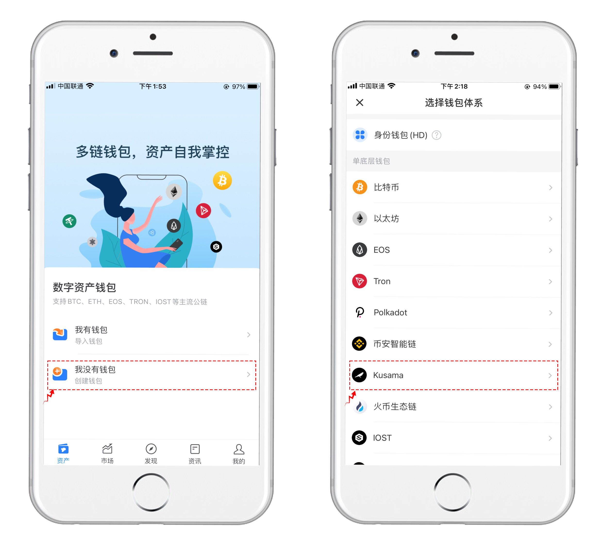

# 版本更新日志（25/12/2020）：正式支持Polkadot和Kusama链

**【版本更新详情】**

Android最新版本号：1.1.6

iOS pro 3.1.3\(70\)  App Store 1.4.8

**【主要更新内容】**

1 支持Polkadot链

2 支持Kusama（金丝雀）

**【版本更新方式】**

安卓：在APP内更新或在www.tokenpocket.pro 官网下载覆盖安装即可。0.9.9版本用户需要通过官网下载覆盖更新。

苹果：Pro/Plus版本需要配合testflight下载或更新（[**下载教程**](https://www.yuque.com/tokenpocket/gz8u7f/ktgryh)）

注：近期部分用户反馈testflight打开会报错，这里提供一个解决方法：打开苹果手机，点击桌面--选择设置 --点击wifi --点击当前连接wifi右侧的小叹号，下拉选择配置DNS 点击选择手动，下方DNS服务器删除其他项 添加8.8.4.4的谷歌DNS 保存后再次打开Testflight使用即可。（[**电梯直达**](https://www.yuque.com/tokenpocket/gz8u7f/fzigb3)）

**【更新功能介绍】**

**\#1. 支持Polkadot公链，新老用户都可以通过钱包的添加底层界面进行Polkadot的导入或创建。（**[**波卡钱包创建**](https://www.yuque.com/tokenpocket/gz8u7f/cf034q)**）**

**\#2. 支持Polkadot公链，新老用户都可以通过钱包的添加底层界面进行Kusama的导入或创建。**

