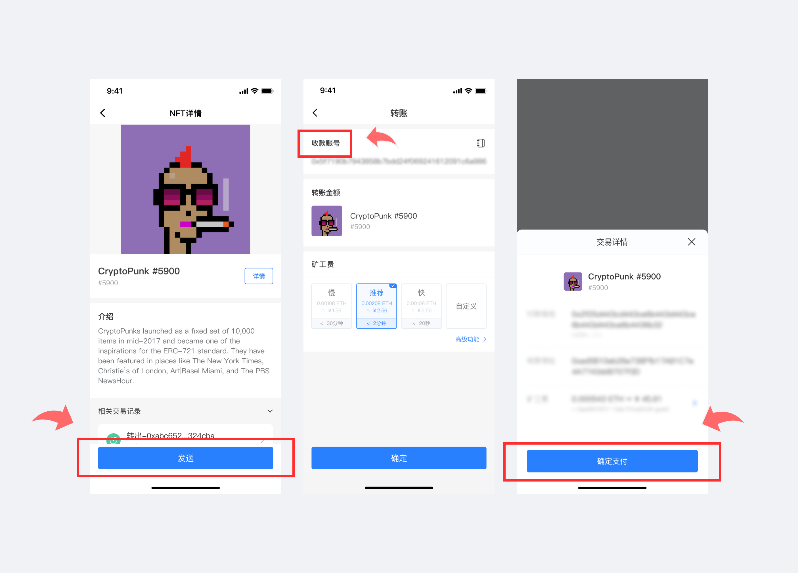

# 版本更新日志（09/18/2021）：支持NFT展示；行情页面优化；用户体验优化。

**【版本更新详情】**

Android：1.3.3

App Store: 1.6.4

**【版本更新内容】**

1.支持NFT展示，现已完成Hoo Smart Chain数据同步，其他链数据同步完后即可展示\
2.行情页面优化\
3.用户体验优化\

**【更新内容详解】**

支持NFT展示，现已完成Hoo Smart Chain数据同步，其他链数据同步完后即可展示。

**一、NFT展示功能**

1\. 打开TokenPocket App，进入「资产」页面，点击【NFT】即可看到现有NFT资产数据；

注：支持NFT展示，现已完成Hoo Smart Chain数据同步，其他链数据同步完后即可展示;

.png>)

2.点击任意一个NFT，进入「NFT详情」页面，在这一页面，您可以了解到该NFT的相关信息及相关交易记录；

.png>)

**二、NFT转账功能**

点击【发送】，进入NFT转账页面，输入收款地址，选择矿工费，点击【确定】，进入「交易详情」页面，再次确认收款地址，确认无误后，点击【确定支付】，即可完成转账。

**三、自定义添加NFT**

点击右上角【+】，进入「自定义添加NFT」页面，输入NFT合约地址，核对该NFT信息，点击【确定添加】，至此，您已成功添加自定义NFT，可在「资产」-「NFT」页面查看。

.png>)

App内提示更新，或官网下载最新版本。（注意：TokenPocket唯一官方网址为：[www.tokenpocket.pro](https://www.tokenpocket.pro)）
