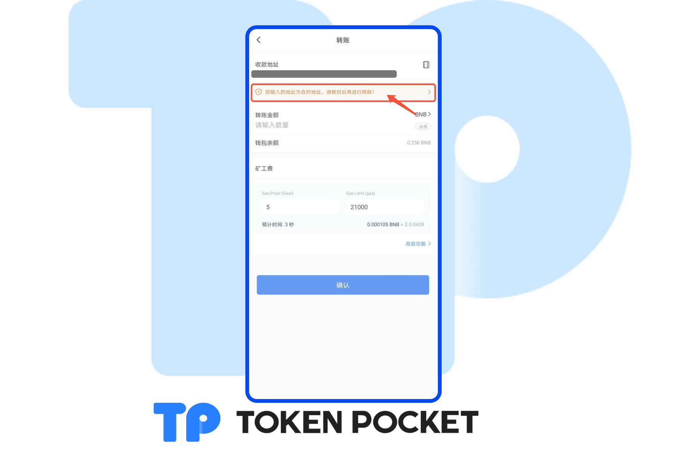
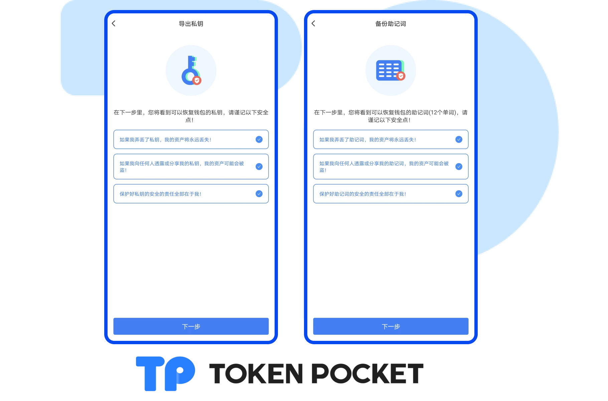
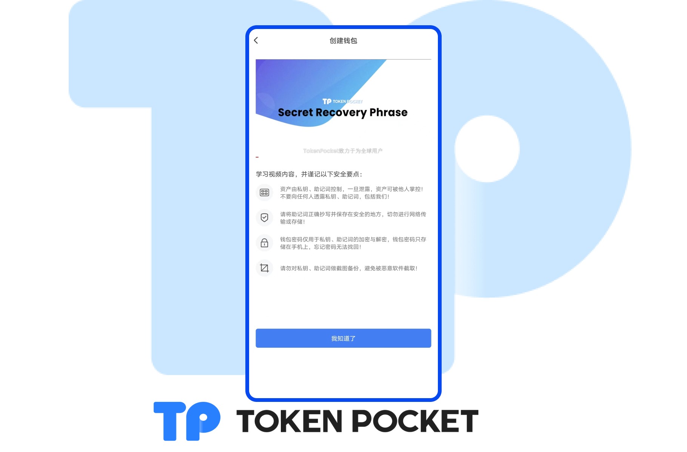

# 版本更新日志（04/13/2022）: Transit Swap添加活动中心，支持第三方Token List; 新增余额缓冲机制；支持NFT显示24h交易价格；优化转账页面合约地址提醒；等

**【版本更新详情】**

Android: 1.4.4

iOS: 1.8.0

&#x20;

**【版本更新内容】**

1\. Transit Swap添加活动中心；

2\. Transit Swap支持第三方Token List；

3\. Transit Swap新增余额缓存机制；

4\. 支持NFT显示24h交易价格；

5\. 优化转账页面的合约地址提醒；

6\. 升级创建/备份钱包流程；

7\. 优化DApp List体验；

8\. 备份助记词页面增加“视频”讲解；

9\. 用户体验优化；

10\. 修复Bug。

&#x20;

**【版本更新部分详情】**

1\. 优化转账页面的合约地址提醒;

2\. 升级创建/备份钱包流程；

3\. 备份助记词页面增加“视频”讲解

&#x20;

**【版本更新方式】**

App内提示更新，或官网下载最新版本。（注意：TokenPocket唯一官方网址为：[https://tokenpocket.pro/](https://tokenpocket.pro)）

&#x20;
