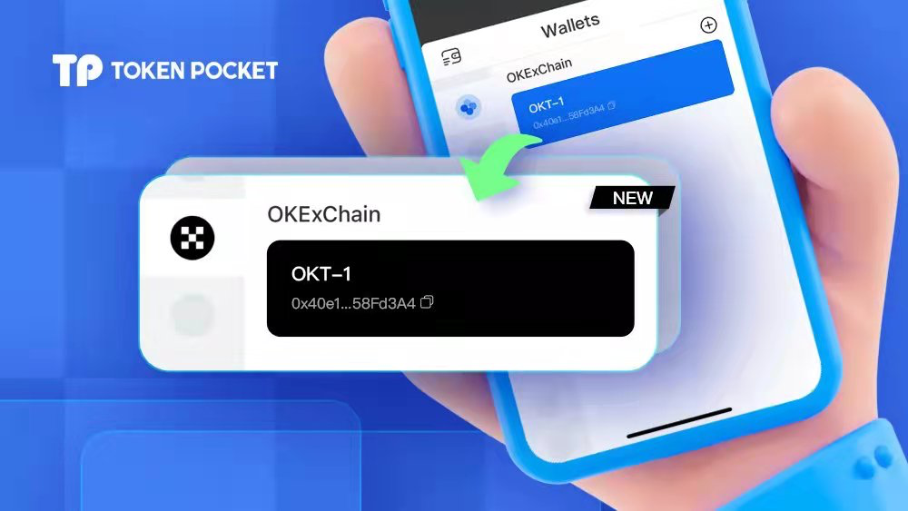

# 版本更新日志（03/31/2022）: 支持EOS、TRON连接硬件钱包；Token详情页面优化；支持OKX品牌升级。

**【版本更新详情】**

Android: 1.4.3&#x20;

iOS: 1.7.9

&#x20;

**【版本更新内容】**

**1.支持EOS、TRON连接**[**硬件钱包**](https://www.keypal.pro)**；**

**2.Token详情页面优化；**

**3.支持OKX品牌升级；**

**4.去除“资讯”页面；**

**5.用户体验优化；**

**6.修复Bug。**

&#x20;

【部分更新内容详情】

1\. 支持OKX品牌升级。

&#x20;

**【版本更新方式】**

App内提示更新，或官网下载最新版本。（注意：TokenPocket唯一官方网址为：[https://tokenpocket.pro/](https://tokenpocket.pro)）

&#x20;
