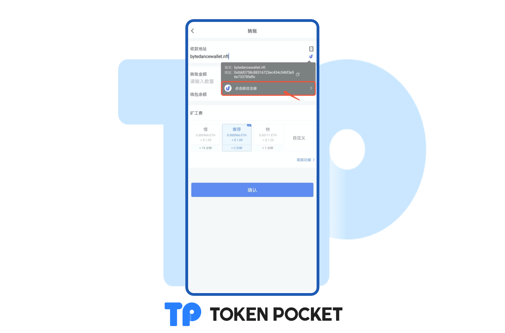
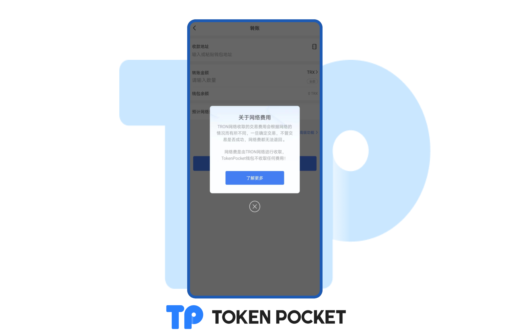
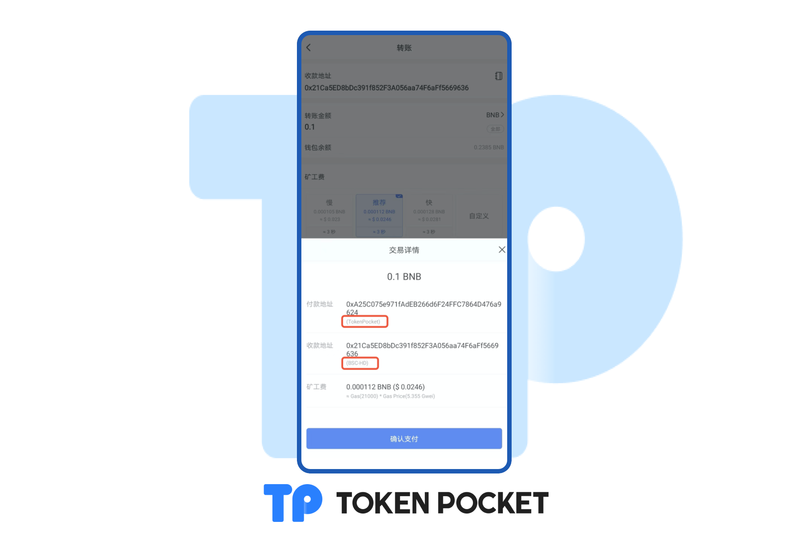
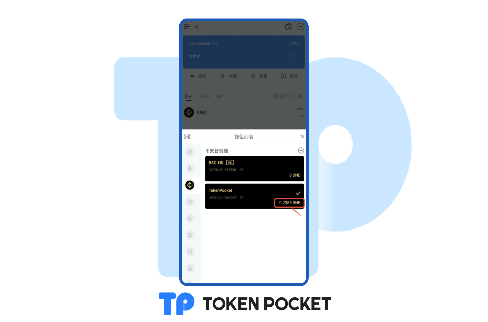
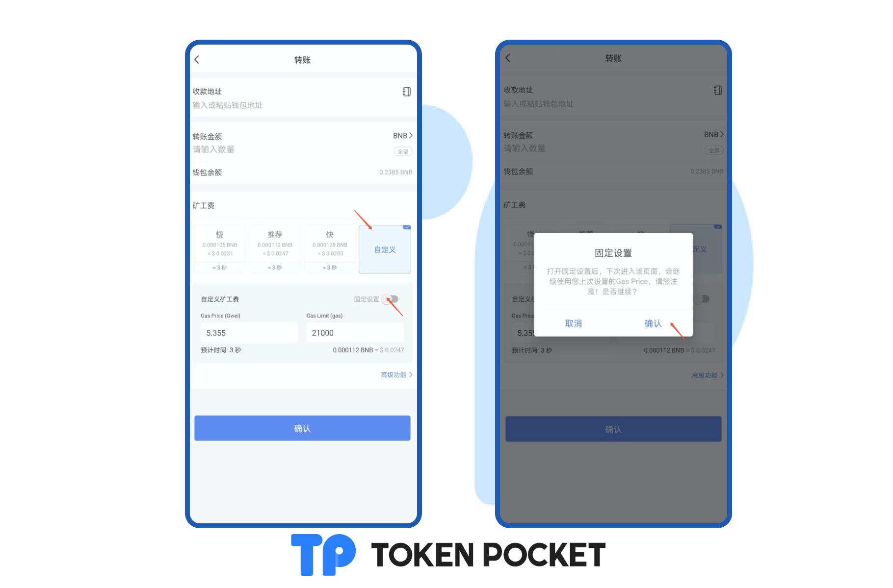
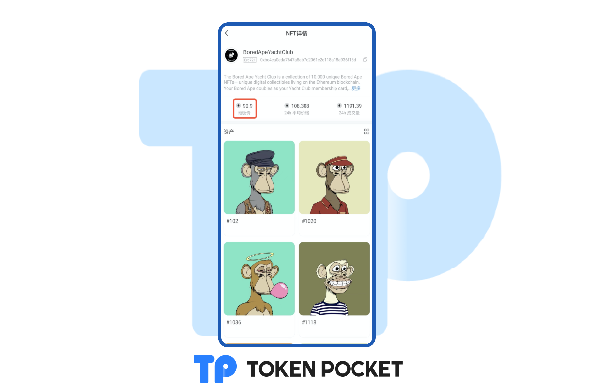

# 版本更新日志（06/28/2022）

**【版本更新详情】**

Android: 1.5.1

iOS: 1.8.5

**【版本更新内容】**

1. 支持unstoppable域名显示，添加注册入口；
2. Transit Swap客户端支持向ENS、.bit、unstoppable域名转账；
3. 增加安全提醒；
4. TRON转账页面添加矿工费解释；
5. 交易弹窗支持地址标签显示；
6. 钱包卡片添加原生币余额展示；
7. 支持设置默认矿工费；
8. ETH NFT支持地板价展示；
9. 支持土耳其语。

【版本更新详情】

1. 支持unstoppable域名显示，添加注册入口。

2\. TRON转账页面添加矿工费解释；

3\. 交易弹窗支持地址标签显示;

4\. 钱包卡片添加原生币余额展示;

5\. 支持设置默认矿工费；

请注意：打开固定设置后，下次进入该页面，会继续使用您上次设置的矿工费。如果当前矿工费比您设置的矿工费高，则该笔转账/交易有可能会失败。

6\. ETH NFT支持地板价展示；

**【版本更新方式】**&#x20;

App内提示更新，或官网下载最新版本。

<mark style="color:red;">**（注意：TokenPocket唯一官方网址为：**</mark>[<mark style="color:red;">**https://tokenpocket.pro/**</mark>](https://tokenpocket.pro/)<mark style="color:red;">**）**</mark>

<mark style="color:red;">****</mark>
