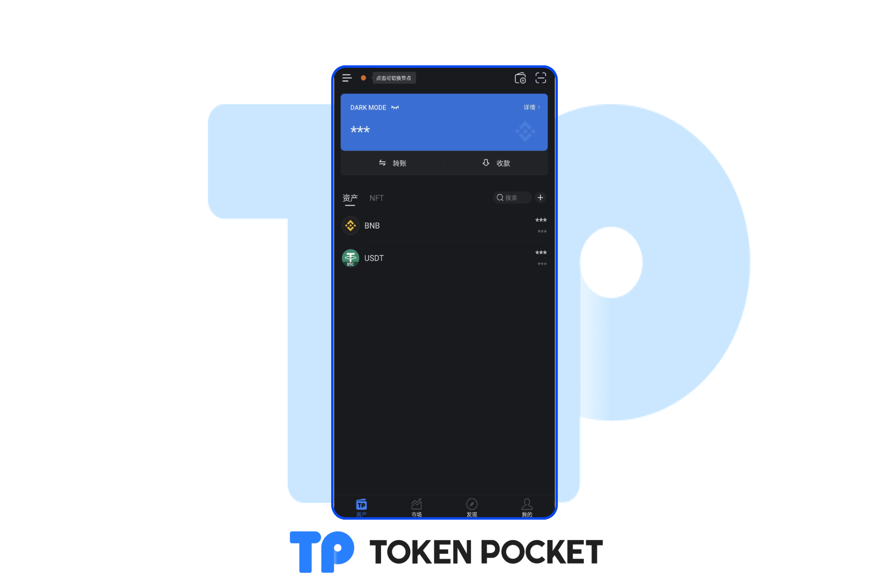

# 版本更新日志（06/08/2022）

**【版本更新详情】**

iOS: 1.8.4

Android: 1.4.8

&#x20;

**【版本更新内容】**

1\. 支持深色模式；

2\. 优化TRON链上DApp的数据解析。

**【版本更新详情】**

如何设置深色模式？

方法一：打开TokenPocket钱包，点击【我的】，点击右上角“月亮”按钮即可切换深色模式

方法二：打开TokenPocket钱包，点击【我的】，点击【系统设置】，点击【深色模式】，继续点击【深色模式】，即可完成切换。

**【版本更新方式】**&#x20;

App内提示更新，或官网下载最新版本。

<mark style="color:red;">**（注意：TokenPocket唯一官方网址为：**</mark>[<mark style="color:red;">**https://tokenpocket.pro/**</mark>](https://tokenpocket.pro/)<mark style="color:red;">**）**</mark>
