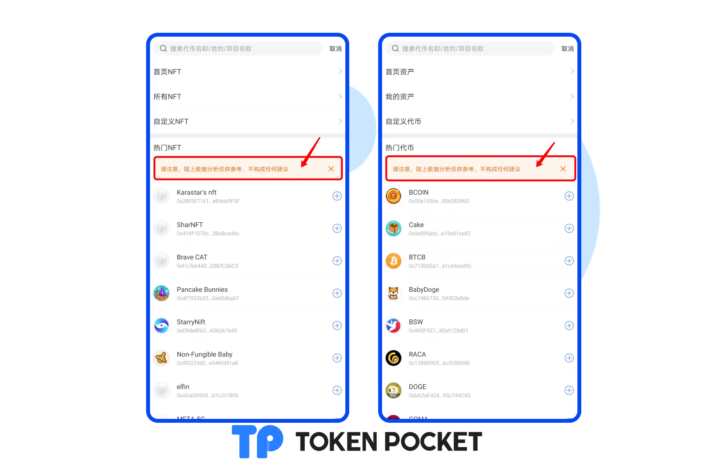

# 版本更新日志（02/25/2022）：支持ERC1155；新增NFT管理页面；增加热门数据显示提醒.

**【版本更新详情】**

Android: 1.4.1

iOS: 1.7.7

&#x20;

**【版本更新内容】**

1.支持ERC1155

2.新增NFT管理页面

3.增加热门数据显示提醒

4.优化token详情页面

5.新增清除缓存功能

6.支持泰语，菲律宾语

7.优化波场转账提示

&#x20;

**【版本更新部分详情】**

1.新增NFT管理页面。

****[**如何管理NFT资产？**](https://help.tokenpocket.pro/cn/wallet-management/how-to-manage-my-nft-assets)****

2.增加热门数据显示提醒。

3.优化Token详情页面。

.png>)

**【版本更新方式】**

App内提示更新，或官网下载最新版本。（注意：TokenPocket唯一官方网址为：[https://tokenpocket.pro/](https://tokenpocket.pro)）
