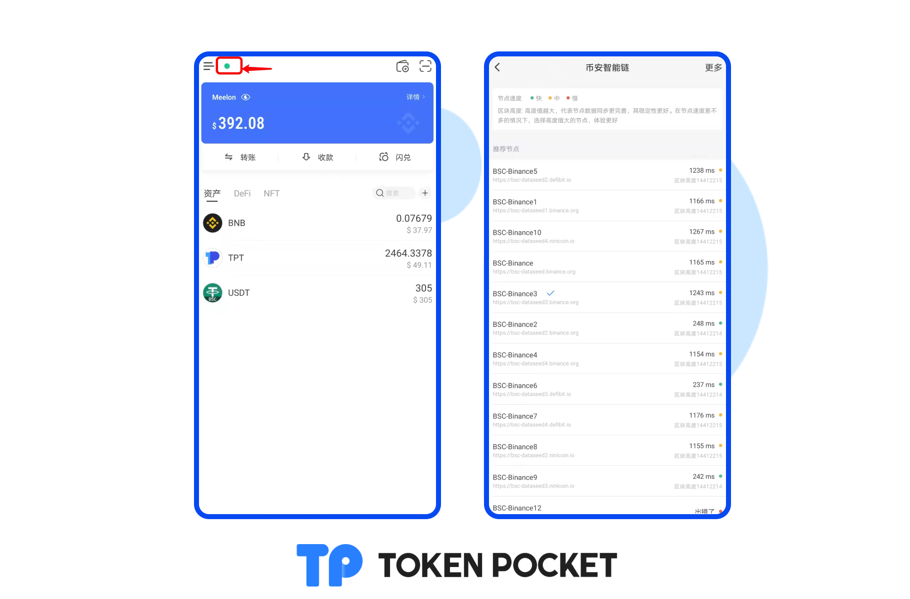

# 版本更新日志（01/17/2022): 支持WAX；支持NFT应用场景；支持NFT图片下载等。

**【版本更新详情】**

Android: 1.3.9

iOS: 1.7.3

&#x20;****&#x20;

**【版本更新内容】**

1.支持WAX;

2.支持NFT应用场景：资产首页顶部背景、收款码页面背景、钱包头像;

3.支持NFT图片下载;

4.增加提醒：交易记录延迟提醒、价格更新延迟提醒、转账前提醒、使用收款二维码及复制收款地址提醒;

5.支持cosmos升级；

6.ETH自定义网络搜索优化

7.支持Optimistic交易记录显示;

8.新增语言：印度语;

9.支持EOSIO自定义网络;

10.用户体验优化。

&#x20;****&#x20;

**【部分更新内容详解/使用教程】**

**一、支持WAX**

[创建/导入WAX钱包教程](https://help.tokenpocket.pro/cn/how-to-trade-on-dex/wax-use-guide)

**二、支持NFT应用场景**

[NFT资产首页顶部壁纸，收款背景，头像设置教程](https://help.tokenpocket.pro/cn/wallet-operation/set-nft)

三、**支持NFT图片下载**

点击您的NFT资产，点击NFT图片，点击右下方下载按钮，即可将您的NFT图片保存至手机。

**四、增加提醒：交易记录延迟提醒、价格更新延迟提醒、转账前提醒、使用收款二维码及复制收款地址提醒**

 

**五、ETH自定义网络搜索优化：自定义网络名称和symbol相匹配**

在添加自动移网络页面，点击【便捷入口】，可通过输入代币名称或Chain ID直接匹配自定义网络。

**六、其他功能优化**

新版本可在资产页面切换节点。

点击左上角圆点，即可进入切换节点的页面。

**【版本更新方式】**

App内提示更新，或官网下载最新版本。（注意：TokenPocket唯一官方网址为：https://tokenpocket.pro/）
