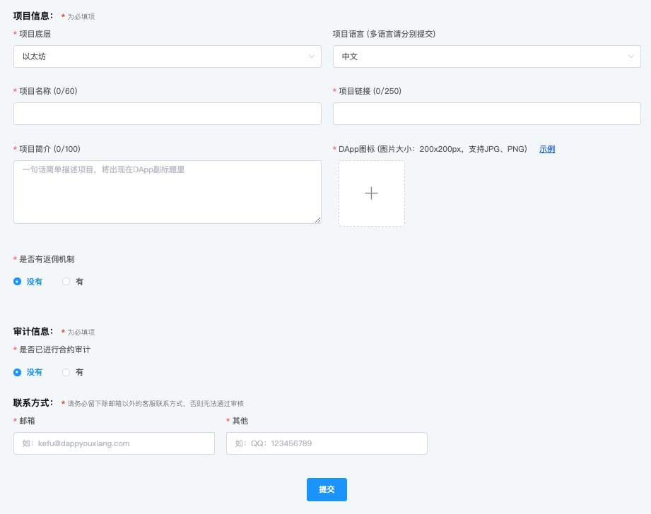

# 如何提交DApp?

1、打开[TokenPocket官网](https://www.tokenpocket.pro/)，点击顶部导航栏的【提交DApp】；

.png>)

2、依次填写信息，然后点击【提交】；

****

**DApp提交要求：**\
****1. 项目方提供的网址可公开访问且稳定性有保证。

2\. 智能合约已部署到主网上，敏感逻辑处需开源。

3\. 敏感的合约需提供第三方安全机构的审计报告。

4\. 交互逻辑清晰，有实际用途，且已适配移动端。

5\. 符合相关法律法规，不存在欺诈和侵权等行为。

6\. 如违反相关法律法规，自愿承受相应法律责任。

****

**DApp联系邮箱**：[dapp@tokenpocket.pro](mailto:service@tokenpocket.pro)\
