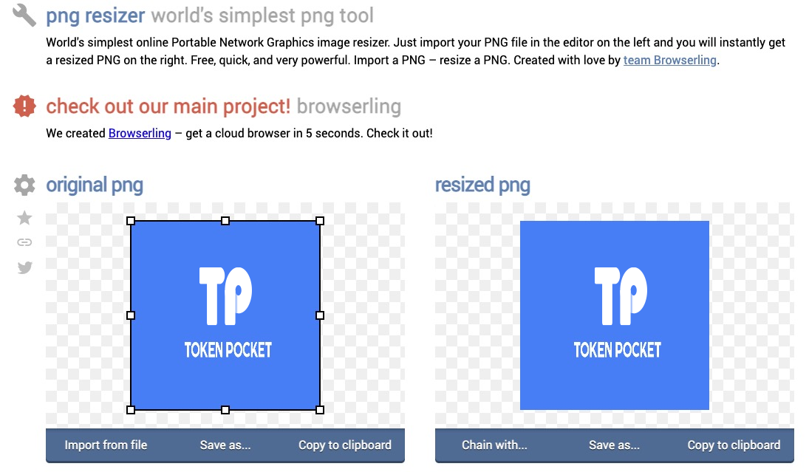
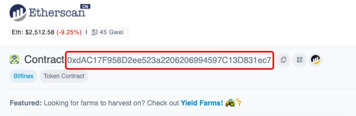
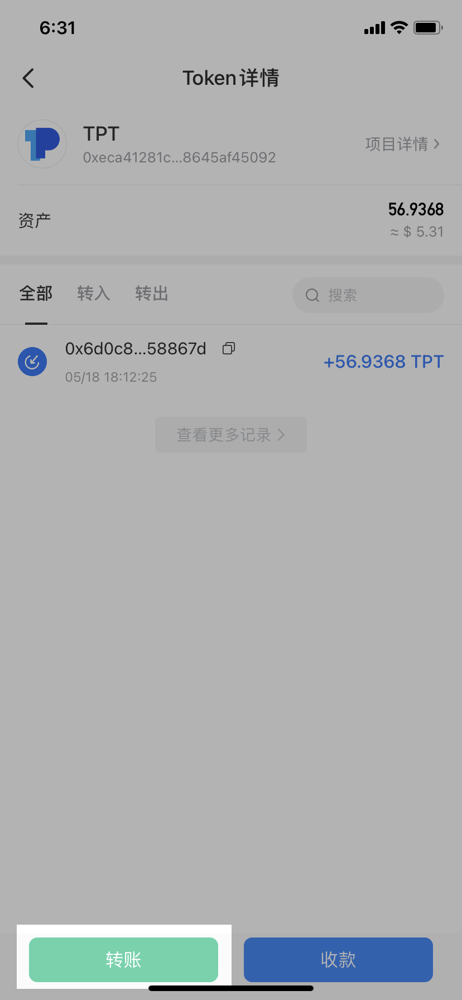
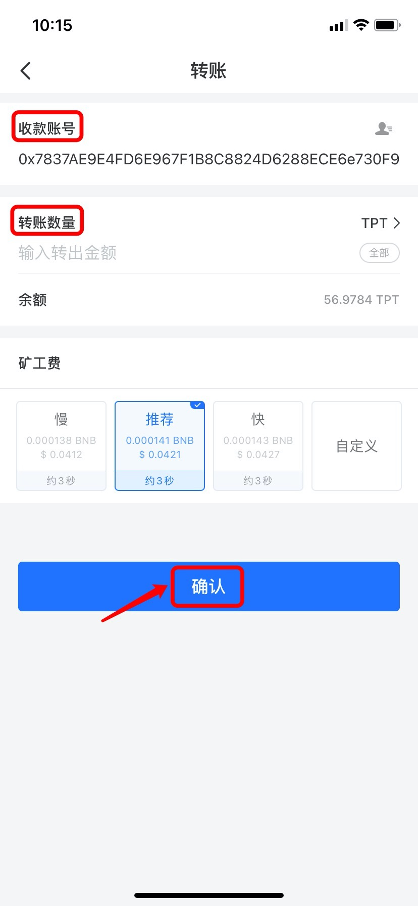
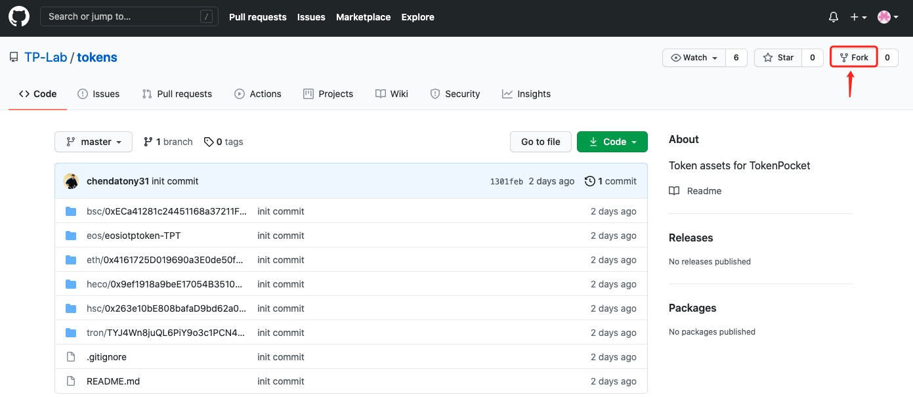
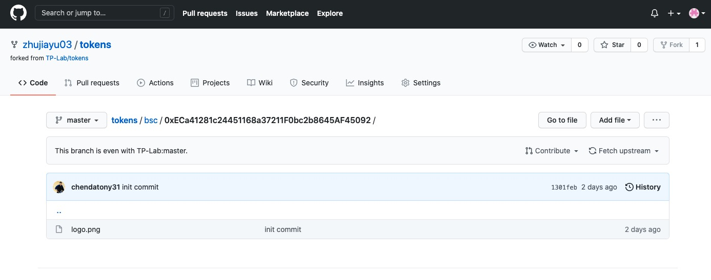

# 如何自主更新代币图标？

提交代币图标时，请根据代币类型在[Github](https://github.com/TP-Lab/tokens)上选择相应的链接，然后提交代币图标和信息文件（注意：如未提交代币信息文件将无法通过）：‌

Ethereum：[https://github.com/TP-Lab/tokens/tree/master/eth](https://github.com/TP-Lab/tokens/tree/master/eth)​‌

BSC：[https://github.com/TP-Lab/tokens/tree/master/bsc](https://github.com/TP-Lab/tokens/tree/master/bsc)​‌

HECO：[https://github.com/TP-Lab/tokens/tree/master/heco](https://github.com/TP-Lab/tokens/tree/master/heco)​‌

TRON： [https://github.com/TP-Lab/tokens/tree/master/tron](https://github.com/TP-Lab/tokens/tree/master/tron)

EOS：目前暂不支持上传EOS​链的代币图标，请勿提交。‌​‌

HSC：[https://github.com/TP-Lab/tokens/tree/master/hsc](https://github.com/TP-Lab/tokens/tree/master/hsc)‌

OKExChain: [https://github.com/TP-Lab/tokens/tree/master/okexchain](https://github.com/TP-Lab/tokens/tree/master/okexchain)

Polygon (Matic): [https://github.com/TP-Lab/tokens/tree/master/polygon(matic)](https://github.com/TP-Lab/tokens/tree/master/polygon\(matic\))

IOST: [https://github.com/TP-Lab/tokens/tree/master/iost](https://github.com/TP-Lab/tokens/tree/master/iost)

Solana: [https://github.com/TP-Lab/tokens/tree/master/solana](https://github.com/TP-Lab/tokens/tree/master/solana)

Fantom: [https://github.com/TP-Lab/tokens/tree/master/fantom](https://github.com/TP-Lab/tokens/tree/master/fantom)

Klaytn: [https://github.com/TP-Lab/tokens/tree/master/klaytn](https://github.com/TP-Lab/tokens/tree/master/klaytn)

Arbitrum: [https://github.com/TP-Lab/tokens/tree/master/arbitrum](https://github.com/TP-Lab/tokens/tree/master/arbitrum)

Avalanche-C: [https://github.com/TP-Lab/tokens/tree/master/Avalanche-C](https://github.com/TP-Lab/tokens/tree/master/Avalanche-C)

Optimistic: [https://github.com/TP-Lab/tokens/tree/master/optimistic](https://github.com/TP-Lab/tokens/tree/master/optimistic)


### <mark style="color:blue;">注意事项：</mark>

<mark style="color:blue;">**1、必须要附上捐赠TPT哈希值链接和验证地址的链接 ；**</mark>

<mark style="color:blue;">**2、一个github账号，不允许提交多个logo申请 ；**</mark>

<mark style="color:red;">**3、TPT捐赠数量已经提高到50,000 个；→→**</mark> [<mark style="color:red;">**社区提案查看**</mark>](https://fans.tokenpocket.pro/t/topic/16905)  <mark style="color:red;">**→→**</mark>  [<mark style="color:red;">**投票结果查看**</mark>](https://snapshot.org/#/tptdao.eth/proposal/0x5e985943ac4dea8d97af93143020c337370950604ebabbe172939a5c63eed872) <mark style="color:red;">**（2022年6月13日0点开始生效）**</mark>

<mark style="color:blue;">**4、因github的开放性，任何人都可以在提交的订单中留言，所以请不要相信任何第三方人员的留言，谨防诈骗。**</mark>

<mark style="color:blue;">**5、代币显示logo只是进行对代币信息进行丰富，并不能保证代币的绝对安全，也不代表TokenPocket的任何投资建议，请您注意风险！**</mark>

### **所需资料如下：**‌

**1.代币图标**


```
文件扩展名：png，请勿大写PNG
文件名称：logo.png
大小：256px X 256px
图标背景：推荐使用透明背景‌
```


提示：你可以使用以下工具裁剪图标大小：&#x20;

1）[onlinepngtools](https://onlinepngtools.com/resize-png) 可将图片大小裁剪为 256 x 256‌



2）[TinyPNG](https://tinypng.com/) 可压缩优化图片大小

.jpg>)

​‌

**2. 代币信息文件**


```
文件扩展名：json，请勿大写JSON
文件名称：info.json
```


内容： info.json文件中必须包含以下信息，请确保详细信息正确无误并遵循格式要求。合约地址应遵循checksum地址格式（请参考下面的示例）。

**注意：如文件格式不正确将无法通过审核！**

```
{
 "name": "TokenPocket Token",
 "website": "https://tokenpocket.pro",
 "description": "A leading multi-chain wallet that supports BTC, ETH, BSC, HECO, TRON, EOS, OKExChain, HSC and so on.",
 "explorer": "https://bscscan.com/token/0xeca41281c24451168a37211f0bc2b8645af45092",
 "type": "BEP20",
 "symbol": "TPT",
 "decimals": 4,
 "status": "active",
 "id": "0xECa41281c24451168a37211F0bc2b8645AF45092"
}
```

****

**3. 使用checksum格式的合约地址**

Checksum地址是指在以太坊网络中包含大写和小写字母的合约地址。你可以通过在[以太坊浏览器](https://cn.etherscan.com/)搜索代币的合约地址，搜索完成后，在左上角的地址即为checksum格式的合约地址。例如USDT的checksum格式的合约地址为：\
0x6B175474E89094C44Da98b954 EedeAC495271d0F。

或者可以点击[转换工具](https://piyolab.github.io/sushiether/RunScrapboxCode/?web3=1.0.0-beta.33\&code=https://scrapbox.io/api/code/sushiether/web3.js\_-\_Ethereum\_%E3%81%AE%E3%82%A2%E3%83%89%E3%83%AC%E3%82%B9%E3%82%92%E3%83%81%E3%82%A7%E3%83%83%E3%82%AF%E3%82%B5%E3%83%A0%E4%BB%98%E3%81%8D%E3%82%A2%E3%83%89%E3%83%AC%E3%82%B9%E3%81%AB%E5%A4%89%E6%8F%9B%E3%81%99%E3%82%8B/demo.js)把合约地址转换为checksum格式的地址。



****

**捐赠流程：** \
提交一个代币图标时捐赠 **50,000TPT**以验证你的地址合法性，需要注意的是**捐赠后无法原路退回**，请您考虑清楚后再捐赠。按照以下步骤准备所需资料并完成捐赠（此处以币安智能链钱包为例）：

1\. 打开TokenPocket App，点击底部【资产】，选择TPT，进入页面后点击【转账】

‌ (1).png>)

2\. 点击【直接转账】进入页面，输入收款账号和 **50,000** TPT数量，然后选择矿工费，点击【确认】，确认信息无误后点击【确认支付】完成 **50,000** TPT的转账。‌

**注意：**收款地址为 **0x7837AE9E4FD6E967F1B8C8824D6288ECE6e730F9** （可底下扫码获取）。仅支持收取BSC、HECO以及ETH链上的TPT，请转账前再三确认！&#x20;

&#x20;&#x20;




3\. 完成**50,000** TPT的转账后，返回【资产】页面，选择BNB，然后点击【直接转账】进入转账页面；‌

 (1).png>)

4\. 输入收款地址（同上）和0 BNB数量（如果遇到未支持0 BNB转账的情况，则可以转非常小的BNB数值替代），选择矿工费后点击右下角的【高级设置】- 【纯文本】，按照格式要求填入文本，然后点击【确认】。‌

（**格式要求：**提交代币图标的链 - 提交的代币名称 - 提交的代币合约 - 支付**50,000** TPT的哈希链接）  ‌


5\. 再次核对转账信息，确认无误后点击【确认支付】完成付款。


### ****

### **提交代币图标步骤：**

以上资料完成后，便可在GitHub上添加代币图标和信息文件**。**

1\. 创建一个以代币的合约地址（Checksum 格式）命名的文件夹，然后将**info.json** 和 **logo.png**两个文件添加至该文件夹；‌

**注意**：文件命名必须为：**info.json** 和 **logo.png**


2\. 打开浏览器，进入[GitHub](https://github.com/TP-Lab/tokens)，点击右上角【Fork】后等待创建；



3\. 根据你的代币类型选择并点击相对应的文件夹（此处以选择BSC链为例），点击进入后请勿关闭此页面；‌


4\. 将步骤1创建的文件夹拖拽至步骤4的页面；‌



5\. 在【Commit changes】处填写代币信息和其他描述，然后点击【Commit changes】；‌

**注意：**<mark style="color:red;">**请在内容描述中添加 50,000 TPT 的交易ID链接；提交步骤5中验证后的哈希值链接，否则无法通过审核。**</mark>


6\. 页面将自动返回至上一级，然后点击【Pull requests】‌；


7\. 点击【Creat a pull request】；‌


8\. 页面将显示你所提交的详细资料，然后点击【Creat pull request】；‌


9\. 输入标题和内容后，点击【Create pull request】；‌


10\. 至此，你已经成功提交了你的Pull request，管理员将尽快审核你的请求。‌


****

### **如何通过申请？**‌

Pull request在添加到Tokens原仓库之前，需对其进行筛选。因此，请查看你提交的申请是否满足以下要求：‌

1. 已经支付**50,000** TPT的手续费
2. 代币项目不存在仿冒或欺诈性行为
3. 详细的代币信息

****

### **免责声明**‌

TokenPocket团队允许任何人向原仓库提交代币申请。 但是，这并不意味着我们与所有项目都有直接的合作关系。‌

经仔细审查后，如发现具有欺诈性或强烈模仿性的项目，TokenPocket团队将予以拒绝。 由于市场状况多变，如发现任何具有欺诈风险或其他危险因素，TokenPocket团队保留随时更改条款的权利。

**通过GitHub自主提交代币图标为官方指定的唯一渠道，**任何通过其他渠道提交的代币图标而导致受骗，TokenPocket团队概不负责。

**​**‌

### **审核时间需要多久？**‌

管理员在进一步验证后，将在 request进行合并。 如果有任何其他需要或需更改的地方，将以链上信息为准进行订正。‌

管理员将Pull request合并后，代币的图标即可更新。**请勿重复提交Pull request !** 感谢你的耐心等待。[\
](https://app.gitbook.com/@tokenpocket-gm/s/tutorial-series/\~/drafts/-M\_yHrzLg8i88f4fnBpi/the-usage-tutorial-of-okexchain-test-okex)
