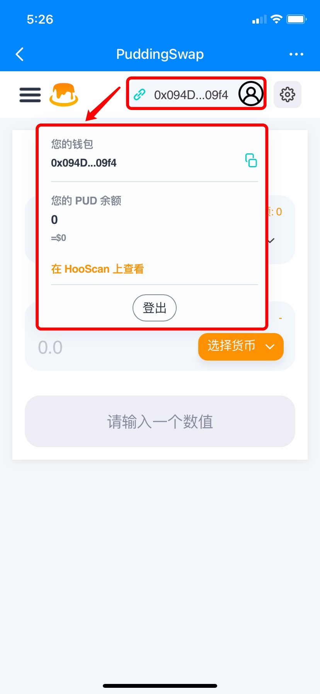

# 如何在DEX上交易——PuddingSwap（HSC）

**关于**[**PuddingSwap**](https://exchange.puddingswap.finance/#/swap)  
****PuddingSwap是基于虎符智能链（HSC）的去中心化交易平台，它有【挖矿】、【质押】、【交易】等功能。

**一、如何兑换交易？**  
1、打开TokenPocket，选择或创建HSC钱包，点击底部【发现】，然后在顶部搜索PuddingSwap进入界面；

2、进入PuddingSwap页面后，右上角将默认链接钱包地址，点击后可以在列表中查看你的PUD余额；

3、在顶部选择【兑换】，输入需要兑换的代币和接收代币，然后输入数量，最后点击【Swap】进行兑换；（这里以HOO兑换USDT为例）

4、确认兑换信息无误后，点击【Confirm Swap】，输入钱包密码后即可完成兑换交易。

\*\*\*\*


本教程仅为DApp在钱包端的操作指南，不代表TokenPocket的投资建议。投资有风险，您须充分认识风险，并自行作出投资决策。


