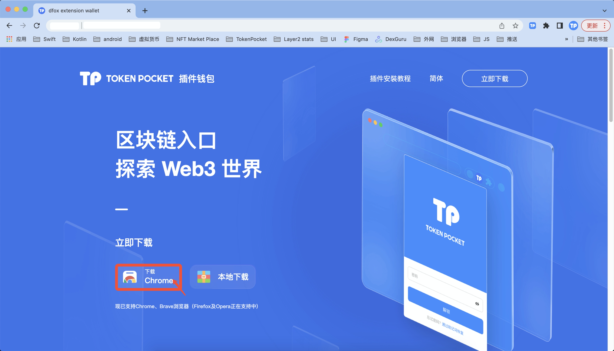

# TokenPocket插件钱包安装教程

目前有两种方法将dfox添加至扩展程序；

**方法一、从Chrome商店下载添加。**

1.点击[https://extension.tokenpocket.pro/#/](https://extension.tokenpocket.pro/#/)，进入TokenPocket插件钱包官网，将鼠标移动至<mark style="color:orange;">**【插件钱包】**</mark>，点击<mark style="color:orange;">**【下载Chrome】**</mark>；

2.进入Chrome商店，点击<mark style="color:orange;">**【添加至Chrome】**</mark>；

3.点击添加至<mark style="color:orange;">**【扩展程序】**</mark>；

4.成功将TokenPocket添加至浏览器扩展功能后，点击<mark style="color:orange;">**【开始使用】**</mark>.

**方法二、本地下载TokenPocket插件钱包安装包。**

1. 点击[https://extension.tokenpocket.pro/#/](https://extension.tokenpocket.pro/#/)，进入TokenPocket插件钱包官网，将鼠标移动至<mark style="color:orange;">**【插件钱包】**</mark>，点击<mark style="color:orange;">**【本地下载】**</mark>；

2\. 解压TokenPocket插件钱包安装包为文件夹；

3.打开chrome浏览器，点击<mark style="color:orange;">**【设置】**</mark>-<mark style="color:orange;">【</mark><mark style="color:orange;">**扩展功能】**</mark>-打开<mark style="color:orange;">**【开发者模式】【加载已解压的扩展程序】**</mark>，载入TokenPocket插件钱包安装文件夹。

4\. 成功将TokenPocket插件钱包添加至浏览器扩展功能后，点击<mark style="color:orange;">**【开始使用】**</mark>;

<mark style="color:red;">**免责声明：本教程仅为TokenPocket插件钱包在PC端的操作指南，不代表任何投资建议。投资有风险，您须充分认识风险，并自行作出投资决策。**</mark>
