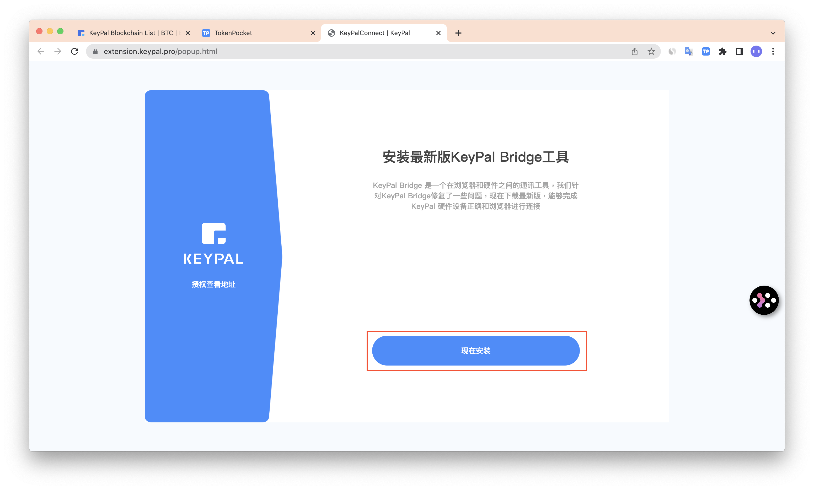
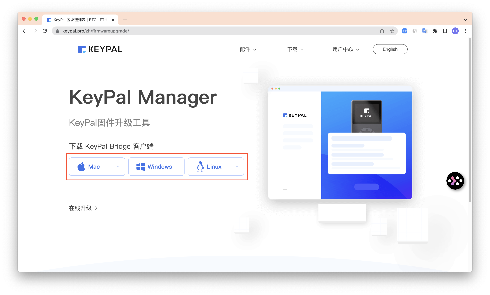
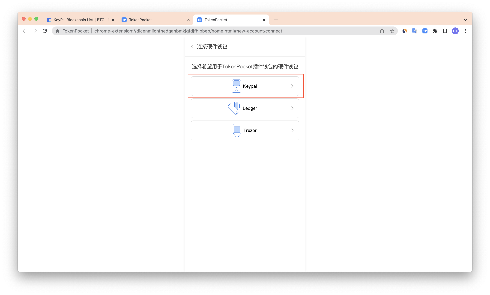
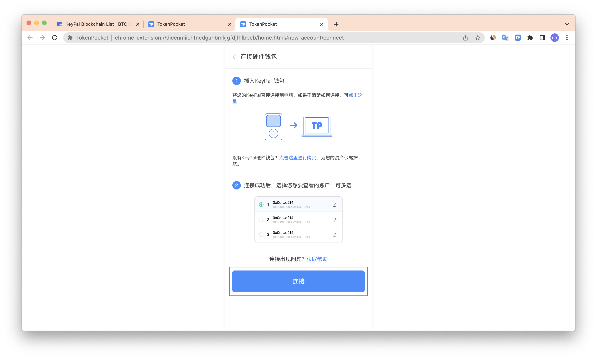
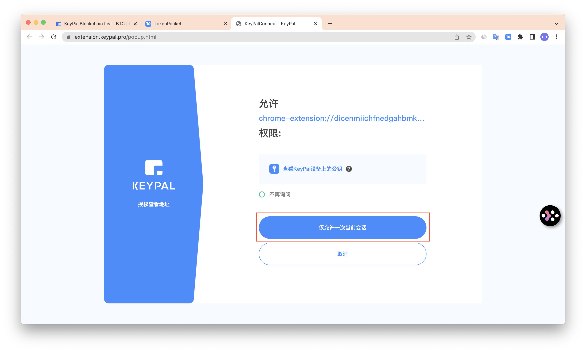
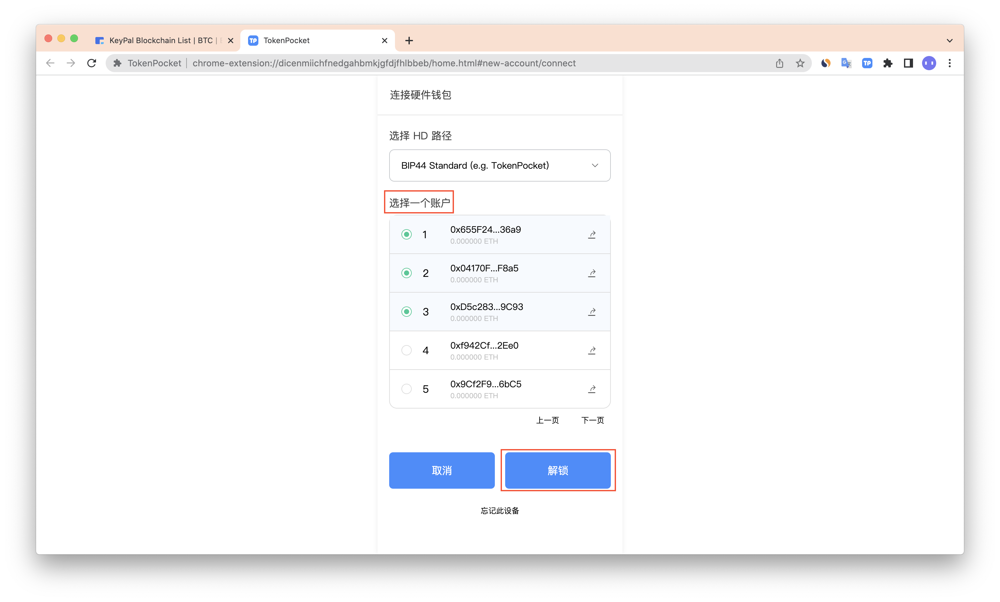

# 如何连接KeyPal硬件钱包？

[**TokenPocket插件钱包**](https://extension.tokenpocket.pro/#/)**（1.1.4）已支持连接**[**KeyPal硬件钱包**](https://www.keypal.pro/)**。**

1. 首先，您需要从[**https://extension.keypal.pro/popup.html**](https://extension.keypal.pro/popup.html)中下载KeyPal Bridge工具，点击**【现在安装】**。

2\. 选择对应的客户端进行下载安装。

3.安装完成后，点击TokenPocket插件右上角图案，进入设置页面。

4.点击**【连接硬件钱包】**。

5\. 选择[**KeyPal**](https://keypal.pro/)，点击**【连接】**。

6.点击**【仅允许一次当前会话】**，继续点击**【导出】**。

7.选择你所需要连接的账户地址，点击**【解锁】**。

8.至此，你已成功连接KeyPal硬件钱包。

