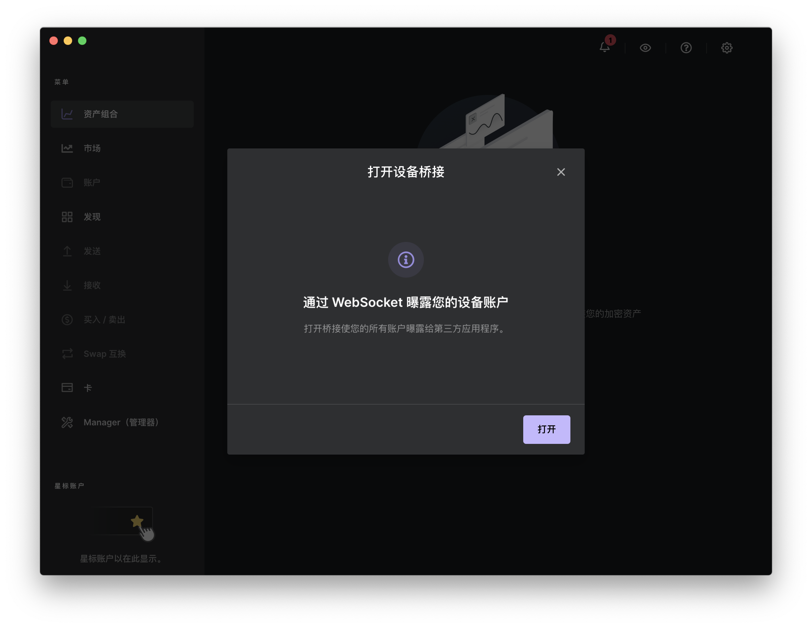

# 如何连接Ledger硬件钱包？

[**TokenPocket插件钱包**](https://extension.tokenpocket.pro/#/)**（1.1.3）已支持连接Ledger硬件钱包。**以下有两种方式连接Ledger硬件钱包。

<mark style="color:red;">**方法一：通过webhid方式连接ledger.**</mark>

1.首先请在Ledger硬件钱包上<mark style="color:orange;">**输入PIN码**</mark>以验证您的硬件钱包。打开TokenPocket插件钱包，点击右上角按钮进入设置页面，点击<mark style="color:orange;">**【连接硬件钱包】**</mark>。

2.点击<mark style="color:orange;">**【Ledger】**</mark>，按照步骤将您的Ledger连接到电脑，点击<mark style="color:orange;">**【连接】**</mark>。

3.选择已连接电脑的Ledger设备，点击<mark style="color:orange;">**【连接】**</mark>

4.选择所需要连接的钱包（可多选），点击<mark style="color:orange;">**【解锁】**</mark>。至此，你已完成Ledger连接TokenPocket插件钱包的操作。

<mark style="color:red;">**方法二：通过Ledger Live连接Ledger硬件钱包。**</mark>

**注意：通过Ledger Live连接TokenPocket插件钱包，需要在桌面端安装**[**Ledger Live**](https://www.ledger.com/ledger-live)**并完成连接Ledger硬件钱包的操作。**

1.点击TokenPocket插件钱包右上角按钮进入设置页面，点击<mark style="color:orange;">**【设置】**</mark>，点击<mark style="color:orange;">**【高级】**</mark>，选择<mark style="color:orange;">**【Ledger Live】**</mark>。完成后即可退出该页面。

2.请在Ledger硬件钱包上<mark style="color:orange;">**输入PIN码**</mark>以验证您的硬件钱包。打开TokenPocket插件钱包，点击右上角按钮进入设置页面，点击<mark style="color:orange;">**【连接硬件钱包】**</mark>。

2.点击<mark style="color:orange;">**【Ledger】**</mark>，按照步骤将您的Ledger连接到电脑，点击<mark style="color:orange;">**【连接】**</mark>。

3.系统将会自动跳转至打开Ledger Live页面，点击<mark style="color:orange;">**【打开Ledger Live】**</mark>。

4.进入Ledger Live页面，点击<mark style="color:orange;">**【打开】**</mark>；显示“已打开桥接”后，返回插件钱包页面。

5.选择所需要连接的钱包（可多选），点击<mark style="color:orange;">**【解锁】**</mark>。至此，你已完成Ledger连接TokenPocket插件钱包的操作。

