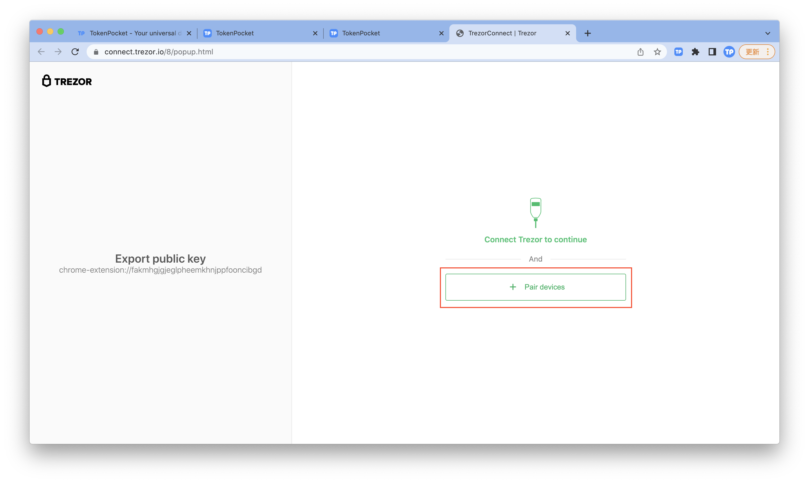
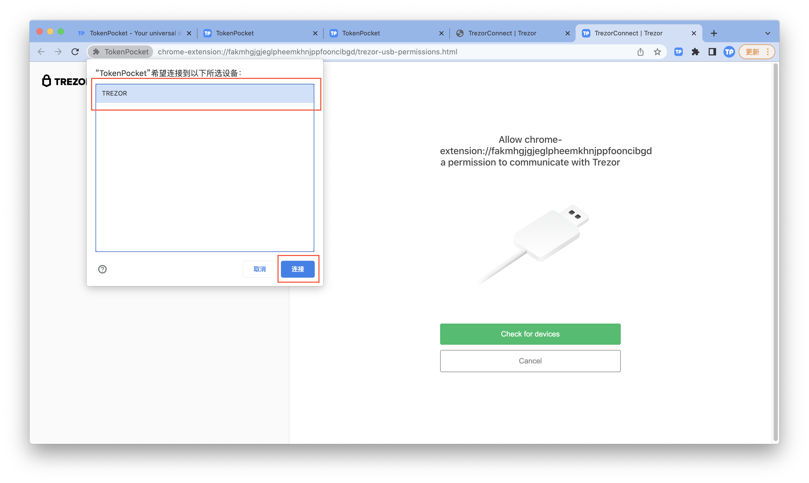
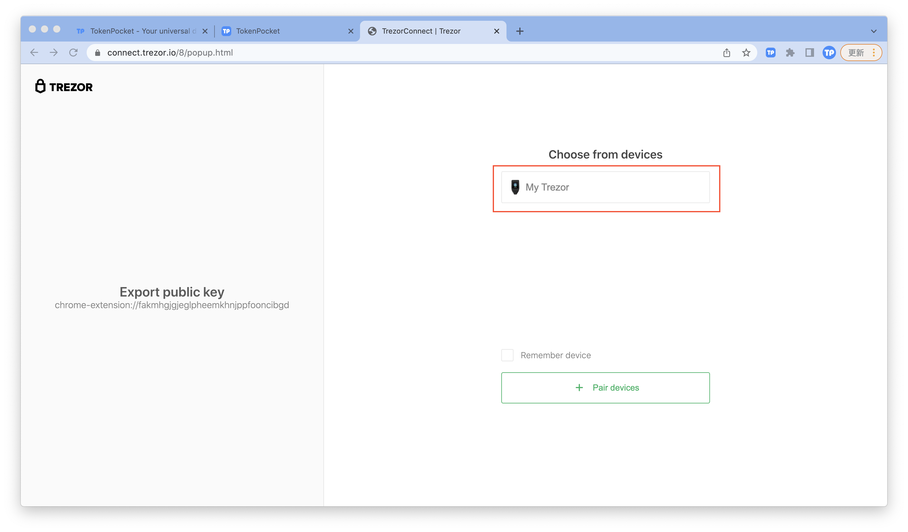

# 如何连接Trezor硬件钱包？

[**TokenPocket插件钱包**](https://extension.tokenpocket.pro/#/)**（1.1.3）已支持连接Trezor硬件钱包。**

1.首先请在Trezor硬件钱包上<mark style="color:orange;">**输入PIN码**</mark>以验证您的硬件钱包。打开TokenPocket插件钱包，点击右上角按钮进入设置页面，点击<mark style="color:orange;">**【连接硬件钱包】**</mark>。

2.点击<mark style="color:orange;">**【Trezor】**</mark>，按照步骤将您的Trezor连接到电脑，点击<mark style="color:orange;">**【连接】**</mark>。

.png>)

3.点击连接后，将会出现以下连接Trezor硬件钱包的页面，点击<mark style="color:orange;">**【+ Pair device】**</mark>，选择已连接电脑的Trezor设备，点击<mark style="color:orange;">**【连接】**</mark>。

4.点击<mark style="color:orange;">**【My Trezor】**</mark>；

5\. 点击<mark style="color:orange;">**【Allow once for this session】**</mark>

6.点击<mark style="color:orange;">**【Export】**</mark>

7.一般默认的passphase无需输入，直接点击<mark style="color:orange;">**【Enter】**</mark>即可。

8.点击<mark style="color:orange;">**【连接】**</mark>，选择所需要连接到插件的钱包地址，点击<mark style="color:orange;">**【解锁】**</mark>。

9.至此，你已完成Trezor连接TokenPocket插件钱包的操作。

