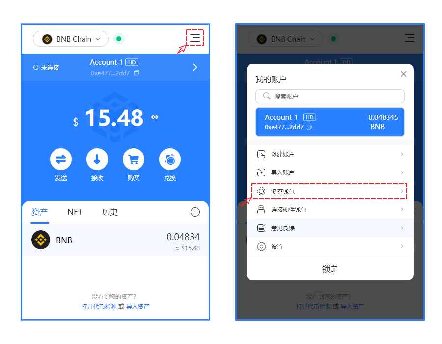
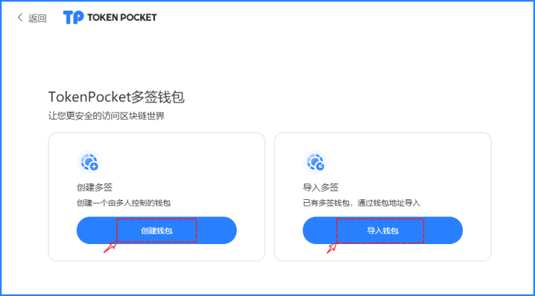
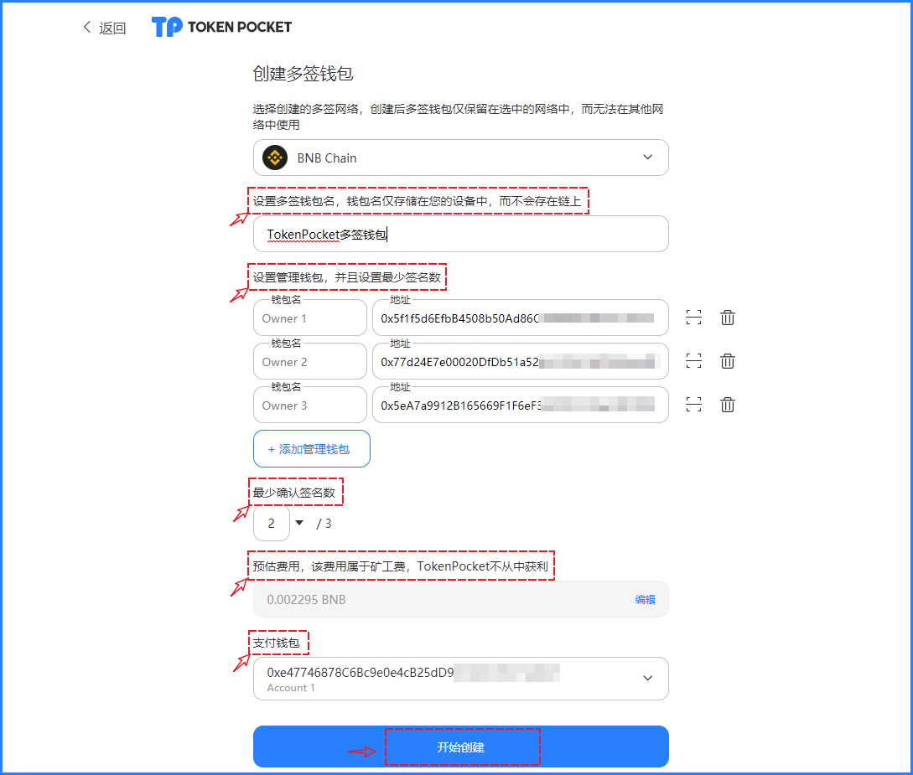
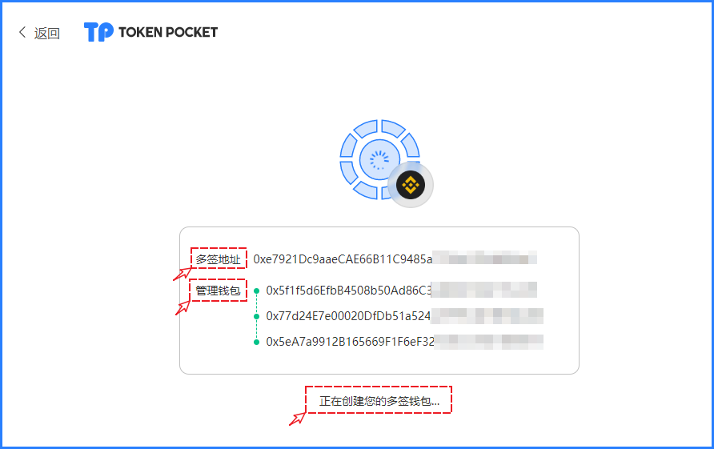
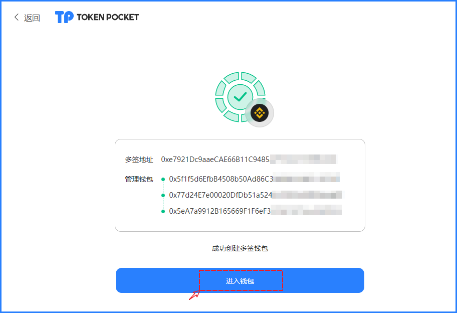
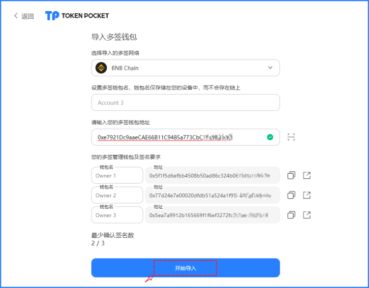

# 使用TokenPocket插件钱包创建多签钱包

### <mark style="color:orange;">什么是多签钱包：</mark> 

与多签钱包对应的是单签钱包，我们要往区块链上发送一笔转账操作，需要用钱包生成一个签名，我们自己签好名把交易发送出去，这就是典型的单签钱包，也是我们平时常用的钱包。

多签钱包，顾名思义，就是需要多个人去签名执行某个操作的钱包。使用多签钱包进行转账，往往需要 >= 1 个人去签名发送交易，转账操作才可以完成。使用多签钱包时，我们可以指定 m/n 的签名模式，就是 n 个人里面有 m 个人签名即可完成操作。比如 2/3 签名模式，就是 3 个人里面有两个人签名就可以。

ETH/ERC20 (包括 BSC/BEP20 等EVM链）的多签采用轻量智能合约（smart contract）方式。

**适用场景：**

1\. 用于需要多人管理资产，避免资产被个人挪用；

2\. 通过多签对资产进行多地址签名管理，增强资产安全性；

3.其他安全应用场景。

### <mark style="color:orange;">创建多签钱包：</mark>

1、打开TokenPocket插件钱包，点击右上角菜单，选择【多签钱包】

<figure><figcaption></figcaption></figure>

2、在弹出的新界面中，我们可以选择创建或导入多签钱包，我们模拟首次创建的情景。点击【创建钱包】

<figure><figcaption></figcaption></figure>

3、多签钱包创建的步骤是最核心的内容，下图中将每一个类型的内容进行了展示，内容如下:

【多签钱包名】和日常创建钱包名一样，可以自定义设置，并不会上链。

【设置管理钱包】设置多签钱包的管理钱包，多签钱包由管理钱包共同进行管理和控制，最多支持30个管理钱包设置。管理钱包可以灵活设置，适用于企业或团队资产管理或个人的多元化使用。

【最少确认签名数】设置钱包最低签名数，当满足最低签名数时，即可发起转账、合约交互等链上操作。最小确认签名数建议设置大于2以上的数值，可以兼顾安全与便捷。

【费用信息】该费用属于在链上执行多签钱包创建的网络费用，TokenPocket不会收取任何费用。

【支付钱包】这里可以点击选择钱包中导入的钱包地址进行创建Gas（矿工费）费用的支付。

当一切设置妥当后，点击【确认】即可看到多签钱包创建中的提示，界面中可以点击跳转到BSC区块链浏览器上查看相关创建信息。

<figure><figcaption></figcaption></figure>

4、创建过程中可以很直观的看到创建状态。

<figure><figcaption>
创建中
</figcaption></figure>

<figure><figcaption>
创建完成
</figcaption></figure>

点击【进入钱包】，即可打开刚刚创建的多签钱包。

### <mark style="color:orange;">导入多签钱包：</mark> 

打开TokenPocket插件钱包，点击右上角菜单选择【多签钱包】

<figure><figcaption></figcaption></figure>

导入界面中输入自定义名称，填入【多签钱包地址】会自动读取到管理地址和最少确认签名数，点击【开始导入】即可导入到多签钱包中。

<figure><figcaption></figcaption></figure>

