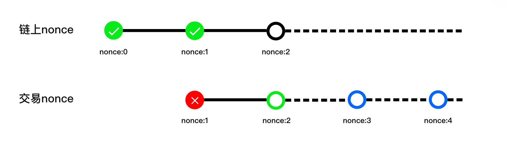

# 什么是多签nonce

EVM的多签交易中，Nonce是一个重要的概念，用于确保交易按照特定顺序执行。它与普通交易中的Nonce有所不同。在多签交易中，多个地址协同进行交易，并使用一个共同的多签账户进行签名和授权。每个地址都有自己的Nonce值，表示该地址已经发送的交易数量。

Nonce的目的是维护交易的顺序性和完整性，以防止重放攻击和混乱的交易执行顺序。它是多签合约的一部分，由合约来管理和维护。因此，多签交易的Nonce可以超过发送者地址的当前Nonce值。

在多签交易中，正确的Nonce顺序对于确保交易的一致性和正确性至关重要。多签交易需要按照正确的Nonce值顺序进行执行，确保交易按预期顺序被执行。

需要注意的是，在创建多签交易时，必须确保交易的Nonce与多签合约预期的顺序一致。如果一个交易的Nonce与预期的值不匹配，交易将在链上执行时直接报错并失败。因此，在同时发出多笔多签交易时，需要按照顺序，将交易的Nonce值从小到大进行执行。只有当发出的交易的Nonce与当前预期的Nonce值匹配时，交易才能成功执行。

在多签交易队列中，我们将交易分为"当前交易"和"排队交易"。如果没有"当前交易"存在，需要通过发起一笔"当前交易"，以确保后续交易可以正常发出。在队列中的交易必须按照正确的顺序进行，并且只有当前面的交易被确认和执行后，才能执行后续的交易。

通过正确理解和使用多签交易中的Nonce概念，我们能够确保交易的顺序性和正确性。这有助于维护多签交易的可靠性和安全性。

总结起来，Nonce在EVM多签交易中起着重要的作用，用于确保交易的顺序执行。通过维护正确的交易顺序，多签交易能够确保每一笔交易都按照预期执行，避免了交易重复执行或乱序执行的问题。这有助于确保交易的一致性和正确性，增强了多签交易的安全性和可靠性。

<figure><figcaption></figcaption></figure>

以上图为例，链上需要一个nonce为2的交易，如果这个时候发出nonce为1的交易则立刻失败，同样，如果发出nonce为3或者4的交易，也立即失败。必须发出nonce为2的交易，才可以成功。 只要交易不发送到链上，交易就可以出现在交易队列里，等待后续执行。
