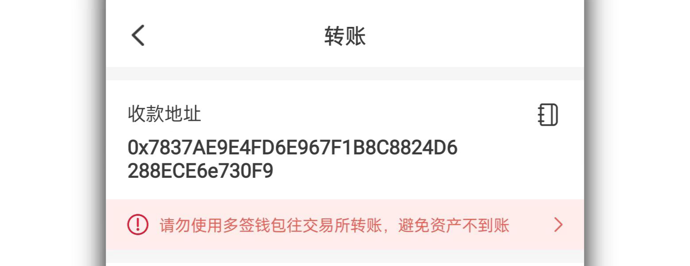

# 多签钱包转账教程

多签钱包的创建和导入过程我们已经掌握，那么使用多签钱包进行转账操作需要哪些注意事项呢，下面带大家一起了解多签钱包转账的教程。

1、打开TokenPocket多签钱包，点击需要转出的代币，例如这里的BNB。（NFT同样也支持多签转账等操作）

情况一：收款地址使用了多签钱包地址，在这里可以看到会有红色文字提示转入的为合约地址，请谨慎操作。

<figure><figcaption></figcaption></figure>

情况二：使用普通地址作为收款地址，会看到【请勿向交易所地址转账】的提示。

<figure><figcaption></figcaption></figure>

<mark style="color:red;">**在这里需要说明的是，创建的多签钱包地址如果作为收款地址，那么可以正常的收到转账的资产；如果使用多签钱包充值代币到交易所地址，那么就会导致无法到账，这是因为交易所不支持合约地址直接充值，他们需要手工处理，所以这一点要特别注意。**</mark>

2、TokenPocket内置了合约地址检测功能，所以在这里还会看到一层安全提示内容，再确认安全后点击【知晓并继续】。接下来跳转到了交易界面中，在这里有一个【高级设置】它是用户自定义nonce值的作用。

<figure><figcaption></figcaption></figure>

小知识：nonce值就是记录每次交易的顺序，每发起一笔交易，nonce就会+1，而最终的执行顺序需要按照nonce的顺序进行例如：0 1 2 3 4的顺序。

现在是多签钱包第一个版本，所以暂时多签队列里的订单暂时无法删除，这时如果已经创建了多个未执行的订单，但是我们需要新建一个订单并让其先执行，那么这里会有两种方法操作。

情况一：把多签队列中的订单按照nonce低的先执行的顺序都执行完毕；

情况二：用自定义nonce为0来进行创建和执行，当执行成功后所有nonce为0的多签订单便会从列表中消失。

<figure><figcaption></figcaption></figure>

3、情景一：多签管理地址未导入钱包。

转账订单确认后，点击【确认支付】会弹出选择签名钱包的提示，如果多签管理地址全部都没有导入钱包，那么会默认选择【手工发送】签名的方式，点击确认后会跳转到多签详情界面，这里会根据自己设置的多签签名地址数量来分配待签名的数量，点击【确认签名】后可以分享给签名管理地址进行签名。

<figure><figcaption></figcaption></figure>

情景二：多签管理地址导入到钱包。

多签钱包创建转账时，如果签名管理地址导入了钱包中，那么会提供选择签名的地址，点击确认后会看到【多签发起成功】的提示，只需要点击前往管理到多签详情界面进行剩余签名。

<figure><figcaption></figcaption></figure>

因为已经使用签名管理地址进行过确认，所以这里看到的确认签名其中之一已经完成了签名，剩余的签名只需要点击确认钱包来调用导入钱包中剩余的签名管理地址进行钱包即可。

<figure><figcaption></figcaption></figure>

情景三：多签管理地址部分导入钱包。

如果剩余签名地址未导入钱包，就需要手工发送方式进行签名，利用多签交易二维码分享功能，通过微信、QQ等方式发送给其他设备或管理者通过钱包中的扫一扫加载多签二维码并完成签名，然后在多签详情中可以看到完成签名的提示，到这里点击【执行】菜单来进行最后的上链操作。

<figure><figcaption></figcaption></figure>

4、完成所有的签名后，最后的上链过程中会调用钱包中已经导入的bsc钱包列表任选一个有足够Gas（矿工费）的地址进行上链费用的支付，同样可以在交易详情中来自定义Gas费用，点击确认支付并输入密码后即可完成多签钱包转账的所有执行操作。

<figure><figcaption></figcaption></figure>

小知识：

如果使用冷钱包进行签名，那么如何进行多签的签名？

按照上面的步骤分享二维码后，使用冷钱包对应的观察钱包的【扫一扫】功能识别后进行签名，然后会生成一个二维码，这时使用冷钱包进行扫码识别，会在冷钱包设备中生成另一个二维码，再次使用观察钱包进行识别后就可以完成最终的签名操作。（硬件钱包也是同理）
