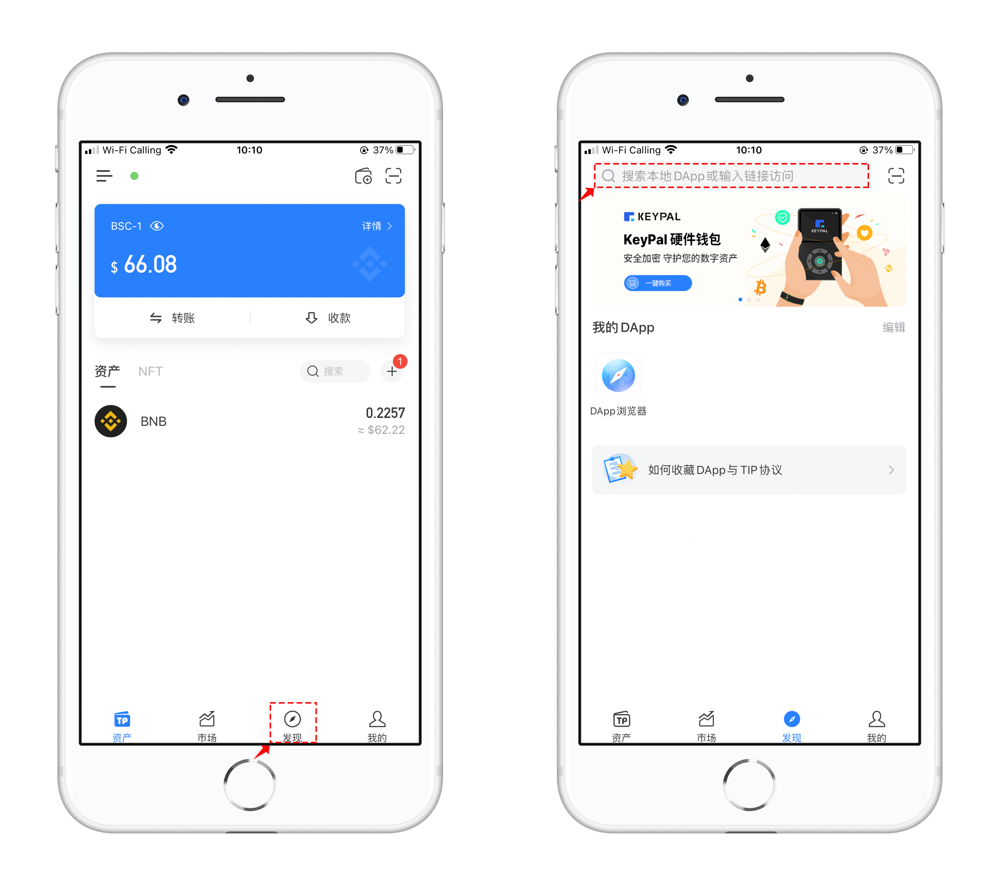
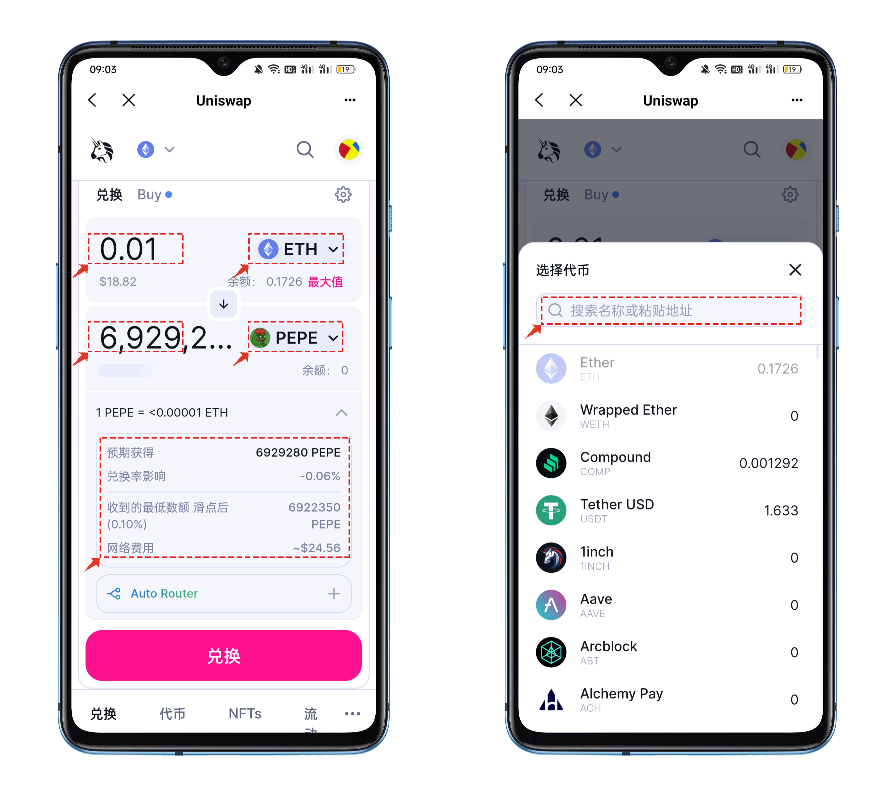
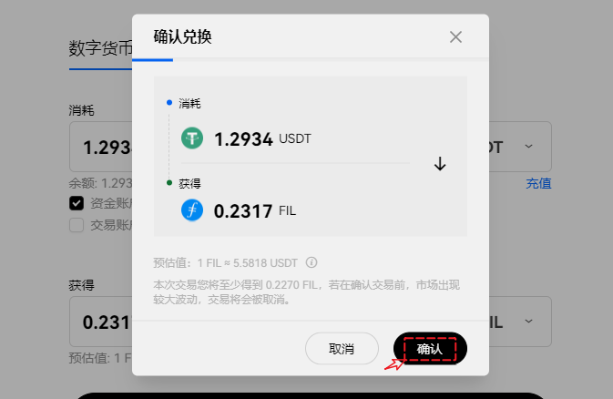

# 在钱包中查看和发送Ordinals铭文

### 什么是比特币Ordinals 

Ordinals协议是一个为聪编号的系统，赋予每个聪序列号，并在交易中追踪它们。简而言之，用户可以通过Ordinals为每个聪附加额外的数据，使每个聪都变得独一无二。这个过程称之为“铭刻”。

“聪”以比特币的作者中本聪命名（中本聪为化名），是比特币(BTC)的最小面额。1比特币可以被分为1亿聪，这意味着每聪价值0.00000001比特币。

聪的编号是根据它们被开采和转移的顺序而定的。编号方案依据聪的开采顺序，而转移方案依据交易输入和输出的顺序，因此被称为“Ordinals（序数）”。

虽然传统NFT在某些方面与Ordinals相似，但也存在几个关键的区别。NFT通常使用智能合约在以太坊、Solana和BNB Smart Chain等区块链上进行制作，有时它们所代表的资产会被托管在其他地方。相反，Ordinals直接记录在单个聪上，然后被纳入比特币区块链的区块中。Ordinals完全驻留在区块链上，不需要侧链或单独的代币。从这层意义上说，Ordinals记录继承了比特币本身的简单性、不变性、安全性和耐久性。

### 什么是Ordinals 铭文（Inscriptions） 

"Inscriptions"是一种协议，它允许将任意内容（如图片、视频等文件）附加到单个聪上，从而将其转化为比特币链上的原生数字艺术品。

铭刻过程是通过发送Taproot脚本的交易来实现，此交易的完成将在链上永久记录这一铭文内容。接着，该内容会与特定的聪建立唯一的联系，从而形成一个不可更改的数字艺术品。这种数字艺术品能被追踪、转移、储存，甚至可供购买和销售。

### 什么是Taproot 

比特币Taproot是比特币协议的一个重要升级，旨在提高比特币的隐私性、安全性和可扩展性。它于2021年11月被激活，是比特币自2017年SegWit升级以来的又一次重要升级。

Taproot更新是 Ordinals NFT的关键推动因素，它将NFT数据存储在 Taproot 脚本路径的花费脚本（spent script）中。这次升级使得结构化和存储任意的见证数据变得更加容易，为 "ord" 标准奠定了基础。随着数据要求的放宽，假设一个交易可以用其交易和见证数据填满整个区块 -- 达到4MB的区块大小（见证数据空间）限制 -- 极大地扩展了可以放在链上的媒体类型。

### Ordinals铭文显示和发送 

1、打开TokenPocket的BTC钱包，在资产界面中点击【NFT】菜单，在NFT分类中可以查看Ordinals铭文。Ordinals目前的用法分为2种，一种是纯粹NFT，另一种是BRC20，TokenPocket暂支持Ordinals铭文的查看、接收和发送。

<figure><figcaption></figcaption></figure>

2、打开铭文内容，在【详情】中可以看到这个铭文的参数，点击【铭文ID】或【铭刻哈希】都可以直接跳转到浏览器中查看更详细的执行内容。

<figure><figcaption></figcaption></figure>

3、点击【发送】收款地址务必要使用**Taproot类型的地址**，这个可以通过点击查看[<mark style="color:blue;">**如何使用Taproot类型的地址**</mark>](ordinals.md#ieois)。点击自定义并合理设置网络费率参数，就可以更快的完成转账，因为当前BTC网络比较拥堵，所以如果不想长时间等待，建议相应的增加网络费率来达到快速成交的目的。

<figure><figcaption></figcaption></figure>

<mark style="color:red;">**需要注意的是，由于BRC20记账方式不完全以持有的NFT为依据，因此收到或转出BRC20相关的NFT，并不代表真正持有BRC20代币。**</mark>

这里是机制决定的，因为BRC20的铭文需要通过铭刻可转账额度的NFT，才可进行转账，对方收到后才算真正的拥有BRC20代币。。而TokenPocket当前还未支持铭刻功能，所以当前只能发送NFT，并不能同步发送余额。
