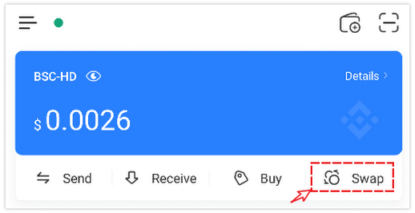
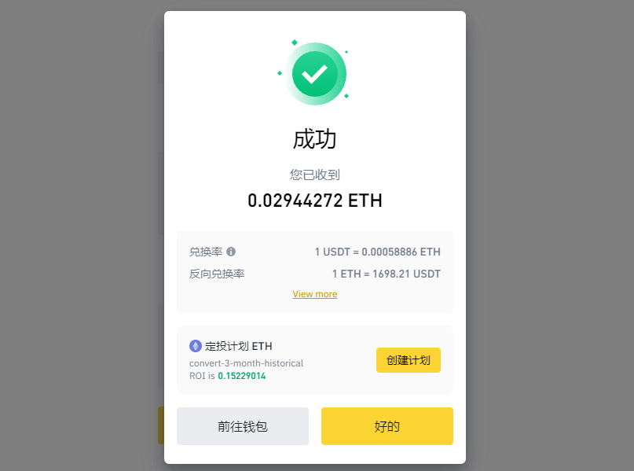
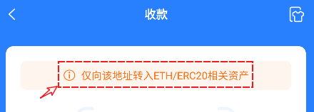

# 如何购买ETH代币

以太坊（英语：Ethereum）是一个开源的有智能合约功能的公共区块链平台。通过其专用加密货币以太币（Ether，又称“以太币”）提供去中心化的虚拟机（称为“以太虚拟机”Ethereum Virtual Machine）来处理点对点合约。

在以太坊网络上执行任何上链的操作都需要消耗矿工费（Gas），所以ETH是使用以太坊钱包中必备的代币。

### <mark style="color:orange;">通过Transit Swap兑换</mark>

打开TokenPocket，点击右上方的【闪兑】。

<figure><figcaption></figcaption></figure>

在打开的界面中设置需要兑出的代币（如USDT），选择需要兑入的代币ETH，然后选择以太坊钱包作为收款地址，请不要使用交易所的地址作为收款地址。

首次使用除主网币的代币进行兑换，在这里都需要执行一次授权操作，授权的数量可以自己合理设置，完成授权后，再次按照兑出、兑入的代币、数量并设置好收款地址并点击【确认兑换】后进行签名就可以获得ETH代币。（Transit支持同链和跨链兑换服务）

<figure><figcaption></figcaption></figure>

### <mark style="color:orange;">通过Binance购买ETH代币</mark>

在交易购买ETH的途径通常有三类，【闪兑】、【现货交易】、【买币】，我们主要针对前两种兑换方式进行介绍。

<figure><figcaption></figcaption></figure>

#### <mark style="color:orange;">一、闪兑方式：</mark>

1、打开binance官网，选择左上角【交易】菜单，选择【闪兑】，闪兑方式是为了方便新用户操作的一种简化图形界面，在这里可以选择【市价】或【限价】交易方式，填入需要兑换的代币数量，点击底部的【预览兑换结果】。

<figure><figcaption></figcaption></figure>

2、兑换界面中可以看到兑换的比例、手续费等参数，点击兑换（因为是市价交易，所以会有8秒钟的交易时间限制）。

<figure><figcaption></figcaption></figure>

3、兑换完成后，可以在界面中看到成功的提示。

<figure><figcaption></figcaption></figure>

#### <mark style="color:orange;">二、现货交易方式</mark>

闪兑的数据取值，正来源于现货交易，在操作界面中可以查看代币的K线走势，买卖价格等信息，同样会区分限价挂单模式和市价直接成交的模式，这个根据个人需要选择。选择一个合适的价格后，下面的滚动条可以根据当前持有的另一个代币数量的百分比来设置买入数量，设置好以后，点击买入ETH即可。

<figure><figcaption></figcaption></figure>

#### <mark style="color:orange;">三、如何提取ETH到钱包</mark>

执行提币操作的时候，最重要的因素就是提币的网络选择和地址。点击转账网络，会弹出窗口提示，其中ERC20网络就是以太坊公链网络。

<figure><figcaption></figcaption></figure>

如果无法确定选择什么网络，那么可以打开TokenPocket，点击需要接收代币钱包的【收款】功能，在收款界面顶部可以看到当前钱包对应的网络，然后在提币界面正确选择。

<figure><figcaption></figcaption></figure>

确认好提币网络，正确填写收款地址，设置好提币数量后，就可以点击【提现】操作，耐心等待几分钟即可到账，到账的时间取决于交易所的放款速度，遇到问题可以和交易所客服进行联系。

<figure><figcaption></figcaption></figure>
