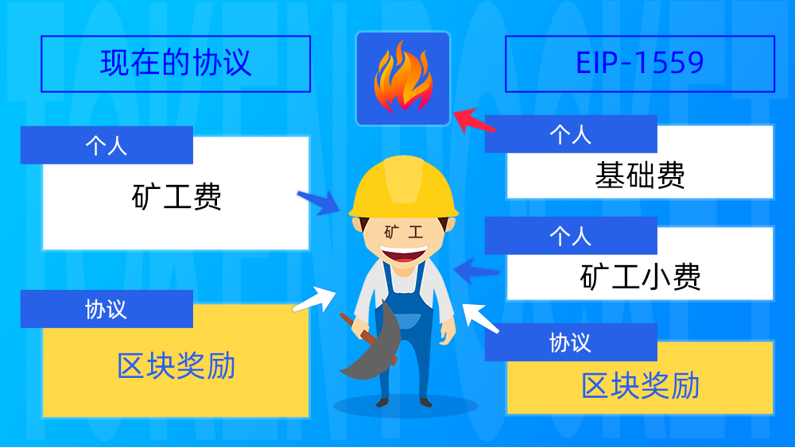

# 什么是EIP-1559？

**什么是EIP-1559？**

EIP-1559是关于以太坊链交易手续费机制的改进提案，主要是更改支付矿工手续费（Gas费）的方式。EIP-1559将原来以太坊上需要给矿工支付的Gas费分成两个部分：**基础费（Base Fee）和矿工小费（Tip）。**

基础费用是用户必须支付的费用，它将被销毁而非矿工所有；而矿工小费则是动态的费用，用于在交易拥堵时激励矿工优先打包用户的交易。

为了保障用户权益及最大的可承受范围内完成上链，提高上链效率，EIP-1559还采取了**最高小费（Max Tip）**和**最高费用（Max Price）**的限制。

~~最高小费（Max Tip）是指用户可设置小费值的上限，如超过最高小费值，高出部分的小费将退还给用户；~~

最高费用（Max Price）是指用户愿意支付的最高矿工费值。

为了更好的理解，我们将划分以下三种情况说明（**以基础费不变的条件下**）：

1、当用户支付的小费不足以上链的情况，该笔转账可能需花费较长时间完成转账；

2、当用户支付的小费达到上链所需费用，但未超过最高小费时，那么超过上链所需的小费不会被退还；

3、当用户支付的小费超过最高小费值时，超出部分将退还给用户。

\*\*\*\*

**为什么要实行EIP-1559？**

为了解决目前以太坊交易的拥堵导致效率低下的问题，因此EIP-1559提案将Gas费的费率根据实际的使用需求进行调整，改变了付费结构和付费流向，从而保证区块的使用率。EIP-1559提案能够动态地调整Gas费的上限以应对短时的交易高峰，避免交易量过多导致的网络拥堵，从而提高交易效率，**改善用户体验**。

\*\*\*\*

