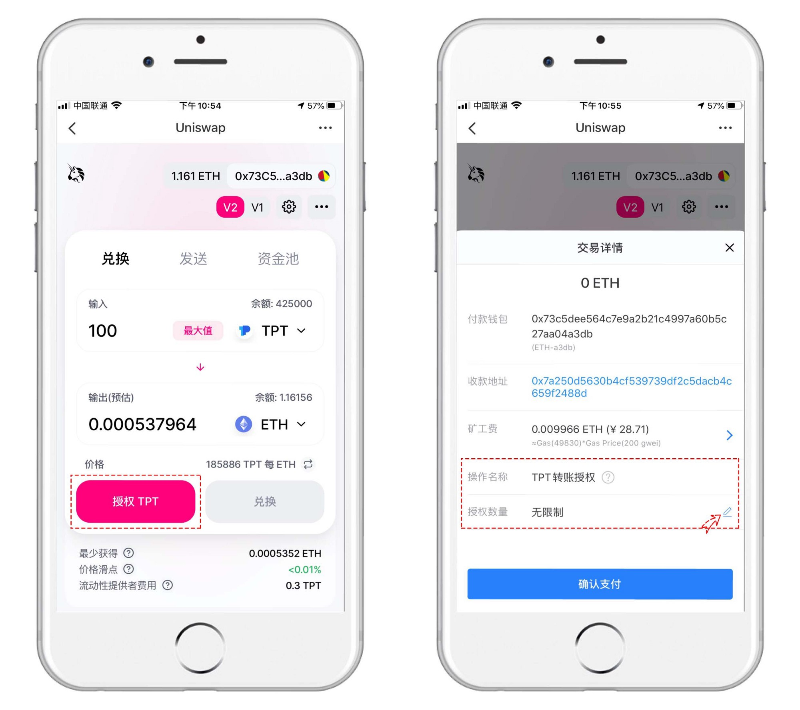

# 代币授权是什么？如何使用代币授权？

**什么是代币授权？**

以太坊链、EVM链（BSC/HECO/OKExChain/Polygon等）和波场链上的DApp大都涉及到合约操作，授权即表示允许该合约地址提取用户的代币。

**例如：**

A账号有10000个token代币，B账号没有token代币，C账号也没有token代币； 

那么：A账号 委托 B账号 转给C账号 100个token代币 怎么来实现呢？    

首先：A账号 和 B账号建立一种委托关联，登录A账户执行Approve\(b,100\)方法结果为：结果：\_allowed\[A\]\[B\] = 100token    

然后：在执行登录B账户执行transferFrom\(A,C,100\),这里的B就是委托账号发送者，gas从B扣除，必须确保token数量小于\_allowed\[A\]\[B\]；

**总结来说： 就是A转入C，但是要经过B的账号来发送交易！**

**可能存在什么风险：**

在操作过程中，如果将代币转账授权给一个恶意的合约，那就相当于这个合约可以把你的代币拿去做抵押或者其它恶意操作。（参考上述案例）

**以太坊链和EVM链上的DeFi已被广大用户所熟知，例如辨识度很高的Uniswap、Curve、Banlancer等工具，这类工具的操作便捷、功能强大，而且上线代币也非常方便，所以这就会导致可能会有一些恶意的人来通过这些平台作恶，所以在我们每次执行代币兑换的时候（尤其是一些新代币）都可能会存在风险。所以TP钱包新版本中的【操作类型】和【授权数量】显得尤为重要。（**授权一次代币的操作，相当于签订了一份协议，协议规定的可以使用的代币数量上限是X，如果需要再次请求大于X数量时会触发二次授权操作，这一切通过TP钱包都可以很直观的查看的。**）**

