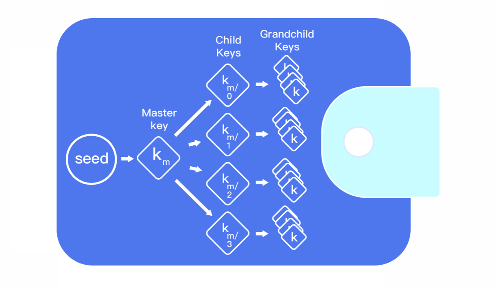

# 什么是身份钱包\(HD\)?

HD 钱包全称为是分层确定性\(Hierarchical Deterministic\)钱包的缩写 HD Wallets。

去中心化数字钱包是用来管理我们的私钥和资产的，而我们所拥有的数字资产（Token）是被记录在区块链上的。后来为了实现不同功能和便利的操作就有了例如云端钱包和HD钱包，其中HD钱包既兼顾了安全的还能更方便的创建子私钥属于分层确定性钱包类型。

实际上想要理解分层确定性钱包的概念也并没有我们想象的那么困难。它的原理用两句话就可以表达清楚：

首先，要用一个随机数来生成主私钥，这跟其他类型的钱包生成私钥过程没有任何区别。

然后，再用一个确定性的、不可逆的算法，基于主私钥生成任意数量的子私钥。

那为什么要用“确定、不可逆”的算法呢?因为“确定”才能保证从一个主私钥可以生成出全部的子私钥，而“不可逆”则是为了确保不能通过子私钥反推出主私钥。

之所以叫分层确定性钱包是因为私钥的衍生结构是树状结构，父密钥可以衍生一系列子密钥，每个子密钥又可以衍生出一系列孙密钥，以此类推，无限衍生。

这种结构跟公司的组织架构和家谱非常相似！

我们在首次创建 HD 钱包或者备份钱包时，会产生一个助记词，助记词是一连串的英语单词，这一串单词序列就可以创建种子，种子又可以创建所有的私钥。单词顺序也是钱包的备份，可以恢复钱包。而种子对应的就是所确定性钱包的随机数。

HD 钱包的优点在于只需要主公钥，就可以生成出任意数量的子公钥。也就是说，无需私钥介入\(主私钥和子私钥\)，就能基于主公钥生成新\(公钥\)地址，而这些地址其实都能被主私钥所控制。

有利必有弊，当我们暴露助记词时，也相当于将所有的私钥拱手让人了，你所拥有的数字资产的安全性也归零了。

