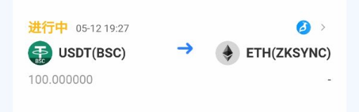

# 什么是质押2.0

带宽和能量是TRON网络中的重要系统资源。TRON通过质押机制分配网络资源。质押TRX除了可以获取带宽或者能量资源外，还将同时获得与质押量等量的投票权（TRON Power，简称TP），质押1TRX，获得1TP。质押获取到的带宽或者能量资源用于支付交易费用，获取到的投票权用于给超级代表投票以获取投票奖励。

TRON Stake 2.0作为TRON的一次重大升级，在质押操作、资源管理、资产解锁等待期等诸多维度均有质的提升，并全面支持TVM。

### **质押 2.0 功能介绍：** 

**1、质押**

用户质押 TRX 并获取指定类型的资源(能量或带宽)， 完成质押后，资源会分配到质押者账户，用户还同时获得投票权，质押 1 TRX 获得 1 个投票权。

**2、代理**

用户完成质押并获得资源后，可以将资源分批代理给其他账户。

用户代理资源时可选择是否开启时间锁，如果不采用时间锁，资源代理后，可随时回收资源；如果采用了时间锁，资源代理后，需要等待 3 天后才能对该地址进行资源回收。

等待期间，如果用户对同一个地址再次进行了资源代理，将重置 3 天等待时间。

**3、回收**

当用户对某一个地址资源回收时，但该资源接收者已经使用掉了部分资源，用户收回来的资源中， 已经使用掉的这部分资源仍然处于恢复状态。

**4、解锁**

用户可以指定特定数量的 TRX 进行解锁，已经代理出去的资源对应的 TRX 无法被解锁， 由于这部分 TRX 质押所获取的资源被代理给其他地址，所以这部分 TRX 被认为是锁定状态。

**5、提取**

用户执行解锁操作后，需要等待 14 天， 14 天后可提取资产到自己的账户中。

提取后可以在链上查看时间等参数。

<figure><figcaption></figcaption></figure>
