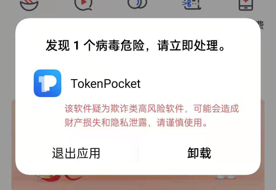

# 杀毒软件误报

TP钱包被<mark style="color:blue;">**腾讯病毒库误报**</mark>为危险应用，国内常见的手机厂商如华为、OPPO、小米、三星等系统的杀毒引擎模式都使用腾讯病毒库，所以钱包正常使用中会出现风险警示窗口。

对此TP钱包也发过多次声明，此次事件属于误判，在向腾讯相关方面提出了申诉后没有实际效果，同期被认定为风险的应用还涉及一些金融类、工具类、运动类等软件，如其他友商钱包。

<mark style="color:blue;">**安天和360**</mark>等实力派病毒查杀厂商数据库均未把TokenPocket列入病毒库中，所以我们要做的就是合理设置把TokenPocket加入到安全“白名单”。

#### **OPPO、一加手机设置教程：**

* 打开手机，在桌面上下拉打开全局搜索，查找并打开手机管家，点击**右上角设置**，点击**病毒查杀引擎**，选择**安天**引擎，设置后返回上一层。

 (1) (1).png>)

* 返回手机管家主界面，点击**病毒扫描**，完成一次扫描后即可解决问题。

.png>)

**OPPO的设置有时候一次性不能成功，遇到这种情况的解决方法有两个：**

**第一，关闭支付保护里的相关应用保护，当然这个不是太推荐。**

**第二，将钱包里所有的地址对应的私钥助记词都备份好，做好校验，没问题之后删除APP，然后用腾讯病毒库杀毒一次，然后换成安天病毒库杀毒一次，重新安装TokenPocket并导入私钥或助记词，这个就可以彻底的解决。**

#### **小米手机设置教程：**

* 在手机中找到手机管家并打开，点击**右上角设置**，在设置界面中选择**病毒扫描**

.png>)

* 点击**选择杀毒引擎**，选择**安天杀毒引擎**后即可

 (1) (1).png>)

#### **华为手机设置教程：**

* 打开华为手机管家，点击**病毒查杀**，可以看到风险项目列表，点击TP钱包（务必不要误操删除）

 (1).png>)

* 点击左下角**解除管控**，再次点击**解除管控**即可解决风险提示的提示。

 (1).png>)

<mark style="color:red;">如果在更新过程中提示纯净模式，那么可以返回手机桌面，打开设置搜索纯净模式并关闭即可正常安装。</mark>

**华为手机如何设置TP钱包联网权限**

首先，在手机桌面找到“手机管家”，点击打开，点击**“流量管理”**（有时候会看到是一些数字）。

.png>)

打开**“应用联网”**选项，在打开的界面中搜索TokenPocket，然后勾选移动数据和WLAN即可正常使用了。

.png>)

#### **三星手机设置教程：**

* 找到手机中的**智能管理器**

 (1) (1).png>)

* 打开**设备保护**选项，在**选择要排除的应用程序**里面添加TokenPocket即可完成白名单操作。

<figure><figcaption></figcaption></figure>
