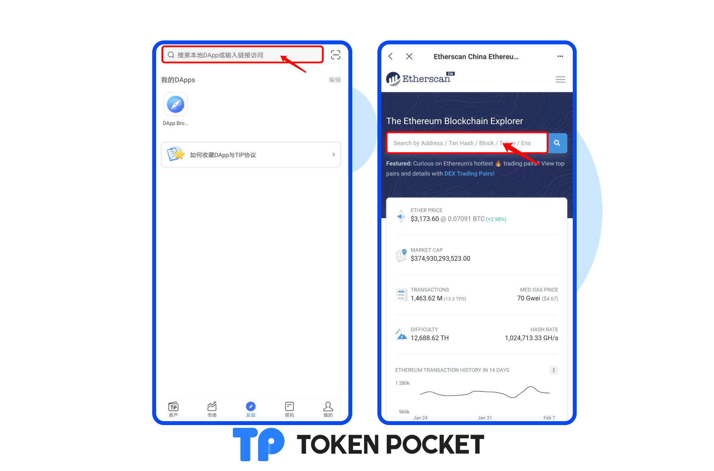
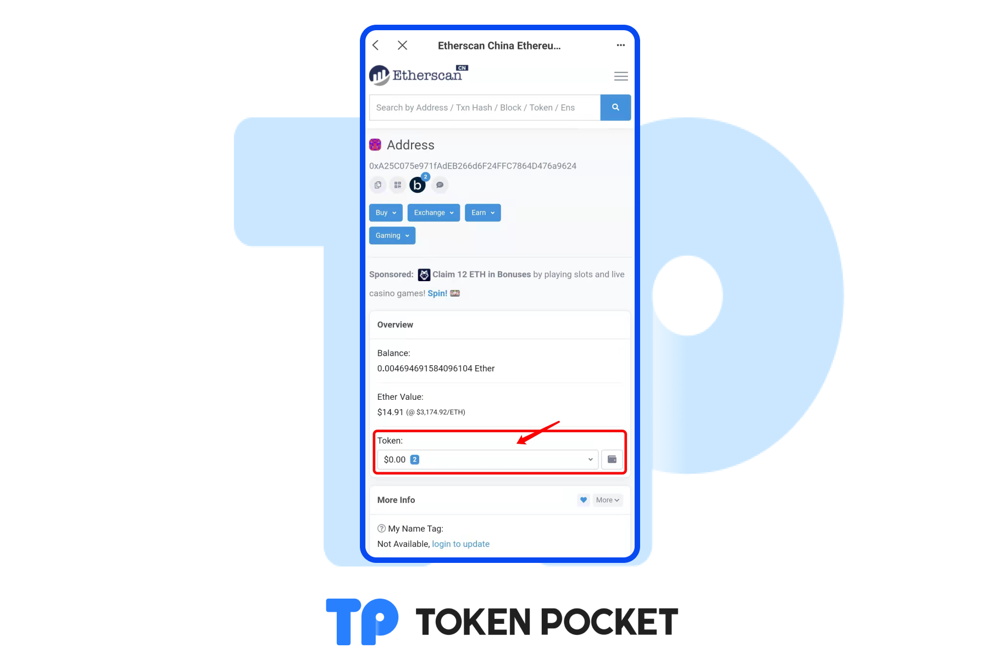

# 如何在ETH区块浏览器查询资产？

1.打开TokenPocket APP，在DApp浏览器内输入[https://cn.etherscan.com/](https://cn.etherscan.com)，进入ETH区块浏览器。在ETH区块浏览器中输入该代币的合约地址，即可查询到相关的代币信息。点击代币名称，进入代币详情页面。

2.点击【Token】，即可看到您钱包地址内的所有资产。 在钱包内添加未显示资产，只需要在浏览器复制相对应资产的合约地址，在TokenPocket资产页面的【+】那里输入合约地址，点击添加即可。 注意：合约地址是辨别真假代币的唯一标准，添加代币时请勿直接输入代币名称进行添加。

3.点击【Token】，即可看到您目前的钱包所有资产，点击您所需要添加的资产，进入代币信息页面，点击合约地址即可复制。[**如何在资产页面添加代币？**](https://help.tokenpocket.pro/cn/token-management/add-token)

