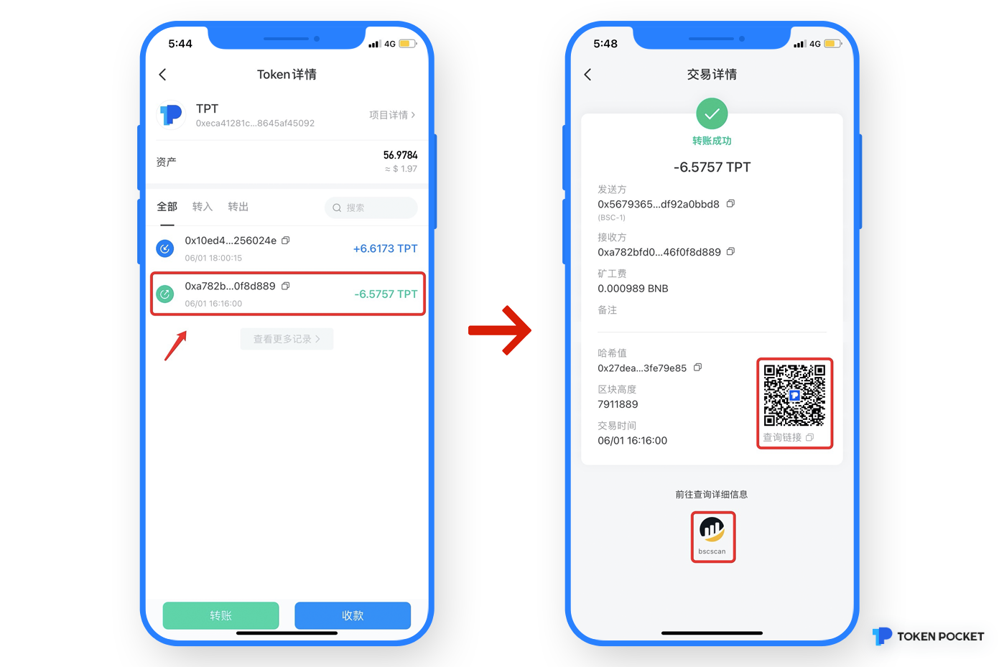
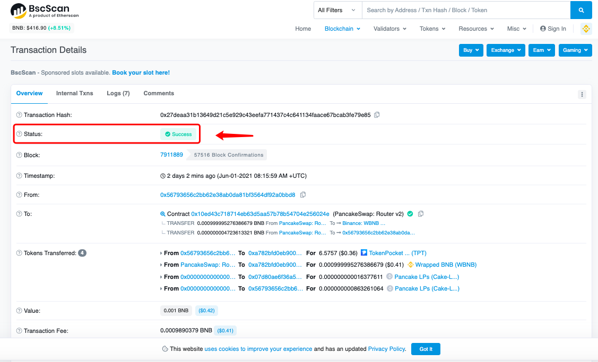
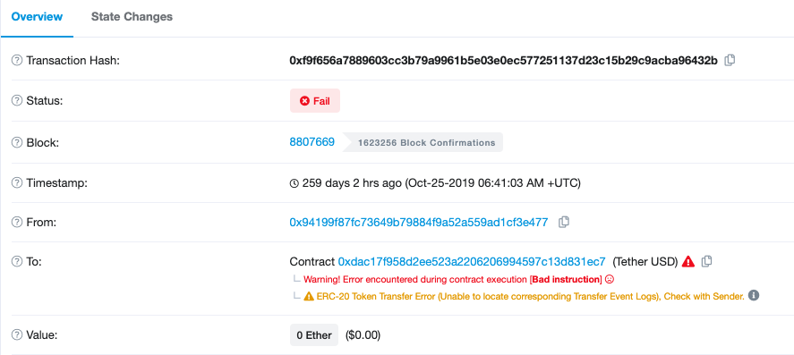
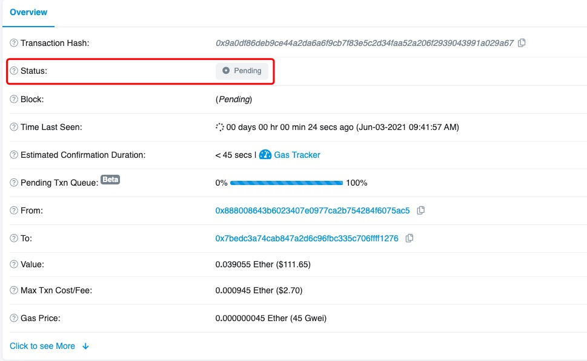

# 钱包充值资产到交易所未到账

首先，区块链资产转账分为三个环节：**钱包出账-区块确认-交易所入帐**。 

如果从TokenPocket提币没有到账，请按照以下步骤进行核查：

**1、查看钱包是否出账：**  
在TokenPocket完成提币后，提现记录将会显示在【转出】记录页面，一旦生成交易ID，表示该提币已经在链上，即完成钱包出账这一过程，这时，你需要点击交易ID查看链上情况。

**2、查看链上情况：**  
根据不同区块的特性，每一笔转账都会需要一定的时间来被区块确认并发送至接收平台。  
1）当区块链显示未确认，且区块确认数未到达交易所所需的上账确认数时，请耐心等待。区块链确认完毕后，交易所才能为您上账；

2）当区块链显示已确认，但充值资金仍未到账时，可以联系交易所客服进行咨询。 

根据不同区块的特性，每一笔转账都会需要一定的时间来被区块确认并发送至接收平台。不同的数字货币所需的“确认数”也会不同，如：充值BTC需要 1 个区块确认数才能到账，充值ETH需要12个确认数，而且，不同的交易所对区块确认数的定量不一，这一点需要以交易所的显示为准。

**如何进入区块查询？**  
1、在TokenPocket完成提币后，在【资产】-【币种】-【Token详情】的【转出】记录中点击交易ID，然后扫码查看或者直接点击底部的图标在链上查看交易详情；

  
2、扫码进入后，查看【Status】（交易状态）。

1）如果显示Success，则表示该笔提现在区块确认中已经完成，如未收到资产，需要联系交易所客服处理。

2）如果显示Fail，则表示该笔提现失败，很大一部分原因是因为你的gas费不足导致的。你可以在TokenPocket查看资产是否被扣，如未被扣，重新发起一笔较高的gas费进行提币即可。

提示：即使交易失败，支付的 Gas 不会被退还。

3）如果显示Pending，则表示该笔提现在待确认中，此时你需要请耐心等待区块打包你的交易，或者通过增加gas费来加速这笔交易。

**提示：**由于区块链转账的不可逆性，TokenPocket无法取消、撤回已经成功的转账，而是需要由收款方（交易所）帮助你找回未到账的币。

**常见的公链浏览器：**  
[以太坊浏览器](https://cn.etherscan.com/)  
[币安智能链](https://bscscan.com/)  
[火币生态链](https://hecoinfo.com/)  
[波场链](https://tronscan.io/#/)

