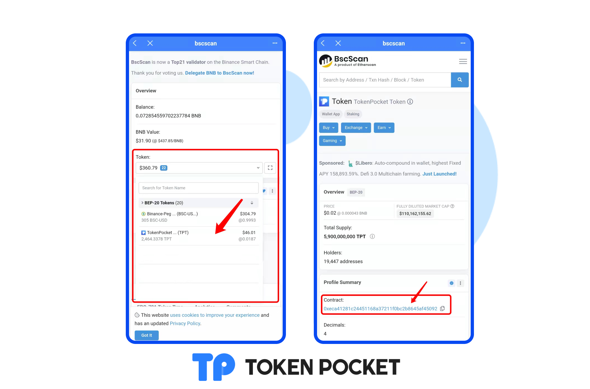

# 如何在BSC区块浏览器查询资产？

1.打开TokenPocket APP，在DApp浏览器内输入[https://bscscan.com/](https://bscscan.com/)，进入BSC区块浏览器。在搜索栏输入您的BSC钱包地址。

2.点击【Token】，即可看到您钱包地址内的所有资产。 在钱包内添加未显示资产，只需要在浏览器复制相对应资产的合约地址，在TokenPocket资产页面的【+】那里输入合约地址，点击添加即可。 注意：合约地址是辨别真假代币的唯一标准，添加代币时请勿直接输入代币名称进行添加。

3.点击【Token】，即可看到您目前的钱包所有资产，点击您所需要添加的资产，进入代币信息页面，点击合约地址即可复制。[**如何在资产页面添加代币？**](https://help.tokenpocket.pro/cn/token-management/add-token)****

<mark style="color:red;">****</mark>[<mark style="color:blue;">**代币合约地址如何查看？**</mark>](https://help.tokenpocket.pro/cn/fqa/blockchain-explorer-tutorial/bsc-explorer-tutorial/inquire-token-information)<mark style="color:blue;">****</mark>
