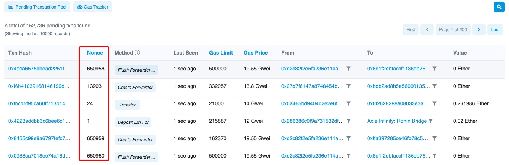

# 为什么转账一直在打包，怎么办？

交易迟迟未转账成功，显示一直在打包中，大抵有两个原因，一是链上的交易过多，出现拥堵状况，此时，你可以选择增加Gas费用加速你的交易，或者选择耐心等待；二是你在转账时，选择了过低的手续费，因为矿工优先打包Gas费高的交易，因此，你的转账将显示一直在打包中，此时，你可以选择增加Gas费来加速你的交易。

为了更加明白为什么转账一直在打包，我们需要明白一个和打包顺序有关的名词：Nonce值（全称：Number once），Nonce是一个在加密通信只能使用一次的数字。在认证协议中，它往往是一个随机或伪随机数，以避免重放攻击。

在以太坊上，每笔交易都有一个值叫 nonce，这个值用于计算一个以太坊地址中**发出**的交易数量。一个以太坊地址里的所有转账会按照你发起转账的时间，给每一笔交易排序，从 0 开始计数。地址每发送一笔交易，交易的随机数 nonce 就会增加 1，而转入这个地址的交易则不会改变 nonce 值。

对于nonce值，以太坊区块链有三条规则：

1、矿工需要按照 nonce 值从小到大去打包转账，所以在 nonce 为 0 的交易未被矿工打包前，nonce 为 1，2，3···的交易无论矿工费给的多高，都必须一直排队等着。

2、nonce 是连续的，不能跳过。当 nonce 为 1 的交易没有发起时，nonce 不能从 0 直接跳到 2，即 nonce 为 2 的交易只能发生在 nonce 为 1 的交易后面。

3、如果有两笔交易 nonce 相同，其中一笔交易成功后，另外一笔交易就会显示被替代，转账失败。

因此，通过[加速交易](https://tphelp.gitbook.io/cn/transfer-tutorial/cancel-and-accelerate-transfer)来加快转账速度的原理很简单，就是再发起一笔 nonce 值相同，但矿工费更高的转账，来覆盖原来的。这样这笔交易就会更快被打包，原来的转账则被替代掉。

**相关文章：**  
1）[如何管理未打包交易？](https://tphelp.gitbook.io/cn/faq/ethwallet/unpackaged)  
2）[如何在以太坊交易加速](https://tphelp.gitbook.io/cn/faq/ethwallet/transaction-accelerator)

