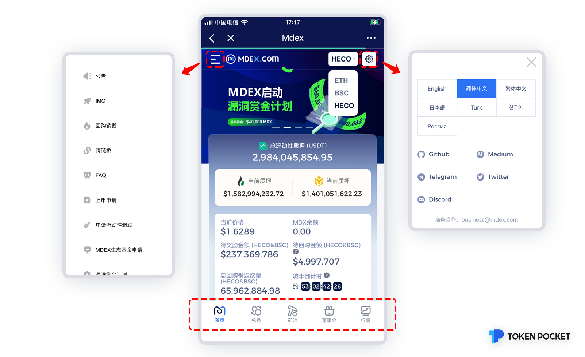
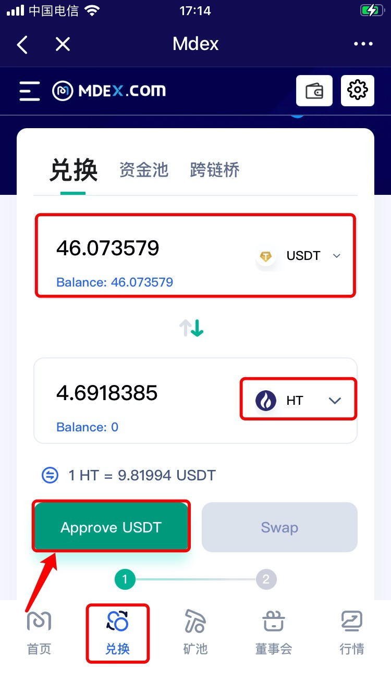
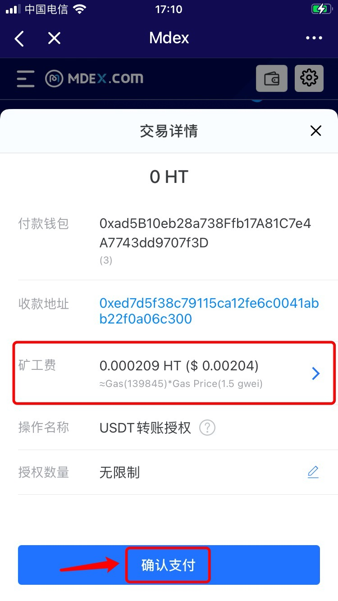

# MDEX（HECO）使用教程

**关于**[**Mdex**](https://mdex.com/#/)  
****MDEX是基于自动化做市机制的去中心化交易产品，旨在融合多种基础公链的差异化优势，打造高性能复合型DEX生态，以流动性挖矿与交易挖矿的“双重挖矿激励”给予参与者最大化回馈，并通过手续费回购销毁机制实现了自驱式价值捕获生态闭环。

MDEX致力于打造集DEX、IMO、DAO为一体的DeFi平台，为更多优质资产提供一站式流动性服务，为用户提供更加安全可信、资产多样、高性价比的交易体验。（本教程以在HECO生态链上为例）

**一、如何使用【兑换】功能？**  
1、打开TokenPocket，创建或选择钱包，选择或创建Heco钱包，点击底部【发现】，然后在顶部搜索MDEX进入界面。

2、进入页面后，点击顶部左侧导航栏可查看所有功能，点击顶部右侧工具栏可切换语言，底部为主要功能区；

3、点击底部【兑换】，第一次进行代币兑换时，需先进行【授权】操作。输入兑换代币和选择兑换数量，选择接收代币，然后接受代币的数量将自动计算显示，然后点击【Approve】；（此处以USDT兑换HT为例）

4、点击【确认支付】进行授权，然后返回页面后，点击【Swap】，输入钱包密码后进行兑换交易即可。

提示：您可以点击【矿工费】自定义调节费用，提高链上的转账速度。

**联系MDEX，请点击**[**这里**](https://t.me/MixDex)**。**


本教程仅为DApp在钱包端的操作指南，不代表TokenPocket的投资建议。投资有风险，您须充分认识风险，并自行作出投资决策。


