# 如何在TokenPocket使用Klaytn?

**关于**[**Klaytn**](https://www.klaytn.com/)  
****Klaytn是以服务为中心的企业级分布式信任区块链平台。它通过高效的“混合”设计，结合了公共区块链（分散数据和控制，分布式治理）和私有区块链（低延迟，高可扩展性）的最优功能。Klaytn与全球众多知名品牌的参与合作，通过共同的不懈努力，创建可靠的去中心化业务平台。Klaytn会使当今的企业和企业家能够利用区块链技术获取更优厚的价值。未来将由GroundX的Klaytn设计。

**如何在TokenPocket创建Klaytn钱包？**

1、打开TokenPocket App，点击左上角切换钱包底层，然后往下滑动找到Klaytn图标后，点击【添加钱包】；

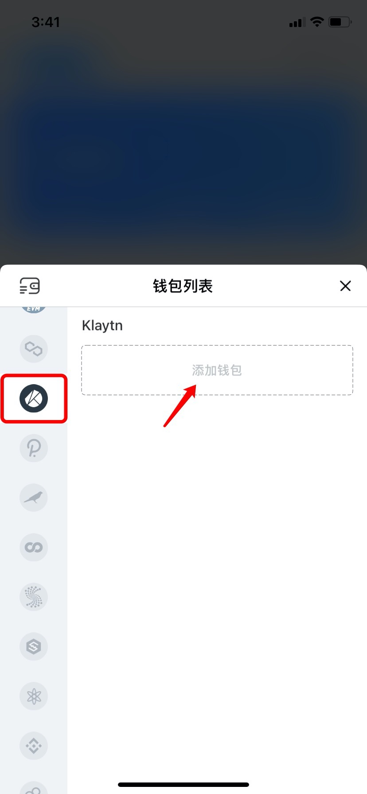

2、点击【创建】进行创建Klaytn钱包；

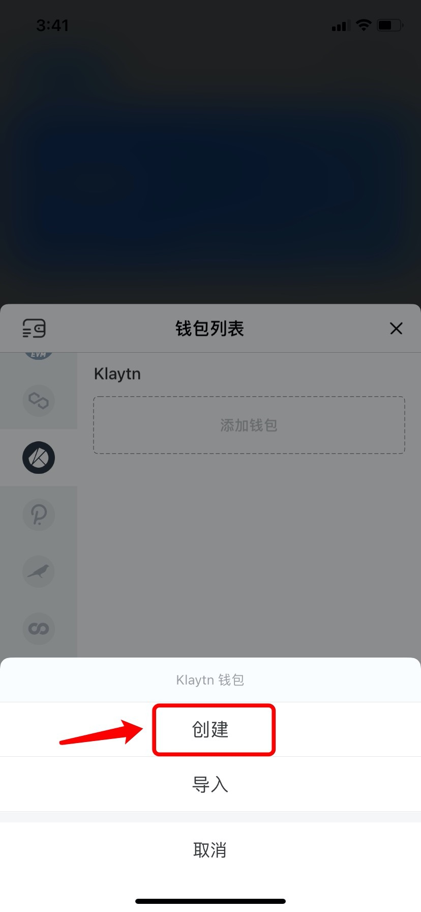

**相关文章：**  
1）[如何创建钱包？](https://tphelp.gitbook.io/cn/wallet-management/create-wallet)  
2）[如何导入钱包？](https://tphelp.gitbook.io/cn/wallet-management/import-wallet)

\*\*\*\*

**如何使用**[**OrbitBridge**](https://bridge.orbitchain.io/)**将以太坊的资产转入Klaytn钱包?**

1、打开[OrbitBridge](https://bridge.orbitchain.io/)网页（目前不支持App端的操作），点击右上角【Select Coin】选择需要转入Klaytn链的代币；

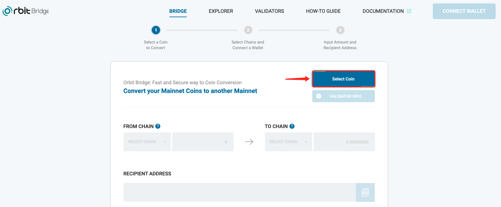

2、点击需要转账的代币，然后点击【OK】；（此处以转入ETH为例）

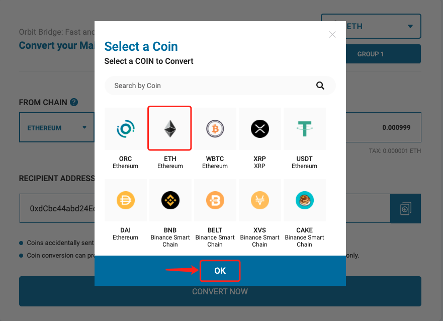

3、选择一组ETH验证组，点击【OK】继续；

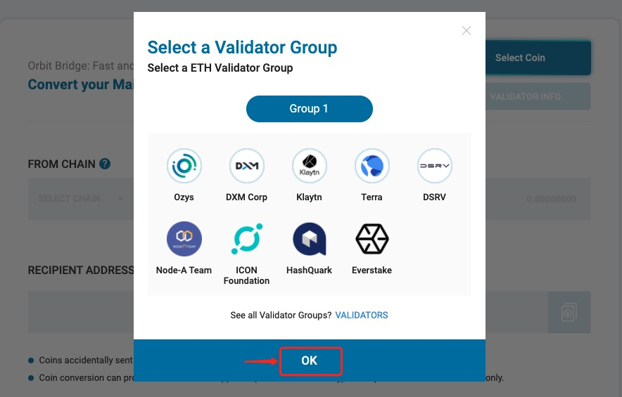

4、接下来在【FROM CHAIN】中点击下拉按钮进行选择转出代币的链；（此处以从以太坊链到Klaytn链为例）

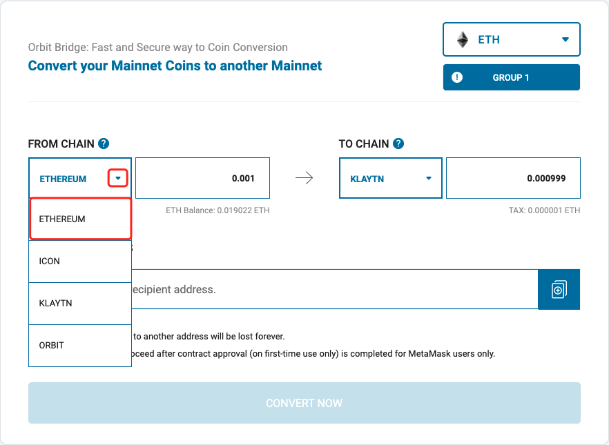

5、随后将出现弹窗连接接钱包；（支持链接MateMask钱包）

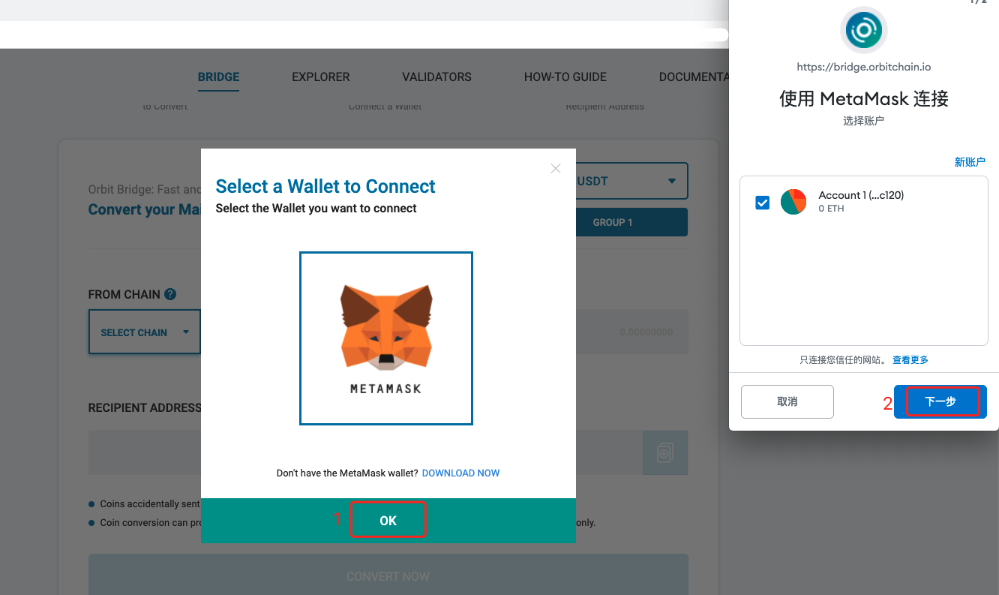

6、钱包连接成功后，输入转出代币的数量，然后在【TO CHAIN】中选择Klaytn链，接收代币数量将自动显示；

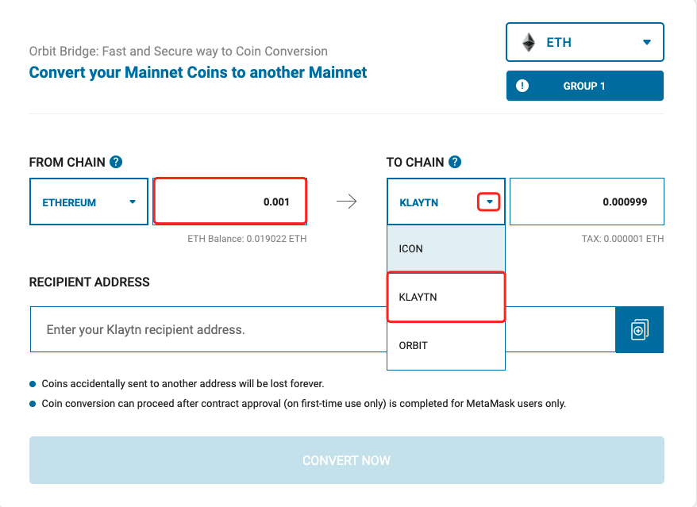

7、接着输入代币的接收地址**，**然后点击【CONVERT NOW】进行跨链兑换；

**注意：1）输入接收地址时，请确认是否为该链的代币接收地址。  
2）兑换时，钱包需要预留一部分的手续费。**

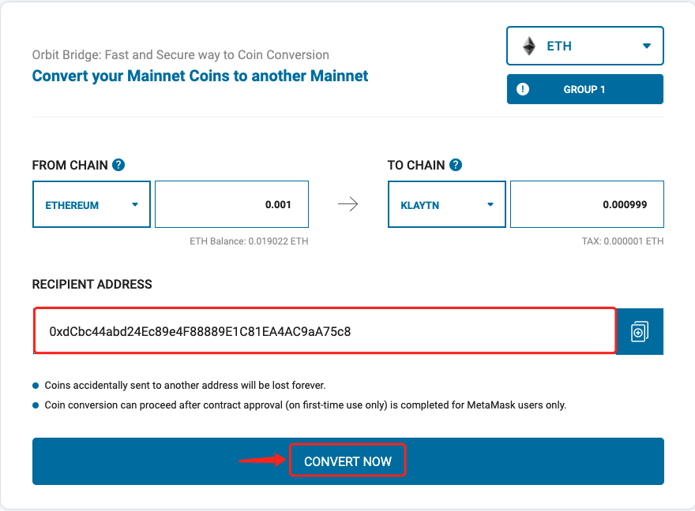

8、确认交易信息无误后，点击【Confirm】**，**然后在弹出的钱包页面点击【确认】继续下一步；

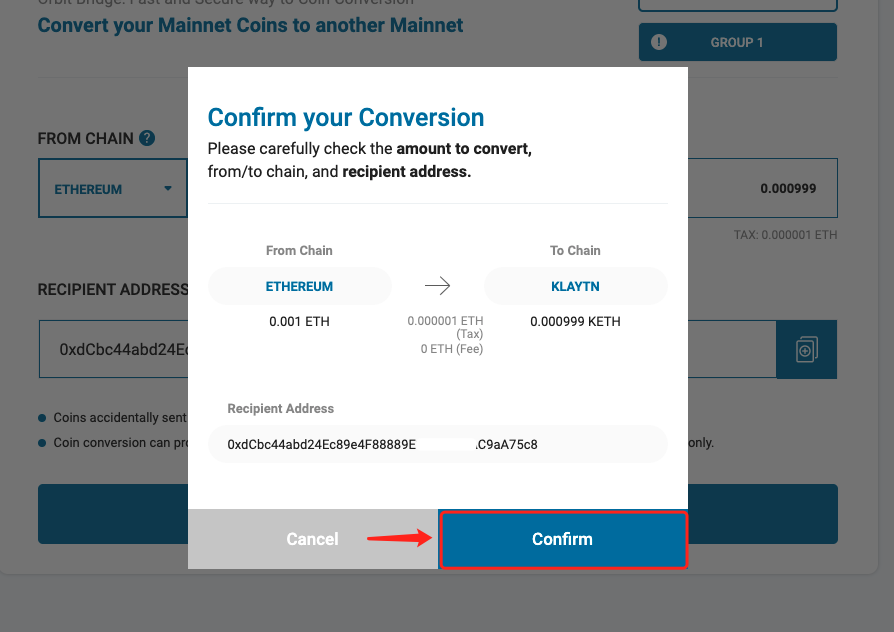

9、等待片刻后，将弹出转账完成的通知。点击【Tx History】可在浏览器查看转账情况，转账完成后，可进入Klaytn钱包。

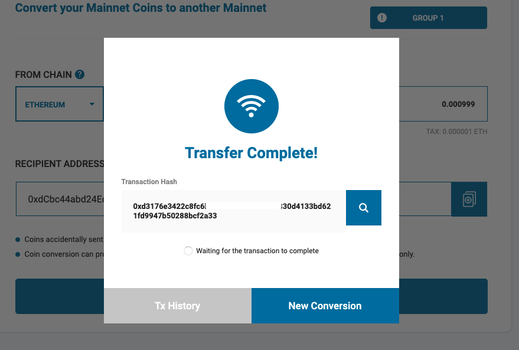

\*\*\*\*

