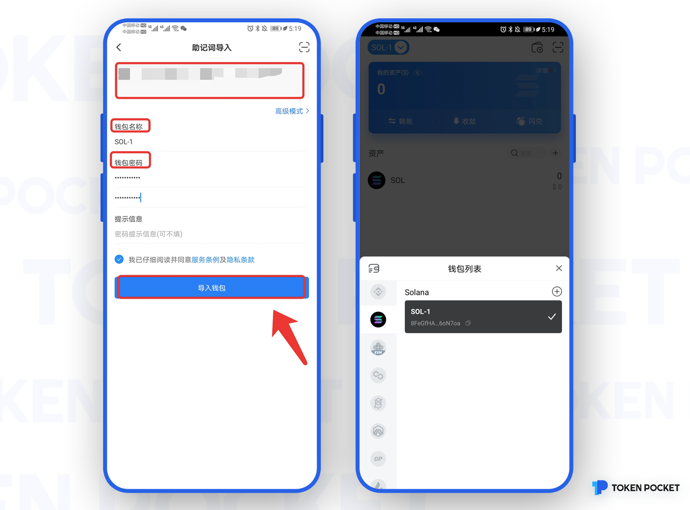

# TokenPocket一文带你玩转Solana!

**如何在TokenPocket创建Solana钱包？**

1、打开TokenPocket App，点击左上角切换钱包底层，然后选择Solana，点击【添加钱包】；

2、点击【创建钱包】；

3、依次设置【钱包名称】和【密码】，然后勾选【服务及隐私条款】，点击【创建钱包】；然后开始备份助记词，点击【备份完成，进行验证】；

**注意：请勿将助记词透露给任何人！**

4、按照顺序验证助记词，然后点击【确认】。至此，你已经成功创建Solana钱包。

**如何在TokenPocket导入Solana钱包？**

1、打开TokenPocket App，点击左上角切换钱包底层，然后选择Solana，点击【添加钱包】；

2、点击【导入钱包】，点击【私钥导入】或【助记词导入】；

3、以助记词导入为例，输入备份的【助记词】及【钱包名称】、【密码】，勾选【服务及隐私条款】；点击【导入钱包】，至此，你已经成功导入Solana钱包。

**注意：为保护您的资金安全，请勿将助记词或私钥透露给任何人！**

