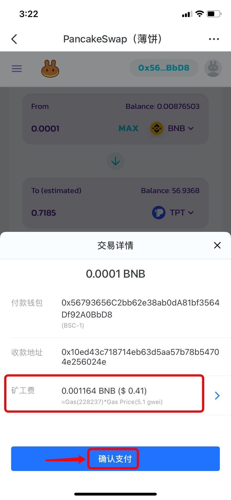

# 使用PancakeSwap（BSC）教程

**关于**[**PancakeSwap**](https://pancakeswap.finance/)  
PancakeSwap是一个自动做市商（“AMM”），目前近允许在**币安智能链**上交换两个代币。它快速、便宜，并且允许任何人参与。

PancakeSwap涉及的功能比较多，分别有【兑换】、【资金池】**、**【Staking】和【跨链桥】等功能，这里我们主要讲解兑换和资金池这两大块功能。

**一、如何使用【兑换】功能？**  
1、打开TokenPocket，点击底部【发现】，然后在顶部搜索PancakeSwap即可找到并打开DApp；

2、DApp顶部是主要功能区，进行兑换操作前请先点击右上角连接钱包。  
点击【Swap】，然后设置需要兑换的代币和数量（自动匹配），点击【Swap】进入确认兑换页面；（此处以BNB兑换TPT为例）

3、确认兑换信息无误后，点击【Confirm Swap】进行授权；

4、耐心等待授权后，进入支付页面，点击【确认支付】，然后输入钱包密码即可完成兑换。

（提示：可点击【矿工费】自定义gas费用。）

**二、如何使用【资金池】功能？**  
1、我们需要分成两步：授权和提供流动性  
首先点击顶部【Liquidity】，然后点击【Add Liquidity】；

2、选择注入流动性的两个代币，并输入代币的数量（输入一个代币的数量后，另一个代币的数量将自动填入），点击【Approve TPT】进行授权；（这里以添加BNB和TPT为例）

3、确认信息无误后，点击【确认支付】；

4、输入钱包密码后完成授权操作，返回页面，点击【Supply】给资金池提供流动性；

5、确认信息无误后，点击【Confirm Supply】；

6、点击【确认支付】以完成流动性的添加；（点击【矿工费】可以自定义gas费用）

7、当链上转账完成后，返回页面，即可看到你的流动性详情。

**三、如何提取流动性？**  
1、PancakeSwap 支持随时赎回注入的流动性代币，如需提取收益，在【Liquidity】页面点击【Remove】；

2、提取流动性的过程中，同样也需先进行授权操作。进入页面后，选择提取数量和代币（此处以提取BNB和TPT为例，可以滑动滑杆来调节数量），然后点击【Approve】以授权；

3、点击【确认】并输入密码以完成授权；

4、返回页面后，点击【Remove】来提取你的流动性；

5、确认信息无误后，点击【Confirm】即可完成提取流动性。你可以返回【资产】页面查看你提取的代币。


本教程仅为DApp在钱包端的操作指南，不代表TokenPocket的投资建议。投资有风险，您须充分认识风险，并自行作出投资决策。


\*\*\*\*

