# 跨链聚合闪兑平台Xswap2.0 教程

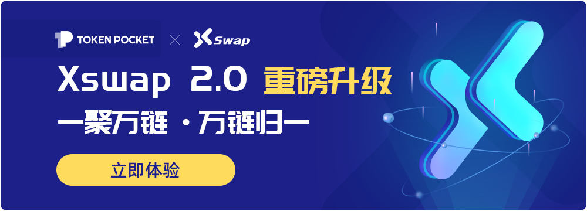

**关于Xswap：**

TokenPocket孵化的跨链聚合闪兑平台，将集去中心化闪兑、聚合交易、一站式跨链等功能于一身，用户无需经过认证，即可完成去中心化的即时交易，并完成TokenPocket支持的多链资产的即时兑换。

Xswap的跨链聚合闪兑平台将会打通主流公链资产的跨链流动性通道，为用户和项目提供一站式的跨链服务，旨在打造头部公链跨链流量聚集地。

**Xswap2.0 功能简介：**

Xswap2.0新版本在1.0的跨链兑换基础上增加了聚合闪兑功能，根据用户登录当前所在公链的DEX来自动分析最优价格来兑换，使代币转换率最优，达到“一聚万链，万链归一”。

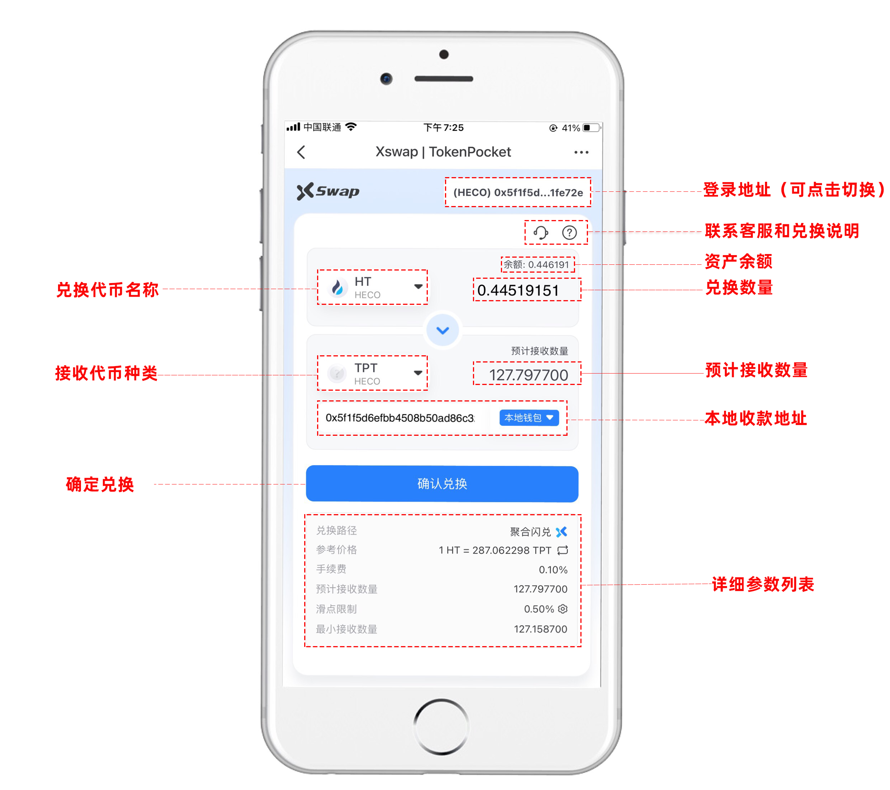

**Xswap2.0 使用教程：**

1、打开TokenPocket, 点击【资产】页面的【闪兑】，或在【发现】页面搜索【Xswap】。进入闪兑页面后，选择待兑换的代币种类。（以HECO链上HT兑换USDT为例）

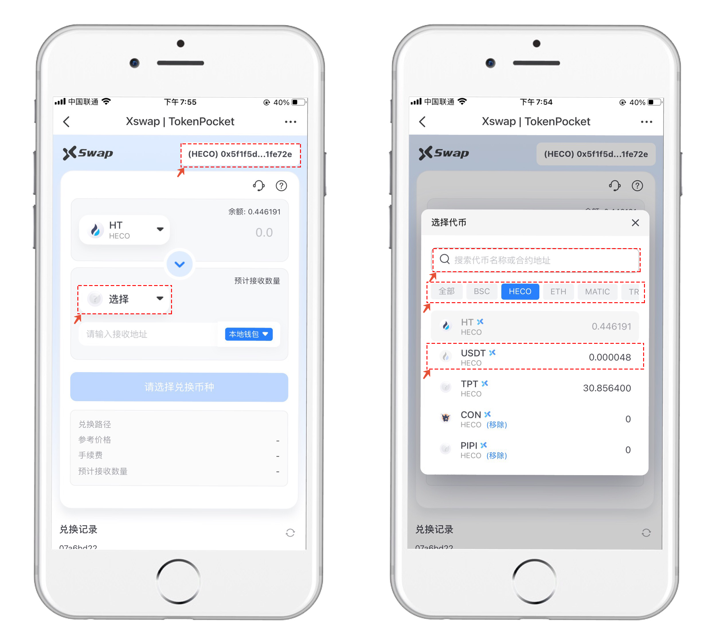

2、选择好兑换代币，设置想要兑换的代币数量（务必要留下足够的矿工费），接收代币的数量将自动显示。收款地址会默认当前登录地址。点击下方的【聚合闪兑】打开界面中可以看到当前公链中的常用DEX的兑换比例，Xswap这里可以获得最优的兑换。（聚合闪兑会收取一定手续费）

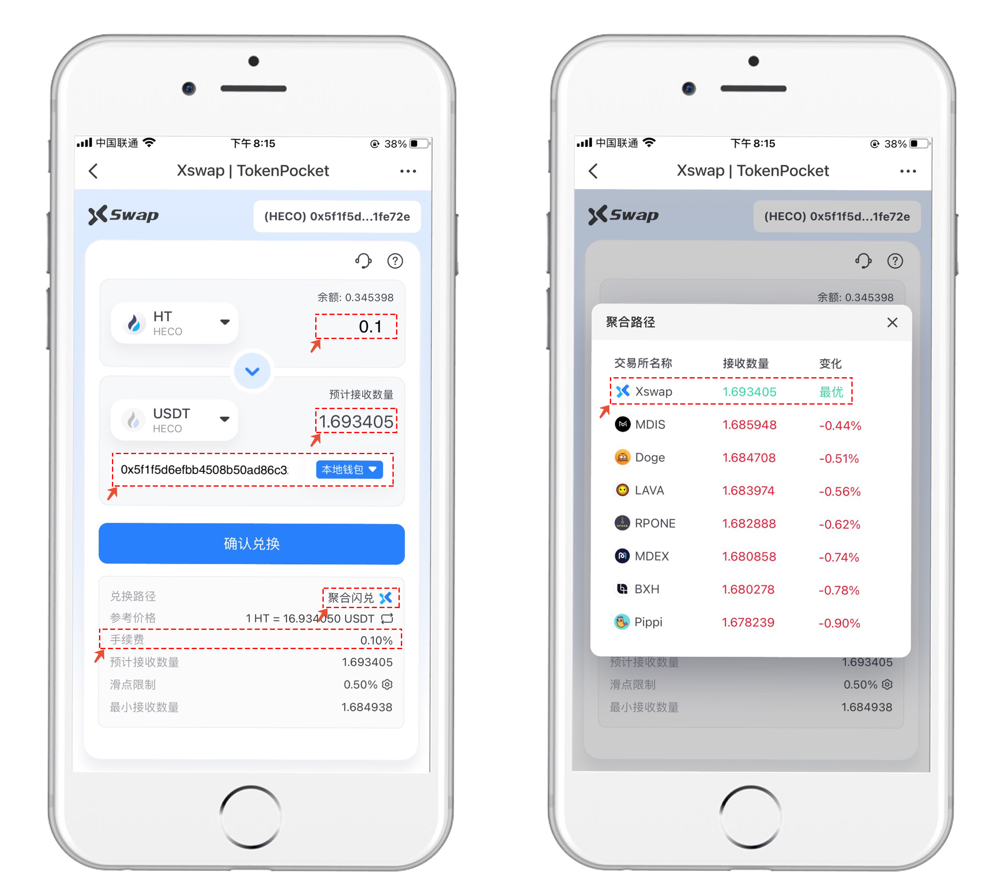

3、兑换授权后，可以在下方的【兑换记录】里看到当前聚合闪兑的交易状态。兑换成功后，【兑换记录】右上侧可以【删除】兑换记录或者【刷新】兑换状态。

注意：如果遇到当前公链网络拥堵的时候，可以在授权的时候灵活调整更高矿工费达到加速交易的目的。

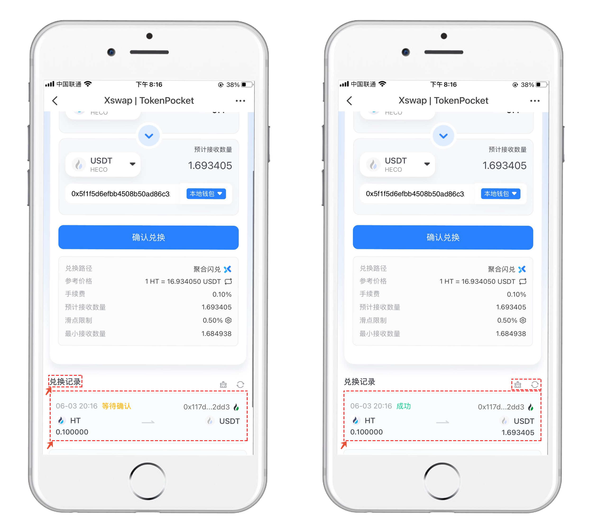

**不在列表中的代币如何进行兑换交易？**

1、在Xswap2.0 的代币列表中只显示有部分代币，那么如果需要交易其他代币如何操作。点击选择需要兑换的代币，在列表上部的搜索栏可以填入代币的合约地址来搜寻所需代币（只要是在链上发行的代币都可以搜索到）。

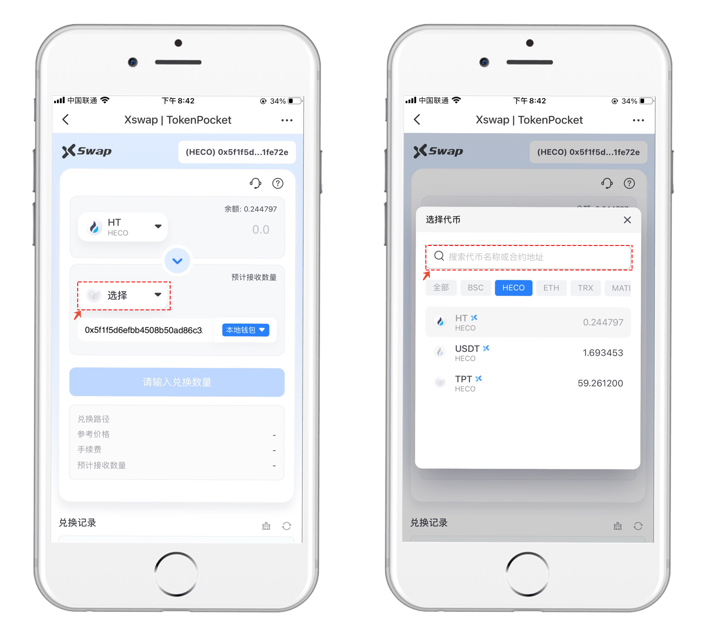

2、搜索到代币后，点击【添加】弹出添加自定义代币窗口，注意查看红色字体内容，请认真核对好代币合约地址，以防添加假币，在确认后点击【确认添加】即可进行兑换。

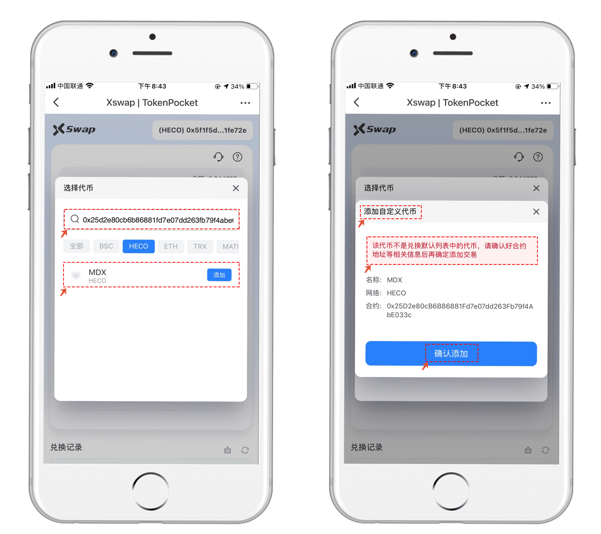

3、添加所需代币后，只需要在列表中选择已添加的代币和兑换目标代币，设置数量后点击【授权】进行聚合闪兑即可。

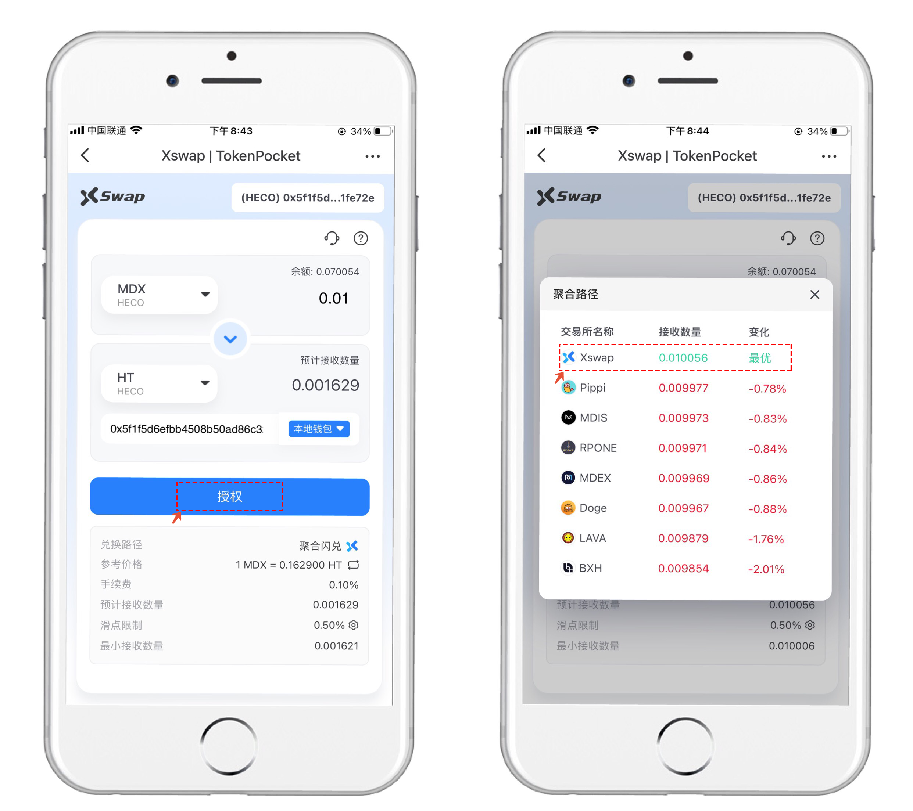

**注意事项：**

1、选择代币列表中可以看到币安小图标的代表可以跨链兑换，X小图标的代表可以进行聚合闪兑。（当前公链下的聚合闪兑）

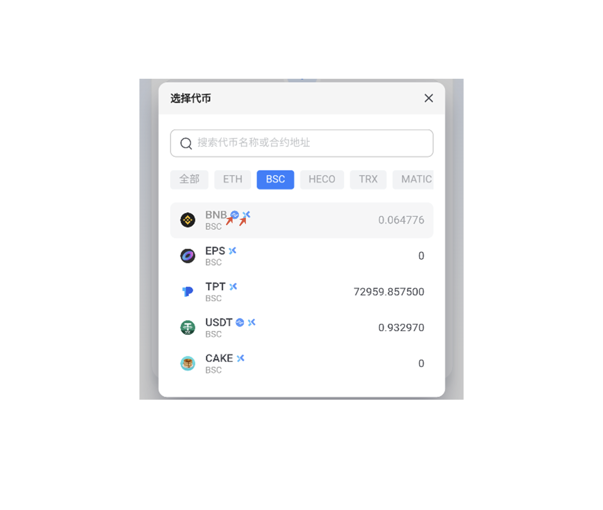

2、不同公链间兑换，不可以使用箭头所示的双向变换功能。

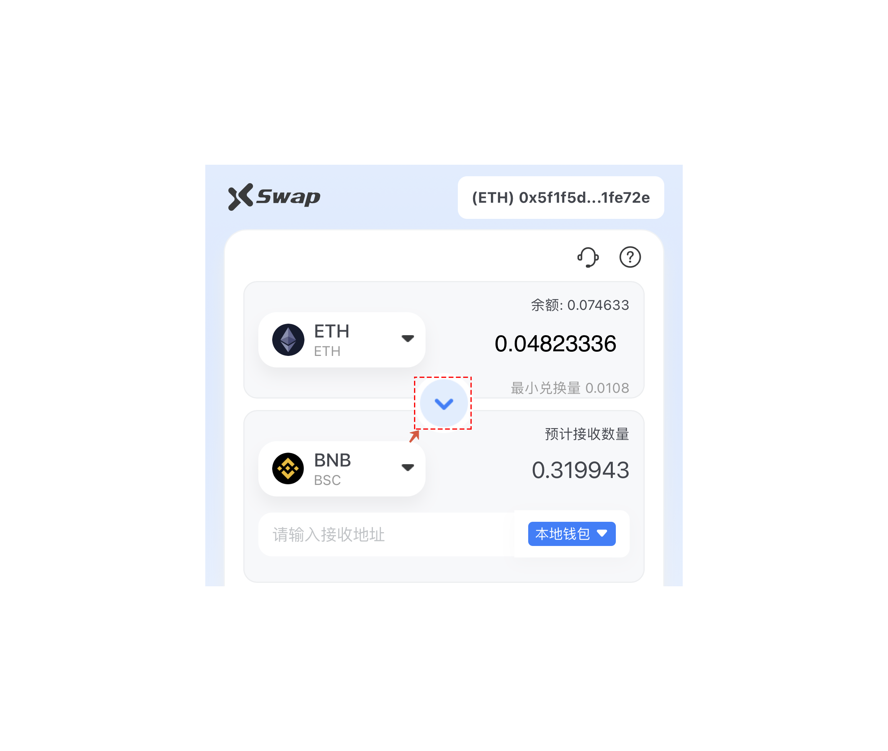

3、遇到交易有销毁机制类代币，会需要提高滑点方可兑换成功，所以在聚合闪兑中可以点击滑点来根据自己的实际情况灵活调整。

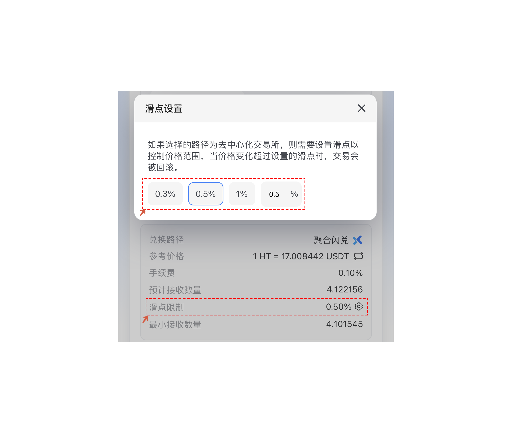


本教程仅为DApp在钱包端的操作指南，不代表TokenPocket的投资建议。投资有风险，您须充分认识风险，并自行作出投资决策。


