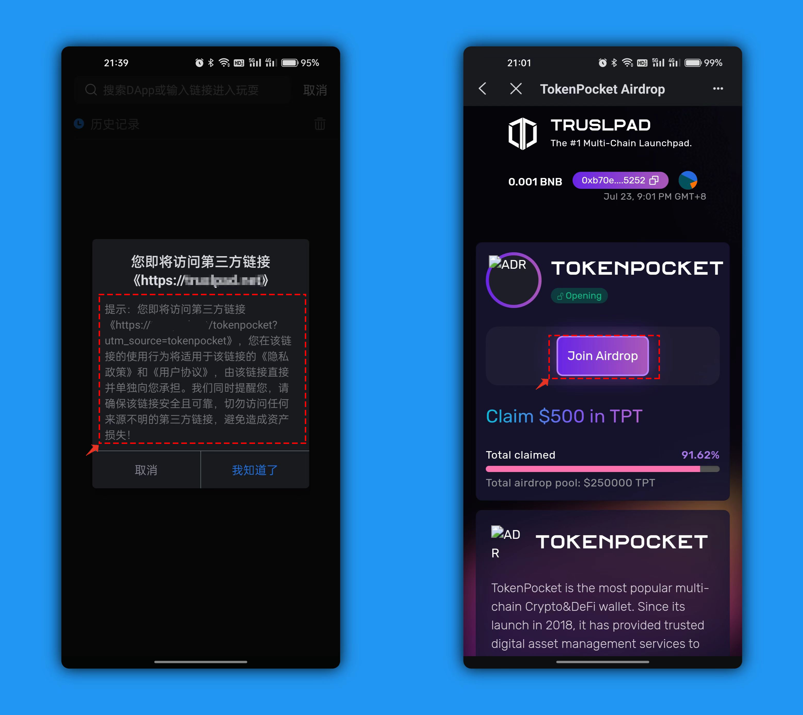

# BSC链恶意授权诈骗

<mark style="color:blue;">**Approve的释义：**</mark>

&#x20;Approve即授权。它允许持有 Token 的用户，通过调用 Approve 方法，授权给指定账户一定额度，赋予该账户自由支配额度内 Token 的权力。如果授权给恶意账户，那么授权资产就会有极大风险。

<mark style="color:blue;">**恶意授权的表现方式：**</mark>

1、日常使用第三方DApp的时候都是通过打开TokenPocket，点击【发现】，在顶部的地址栏填入链接后打开。打开链接后会弹出风险提示，这里是提示您要确认使用的链接安全性，如果无法确认安全那么一旦授权后有很大概率会导致资产被盗。

今天的案例就来自于一个号称TokenPocket 空投的骗局，打开链接后可以看到整个DApp的制作比较精良，说明中有关于活动的介绍，只需要点击【Join Aridrop】并授权就可以得到空投的代币。

2、点击【Join Aridrop】会自动调用钱包授权，首先弹出的是【即将执行授权操作】这里就需要引起高度注意，点击下一步后来到了【交易详情】界面，在这里可以看到【授权地址】的合约地址在申请USDT的转账授权权限，到这里就应该停下来不要去继续执行操作，因为一个普通的空投为什么要调用USDT的授权？如果没有信任钱包弹出的层层风险提示去执行了授权，那么就会导致所有的USDT被盗。

我们来深入分析一下。

.png>)

3、复制授权地址到BSC浏览器打开搜索，在这里可以看到这个恶意的地址已经被BSC官方列入了黑名单列表中。

.png>)

通过这个恶意地址的链上执行记录，我们找到了一个被盗的地址哈希值执行记录，在这里可以看到USDT的转账发起地址是恶意的地址，转出的是是丢失代币的地址，而正常 情况下操作的发起地址和发出地址都应该相同。这里的恶意地址是起到了直接发起合约调用盗币的操作。

.png>)

通过BSC上的[<mark style="color:blue;">**授权检测工具**</mark>](https://bscscan.com/tokenapprovalchecker) <mark style="color:blue;">****</mark> 查看授权历史记录，在这里可以看到恶意的地址是存在于授权列表中的，也就是说如果这个代币的地址再次转入USDT到钱包中会马上被盗。

.png>)

确定是被恶意授权盗币后，请停止这个地址的使用，使用工具来清理权限或者最彻底的方法是新建一个地址来转移其他的资产。恶意授权只会影响授权的代币的安全，其他的代币是没有权限调用的。
