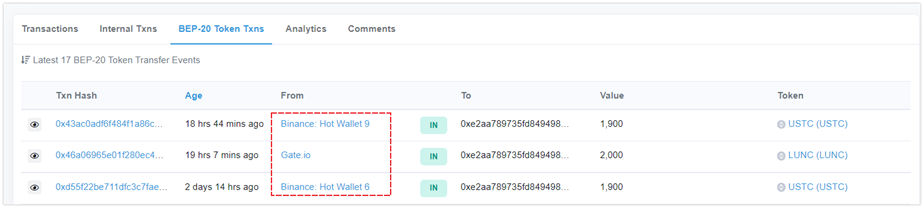

# 警惕新型空投诈骗

<figure><figcaption></figcaption></figure>

近期接到用户反馈，说收到了来自交易所的空投代币（此诈骗方式可以模仿任何的平台标签），当用户去参与执行这个代币的时候发现代币会存在一些问题，例如可以买入却无法卖出等情况，对此TokenPocket安全部门针对用户反馈的链上信息进行分析，<mark style="color:blue;">**发现这是一个通过利用浏览器/钱包解析转账交易记录的方式来伪造任意地址之间转账的交易记录的新型诈骗。这种交易记录的伪造只能针对诈骗者发行的代币。 主流的代币交易诈骗者无法伪造。**</mark>

因此防范此类空投诈骗的最有效的方法，就是不相信任何不明来历的空投，交易所也不会主动给链上钱包进行空投，面对纷繁复杂的环境，一定要做好自我安全知识的积累，加强反诈骗知识的学习，做到任何主动私聊的人的都不要信，任何推荐的官网或app都不要使用，不随意打开三方链接并授权，私钥、助记词安全保存不要丢失和分享给任何人。
