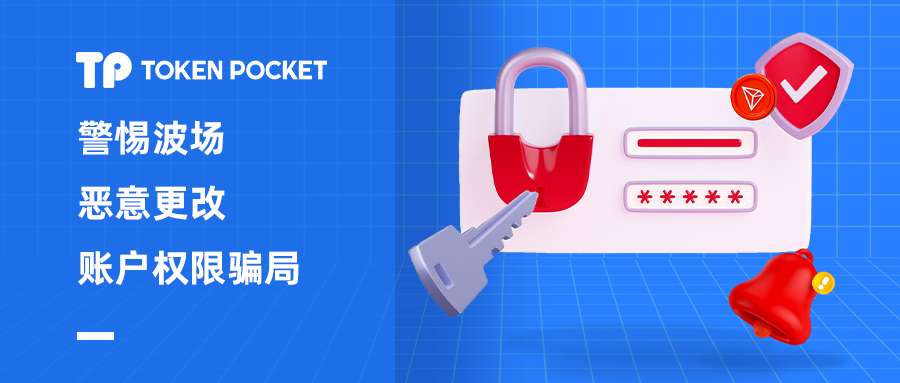

# 警惕波场恶意更改权限骗局

<figure><figcaption></figcaption></figure>

近期有部分社区用户反馈波场钱包被莫名的执行了多签，导致Token无法操作。针对这类问题我们整理了本次的波场多签的相关科普，希望可以帮助用户了解波场多签的原理，认识到恶意更改权限的危害，更好的保护资产安全。

### <mark style="color:orange;">**波场多签场景**</mark>

根据和用户的沟通及相关数据的验证，得到了以下几种可能会导致多签的场景。

1、自己设置了多签，需要自己管理地址执行签名；

2、使用假钱包导致私钥助记词泄露，被对方获取后设置多签；

3、网络获取的私钥助记词导入钱包，该地址已经被多签；

4、执行了第三方恶意链接，并且签名完成了更改权限操作。

<mark style="color:blue;">**波场钱包地址创建后是默认的单权重设置，可以执行任何的链上操作，如果地址被多签，一定是因为私钥或助记词的泄露或执行恶意链接导致的权限变更。**</mark>\

### <mark style="color:orange;">**波场多签简介**</mark>

波场（TRON）的多重签名机制是一种安全措施，通过设置阈值和权重来限制特定的操作，只能在多个签名方的共同确认下才能执行。

在波场多签机制中，阈值是指多少个签名方需要确认才能执行特定的操作。例如阈值为 2，那么在执行特定操作时至少需要签名方权重大于等于阈值才进行确认。阈值可以在多签合约中进行设置，根据具体需求进行调整。

权重是指每个签名方的权重大小，它可以决定每个签名方在多签操作中所占比例。例如，如果设置了阈值为2，两个签名方权重为 1，那么在执行特定操作时，需要两个拥有权重为 1 的签名方的确认才可以生效。权重的设置需要在合约中进行设置，并且必须满足所有签名方权重之和大于等于总权重的要求。

<mark style="color:blue;">**通过设置阈值和权重，波场多签机制可以提高合约的安全性，防止合约被未经授权的操作所篡改或者被攻击者利用进行恶意操作。**</mark>\

### <mark style="color:orange;">**波场多签骗局**</mark>

波场的更改权限和Approve（授权）是有区别的，授权后影响的只有授权过的这个Token；而更改权限则会导致波场地址权限的变更，从而失去了对地址的管理权限。\

波场恶意的更改权限，多发生于一些使用TRC20充值的过程中，例如以很低的价格购买加油卡、礼品卡、使用一些验证码平台充值等途径。根本上就是利用了人们贪图便宜的心态进行布局，当用户使用他们提供的链接进行充值时，就会调用恶意更改权限的代码，当用户确认并输入密码签名后，地址的权限便发生了变更。

下面的是一个典型的恶意更改权限的案例。\

用户通过某种渠道得到了第三方链接，通过恶意链接的充值入口跳转到钱包中打开界面（如下图）。收款地址填写的是Token的合约地址，点击立即支付，提示不要复制地址进行转账，这个是骗子为了防止用户自行复制地址绕过恶意代码执行转账的“友情提示”。\

<figure><figcaption></figcaption></figure>

点击确认后弹出详情界面，在下图中通过三个箭头所示的位置提示正在进行的操作以及操作后可能带来的风险。点击第二个箭头位置，可以查看更改权限的作用和风险，如果无视风险提示并执行了操作，就会导致恶意更改权限。这时再进行转账就会看到错误的提示信息，实际上已经失去了对改地址的控制权。\

<figure><figcaption></figcaption></figure>

<mark style="color:blue;">**多签设置的初衷是为了更好的保护用户资产，但是被骗子精心利用后会成为其盗取资产的工具。所以请一定要认真查看钱包中出现的每一个提示，这些内容都是经过大量考证后才会添加的信息，适用于绝大多数用户。**</mark>

### <mark style="color:orange;">**多签骗局防范**</mark>

TokenPocket很早就支持了波场更改权限操作的预警提示，只需要认真的查看钱包中出现的提示信息就可以绕过大多数的骗局。同时请不要相信网络上虚假宣传的各类礼品卡、加油卡、验证码等网站，更不要参与他们的充值，尤其是提供充值跳转服务的链接。正常的充值类服务，只需要使用对方的收款地址转账就可以完成操作。

**如果遇到类似的诈骗链接，请发送到我们的邮箱：**<mark style="color:blue;">**service@tokenpocket.pro**</mark>** 进行举报，我们验证后会对链接进行本地化处理，防止更多TokenPocket用户上当受骗。**
