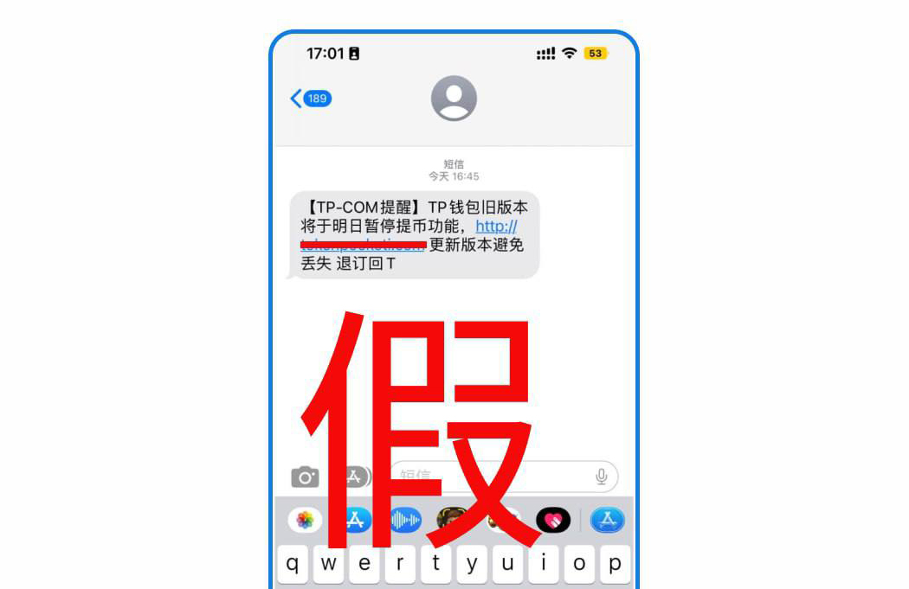

# 警惕短信分享假钱包骗局

<figure><figcaption></figcaption></figure>

TokenPocket社区用户反馈收到来历不明的【钱包更新提醒】短信，请注意，TokenPocket并未通过短信，邮箱等形式发布钱包更新提醒！请用户提高警惕，注意鉴别。<mark style="color:blue;">**任何通过短信，邮箱等聊天工具主动联系您的，都是诈骗！**</mark>

同时，TokenPocket是一款自托管的去中心化钱包，用户的资产仅由私钥和助记词控制，钱包不存在所谓的“提币”功能，用户转账等操作均能正常执行。

TokenPocket提醒所有用户备份好私钥和助记词。请不要相信任何自称是官方客服的人。任何给你发私信的人都是骗子! 不要与任何人分享私钥和助记词，请保持警惕! 如果你有任何问题，你可以通过电子邮件与我们联系。

电子邮件：service@tokenpocket.pro&#x20;

请认准TokenPocket网址：www.tokenpocket.pro  www.tpwallet.io&#x20;
