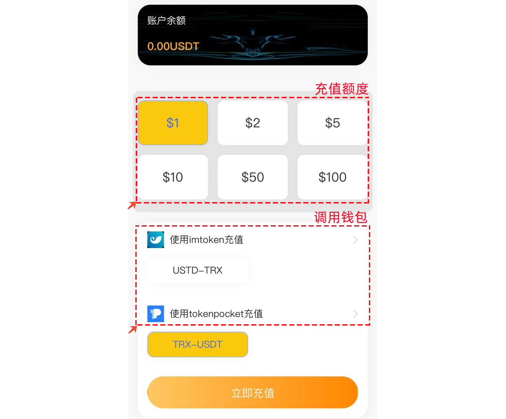

# 警惕接码类诈骗

接码平台，是指专门提供手机号为他人接收来自第三方平台验证码并将验证码提供给他人的资源平台，可以通过平台注册更多的APP账号。这种方式是不提倡的，因为多账号刷单或者其他的使用范围都属于违规的一种参与，不过这类平台总会有人去青睐。

接码类诈骗案例其实就是换了一层包装的恶意授权诈骗，他们会利用网站提供APP的下载，下载后需要使用接码功能就必须充值，例如下面的界面

<figure><figcaption></figcaption></figure>

充值额度和充值调用钱包都会在界面中提供选择，点击充值后就会调用打开钱包。因为执行的是合约调用而不是普通的转账操作，所以在TokenPocket中会看到风险提示，如果只是余额充值，那么为什么会调用USDT的合约授权呢？所以这个时候必须立即停止这个操作，马上跟我们的service@tokenpocket.pro 邮箱进行举报，防止更多人被这个同样的链接诈骗。

{% embed url="https://files.gitbook.com/v0/b/gitbook-x-prod.appspot.com/o/spaces%2F-MMF2k4MCaxErpZyah2d%2Fuploads%2FotiQUwJjR29IwJJOUPw4%2F2.png?alt=media&token=c9b1c13c-9c5f-481f-8397-b5112f43cbe3" %}

解码类诈骗方式的防范，只需要观察钱包中出现的授权调用的风险提示窗口，如果只是充值代币出现调用的窗口，那么百分之百都是诈骗，请一定不要继续使用和授权，并积极跟我们举报。

