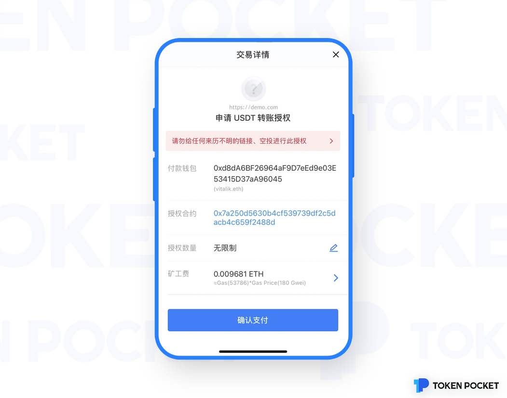

# 授权（Approve）一文详解！

**什么是授权（Approve）？**

授权(Approve)，就是允许另外一个账号（可以是普通的个人账号，也可以是智能合约账号），<mark style="color:red;">在不通知你的前提下</mark>，使用你的部分资产。

因此，该操作存在非常大的安全隐患！

**为什么要授权（Approve）？**

用以太坊网络举例，由于ETH是原生资产，在向目标智能合约转账的时候，本身会携带ETH资产到目标合约中；而非原生资产ERC20代币在向目标合约转账时，只是更改ERC20代币合约本身的账本信息，目标合约不会收到任何通知，因此approve操作是告知ERC20代币合约，将来某授权账号可以划转我的资产。

而授权（Approve)操作广泛的存在于ETH，BSC，HECO，波场（TRON），Polygon（Matic），OEC，Fantom，以及所有地址格式与以太坊一致的区块链网络中（即EVM兼容公链）。

**在使用钱包的过程中都有哪些场景会用到授权（Approve）？**&#x20;

在使用钱包的过程中，普通的转账并不会用到approve操作； 一般情况下，只有涉及到和合约交互（DApp、DeFi等），需要对合约进行授权的时候，才会进行授权（Approve）操作。

<mark style="color:red;">所以，当你在使用钱包的过程中，出现以下界面的时候，就是在向你询问授权（Approve）操作，那就一定要多加小心，多次确认当前你访问的链接是否是安全、可信的，才可以继续操作！</mark>

.png>)

**授权（Approve）有什么危险？**

<mark style="color:red;">授权（Approve），是允许第三方在不通知你的前提下，划转你的资产。往最严重的情况说，就是对方在你不知道的情况下，可以把你的某个资产全部转走。</mark>因此，如果你给一些不明来历的第三方应用进行授权，是存在着巨大的安全隐患的！ 所以，遇到授权（Approve）的时候，一定要多加小心！一定要确定对方代码是否开源，对方是否有做代码审计，对方团队是否是可信任的等等！

**怎么管理/取消授权（Approve）？**

请点击链接按照教程操作：[https://help.tokenpocket.pro/cn/secirity-knowledge/protective-measures/cancel-malicious-authorization](https://help.tokenpocket.pro/cn/secirity-knowledge/protective-measures/cancel-malicious-authorization)

**如何防范Approve骗局?**

1.不要参与<mark style="color:red;">来路不明</mark>的DApp，不要参与<mark style="color:red;">没有开源</mark>的DApp，不要参与<mark style="color:red;">没有审计报告</mark>的DApp，不要参与<mark style="color:red;">匿名团队</mark>的DApp，不要<mark style="color:red;">轻信社区传播</mark>的任何项目。&#x20;

2.定期使用DeBank,Cointool等清理授权工具进行授权清理;&#x20;

3.创建新的钱包，在授权等操作完成后，将Token转到新的钱包地址，该地址由于没有授权历史所以较为安全.&#x20;

（注：授权清理也不意味着绝对安全，目前市面上没有任何工具可以保障完全清理干净）
