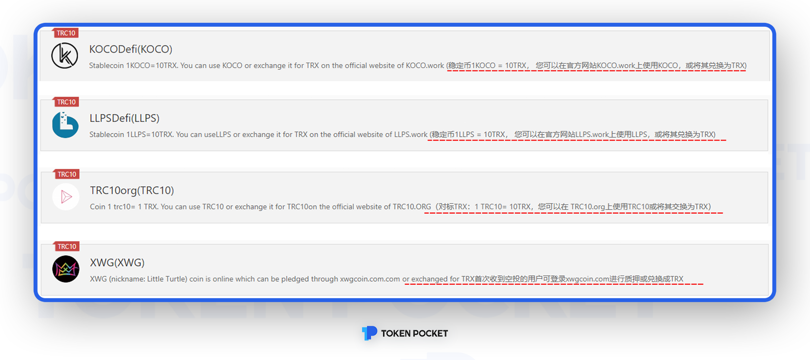
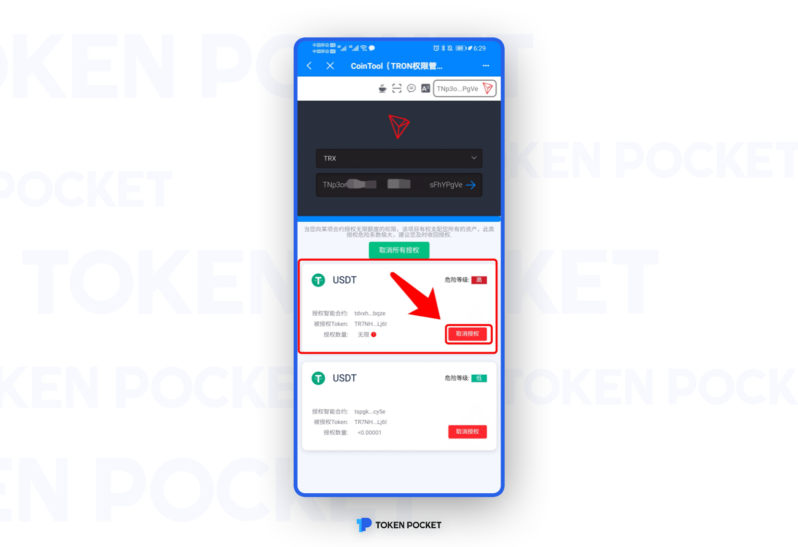

# 取消恶意授权，请马上行动！

Approve即授权。它允许持有 Token 的用户，通过调用 Approve 方法，授权给指定账户一定额度，赋予该账户自由支配额度内 Token 的权力。如果授权给恶意账户，那么授权资产就会有极大风险。

[about-approve.md](about-approve.md "mention")

**如何查看钱包地址是否授权？**

\-手机端操作教程-

1.打开TokenPocket App，搜索栏搜索「CoinTool」，系统将会自动显示各条链的权限，点击您所需要查询的链，即可进入授权查询页面；

.png>)

2.以波场为例，点击「CoinTool（TRON权限管理）」，点击「我知道了」，进入TRX授权查询页面。

.png>)

3.按照提示输入您需要查询的地址，地址授权情况就会出现在下方，如果该地址未授权，则会提示「你没有授权过合约，很棒！」

.png>)

这里是查询到该地址授权USDT的两个记录，那么界面中的说明是什么意思呢？

1、授权智能合约，我们在首次进行USDT兑换其他Token的时候首先会进行授权（Approve），授权完成后就会在这里留下痕迹；

2、被授权Token，这个就是对应的Token合约地址;

3、授权数量，这个在我们进行授权的时候，会在钱包里弹出的界面中灵活选择，默认的情况下是无限；

4、**危险等级**，这里的危险等级对应的**并不是病毒数据库**，这里直接和授权数量挂钩，**并不能代表绝对的安全或危险**；

**注：**使用JustSwap授权会在授权智能合约位置看到JustSwap的提示，此类授权都是比较安全的，如果查看到授权合约是普通的波场地址而不是JustSwap或Token合约地址，这类情况大概率就是恶意授权。丢失USDT的哈希值发起方一般都是这个恶意授权地址。

\-电脑端操作教程-

**区块浏览器查询（以TRON为例）**

1.使用电脑打开TRON区块浏览器https://tronscan.io/#/，输入钱包地址，进入「账户」页面。点击【授权列表】，即可查看钱包地址的授权情况；

.png>)

2.「授权列表」中，可以查看当前授权的地址。

.png>)

**如何确认恶意授权地址？**

**恶意授权地址有如下几个特征：**

特征一：来路不明的空投引诱

1.任意点开一个授权地址，点击【通证余额】，点开任意代币进行「通证转账」查看；

.png>)

2.在部分转账中，盗币者会附上备注，以空投为诱饵，让用户通过第三方的DApp来进行兑换。这是最常见的一种获取用户授权的方法，请注意防范！！切勿不要相信任何来路不明的空投，避免因小失大！！

.png>)

特征二：授权地址发行多个同类型代币

1.经过授权地址查看，发现该地址发行有多个TRC10的Token内容如下：

.png>)

2.这么多TRC10类型的Token，又不能在Swap中兑换，那肯定是另有他用，逐个点开查看Token得到以下内容：

Token介绍里面都附带了链接，用户打开Token介绍访问链接并授权后资产即被盗。

**注：**除此之外还有盗币者利用假的收款界面和用户进行转账交易，利用Approve恶意授权来达到盗币目的，所以一定要谨慎和他人交易。

**不要走开！！**

**重头戏来了！！！**

**如何取消授权？（以TRON为例）**

在确认该授权地址为恶意地址后，打开TokenPocket，进入CoinTool授权查询页面，选择需要取消授权的合约地址，点击【取消授权】完成上链操作，即可完成。。

