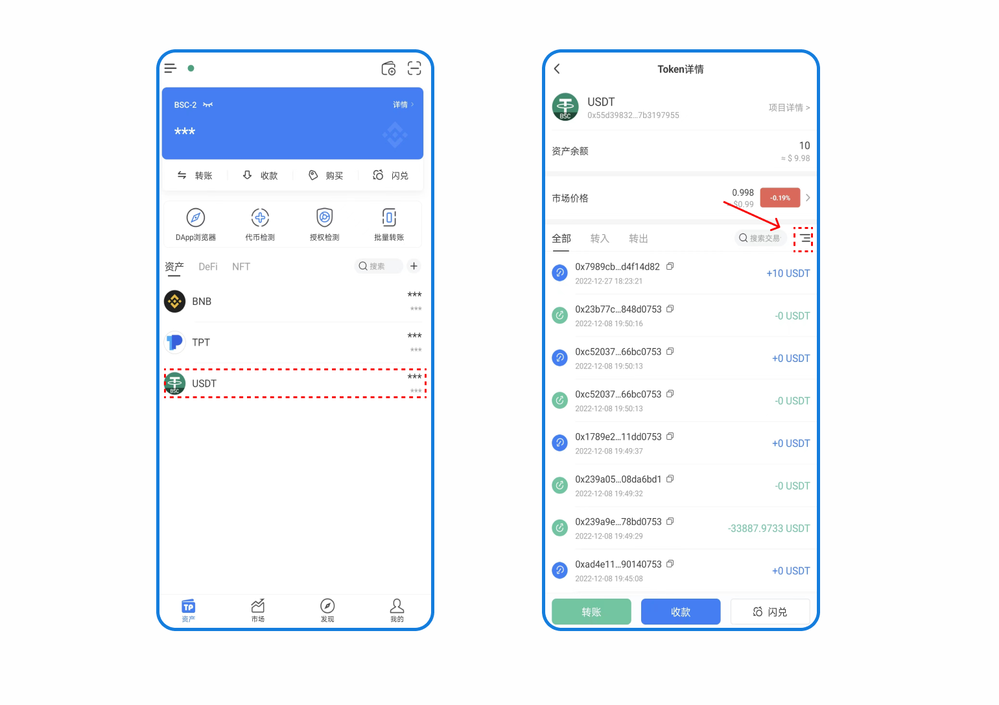
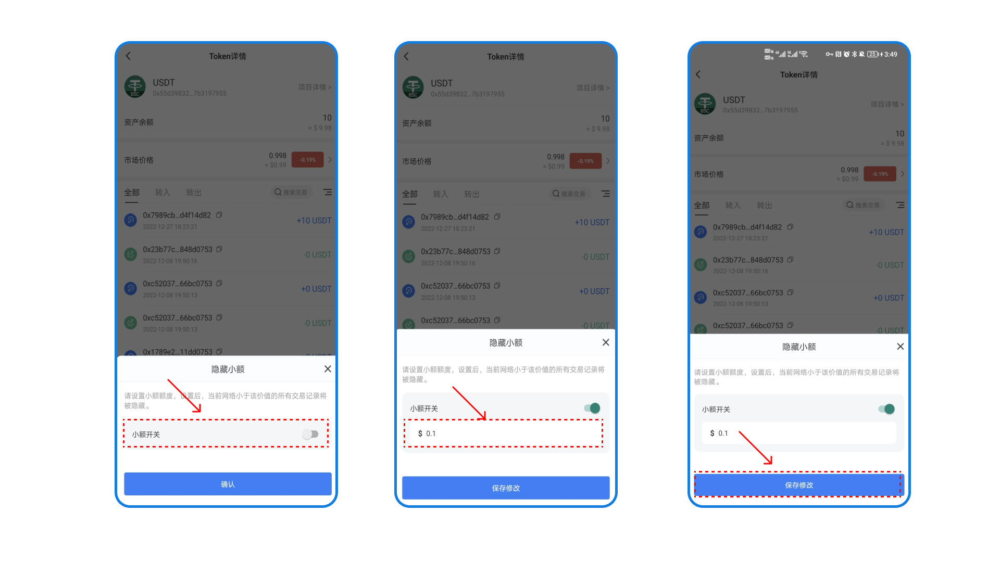
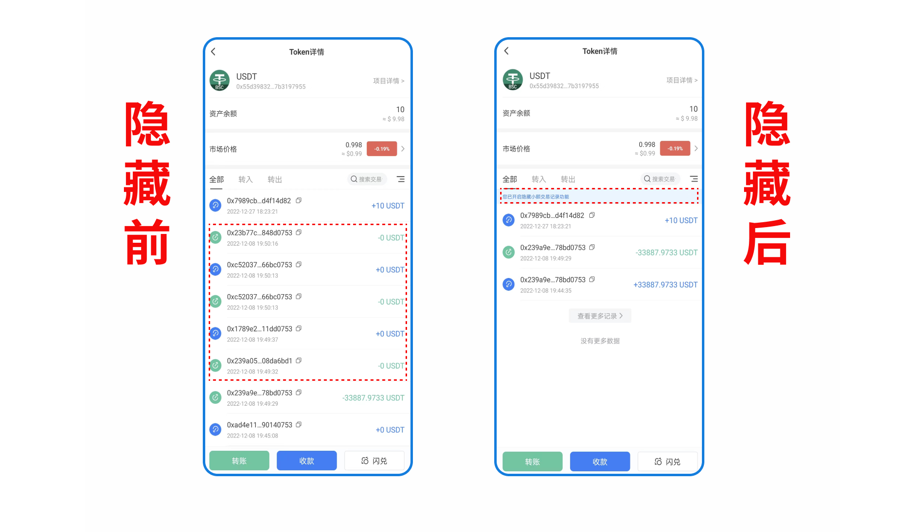

# 设置隐藏小额交易记录

部分社区用户反馈，在自己的USDT转账列表中会看到有“0USDT”被转出的记录，引起了一部分用户对钱包安全的担忧。

为协助用户远离“零金额”钓鱼诈骗，<mark style="color:blue;">**TokenPocket 安卓1.6.6版本**</mark>针对“零金额”转账进行了优化，推出【隐藏小额交易】的新功能！

### 为什么“零金额”转账记录会出现？

“零金额”转账操作是直接通过USDT代币的 TransferFrom 功能执行的，任何地址都可以被调用并在钱包中生成一个记录，在授权记录中生成一个空白的记录。

这种操作目的就是为了模拟从用户地址转出的记录，结合伪装地址的方式来诱导用户误操作进行转账，它并不能对你的资产产生任何风险，但是请一定要注意这种可能误操作的执行。

### &#x20;如何隐藏小额交易功能？

1.打开TokenPocket钱包（安卓1.6.6以上版本支持隐藏小额交易），点击任意资产进入交易记录页面，此处以USDT为例。点击右边的设置图案（如图）。

<figure><figcaption></figcaption></figure>

2.打开【小额隐藏】设置开关，输入您所需要设置的小额额度，点击【保存修改】即可成功设置。

请注意：设置后，当前网络小于您所输入的小额额度的所有交易记录将被隐藏。

<figure><figcaption></figcaption></figure>

3.设置隐藏小额交易成功后，所有小额钓鱼转账记录将会被隐藏。您可以通过下图清楚看到隐藏前后的交易记录对比。

<figure><figcaption></figcaption></figure>

钱包安全功能的不断完善，在帮助用户更好地保管资产的同时，也在提醒各位用户，进行钱包操作的时候要谨慎，在复制钱包地址进行转账的时候，一定要认真检查核对完整的钱包地址。提高钱包安全意识，才是保护钱包资产的前提！\
\
