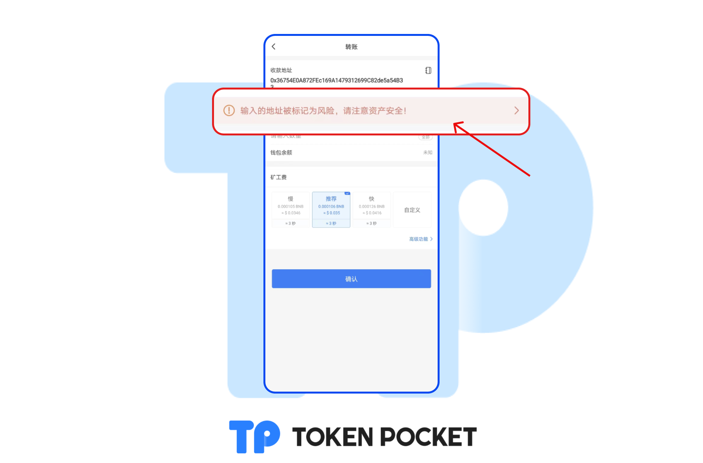
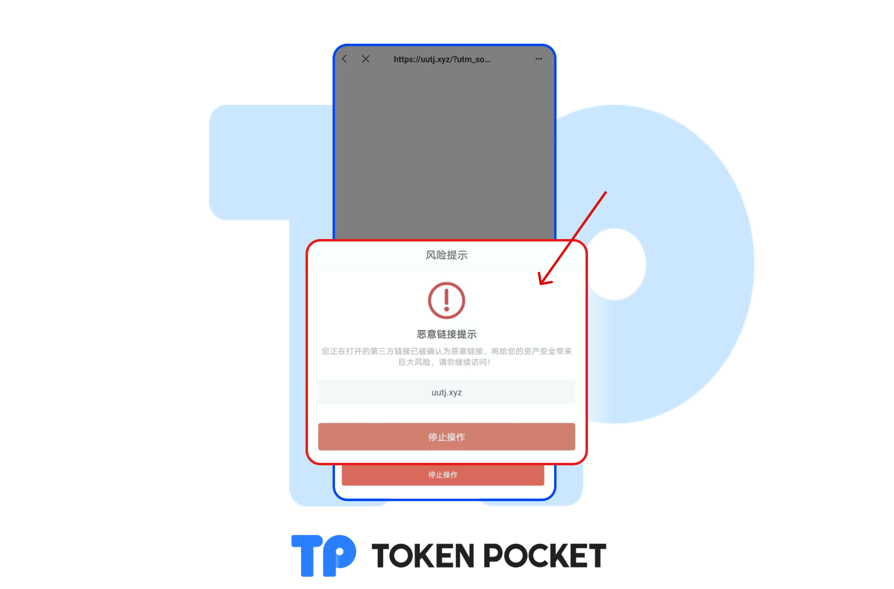

# 请小心被标记为风险的代币或网站链接

为了帮助用户规避“貔貅”、“假代币”、“诈骗网站”等的安全风险，TokenPocket将会针对此类项目进行风险标记，如您在资产页面，或者打开网站时候出现以下界面，<mark style="color:red;">**请马上停止任何操作，并主动删除该资产！**</mark>

**`被标记为风险代币的提示`**

被标记为风险的代币大多为“貔貅”，假代币，或者有买入卖出税率为100%等其他安全问题。您也可以在[**代币安全检测**](https://tokensecurity.tokenpocket.pro)中输入合约地址检测代币。

**`被标记为风险地址的提示`**

如果在转账过程中，遇到这种安全提示，请马上停止转账操作，并注意资产安全。

**`被标记为风险网站的提示`**

如果在打开网站的过程中，遇到这种提示，请马上停止所有操作，并检查您的钱包授权记录，取消危险授权！[**查看教程**](about-approve.md)****

****
