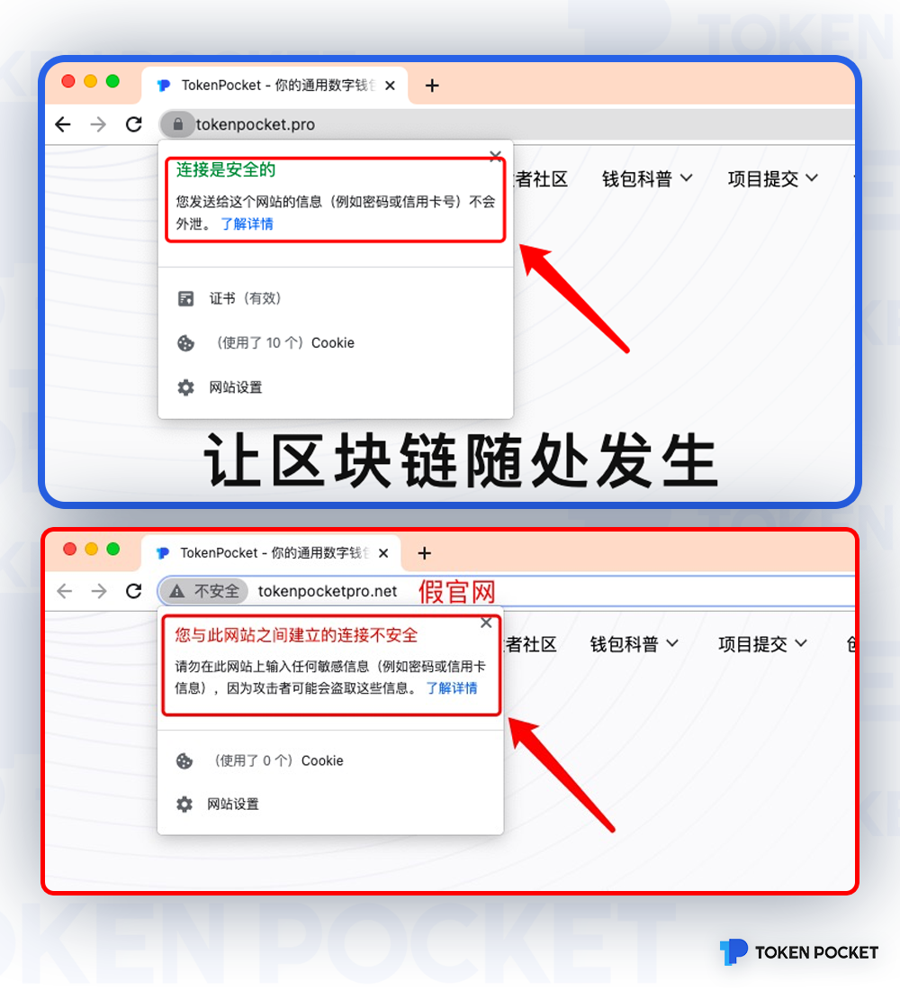
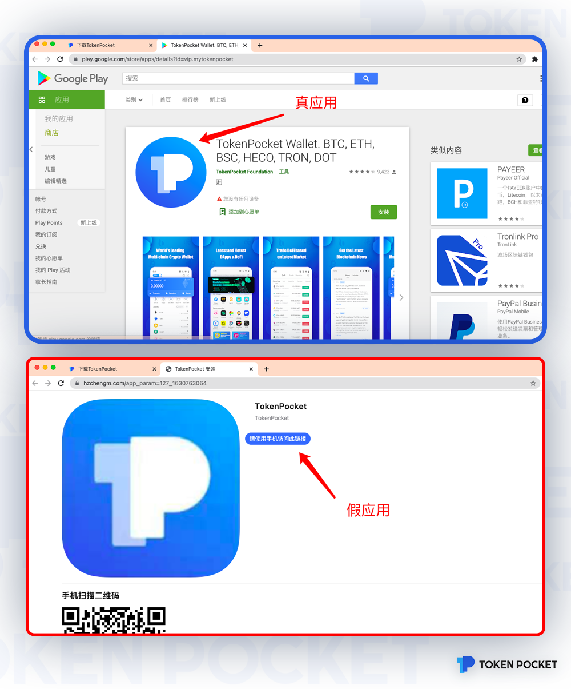
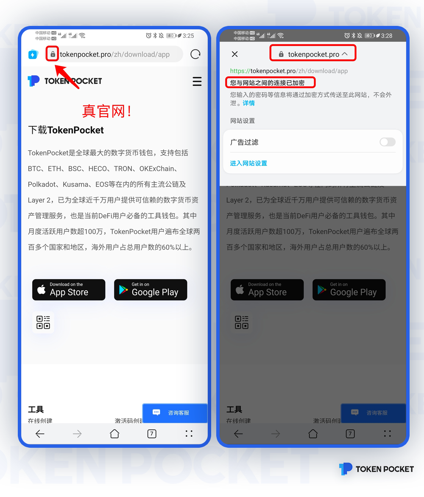
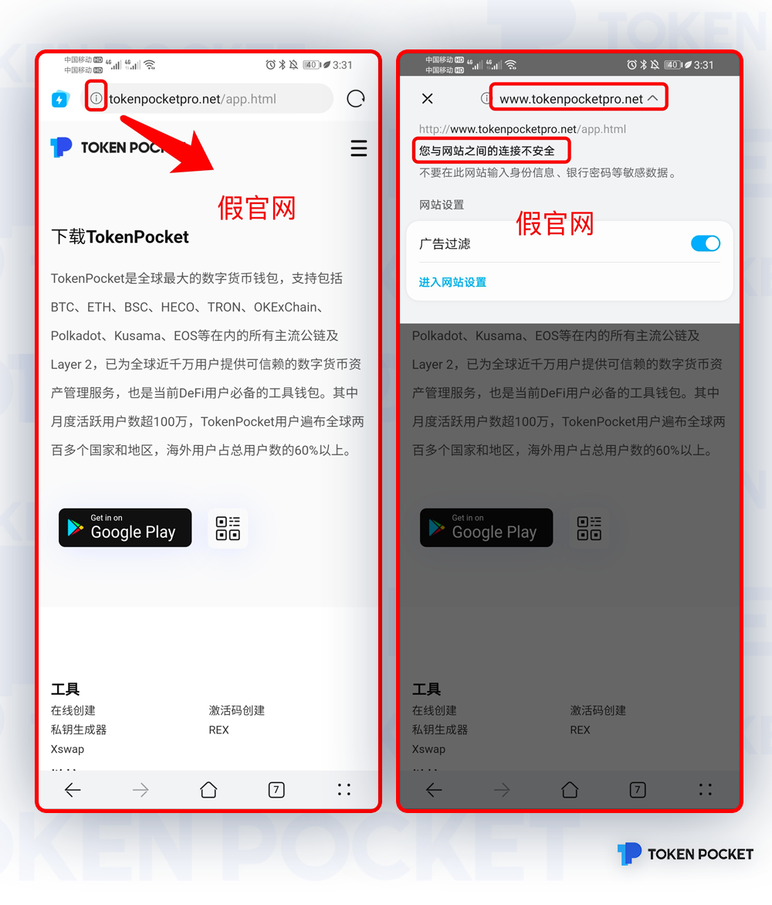
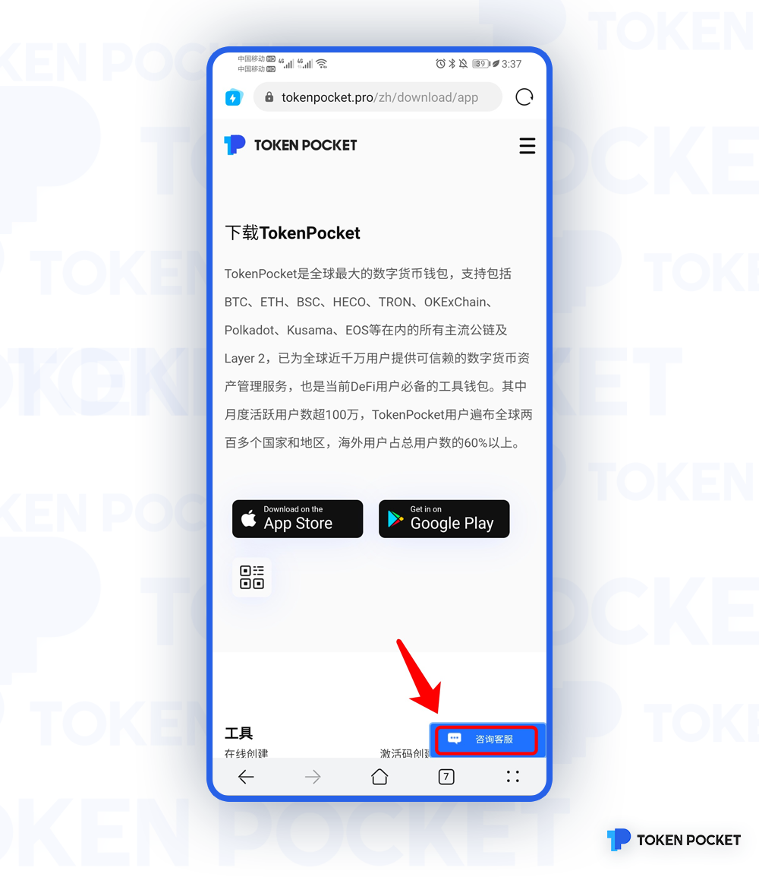
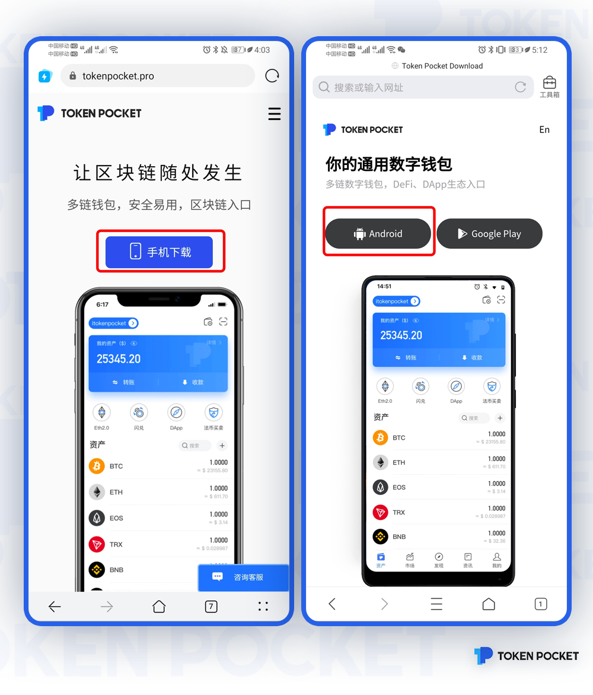
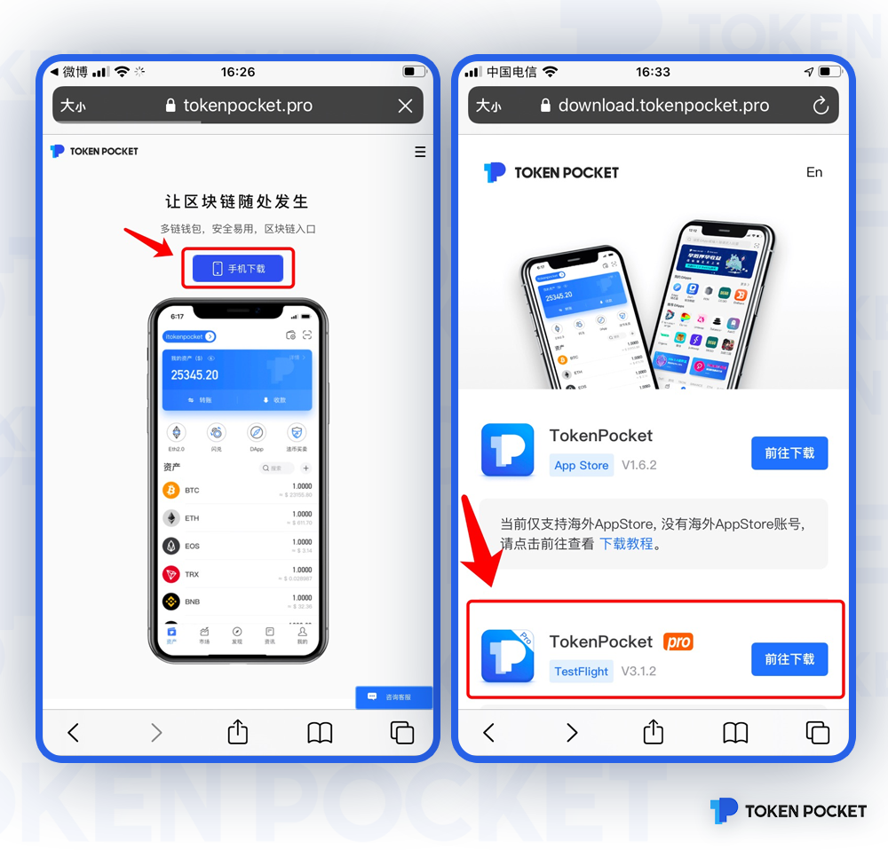
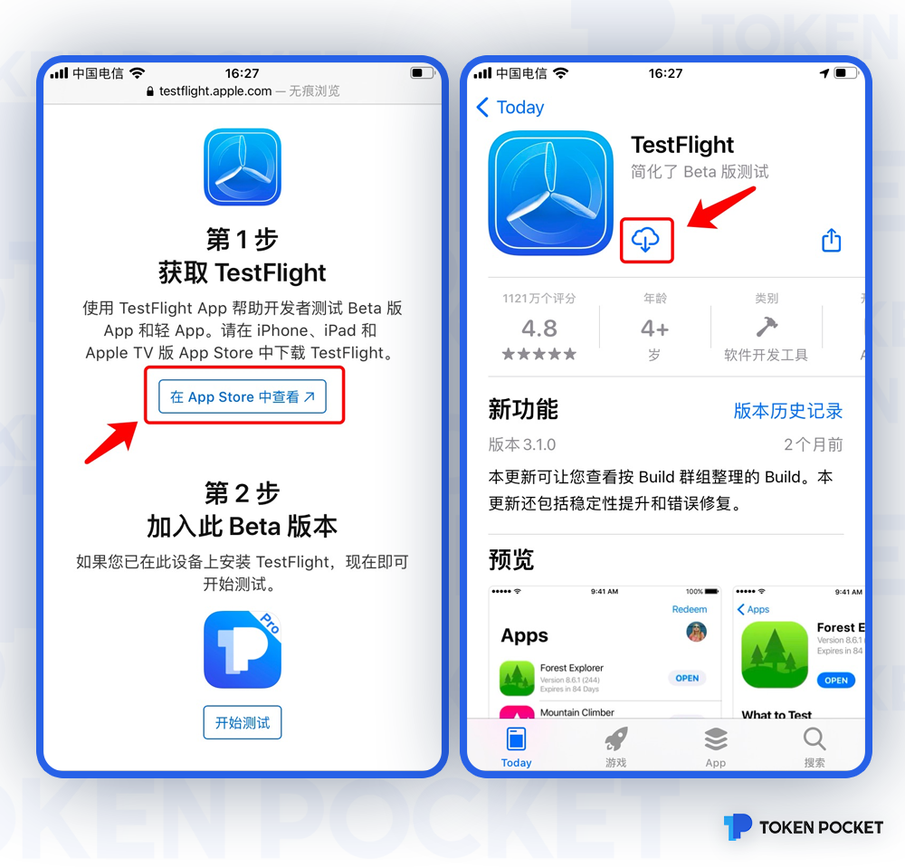
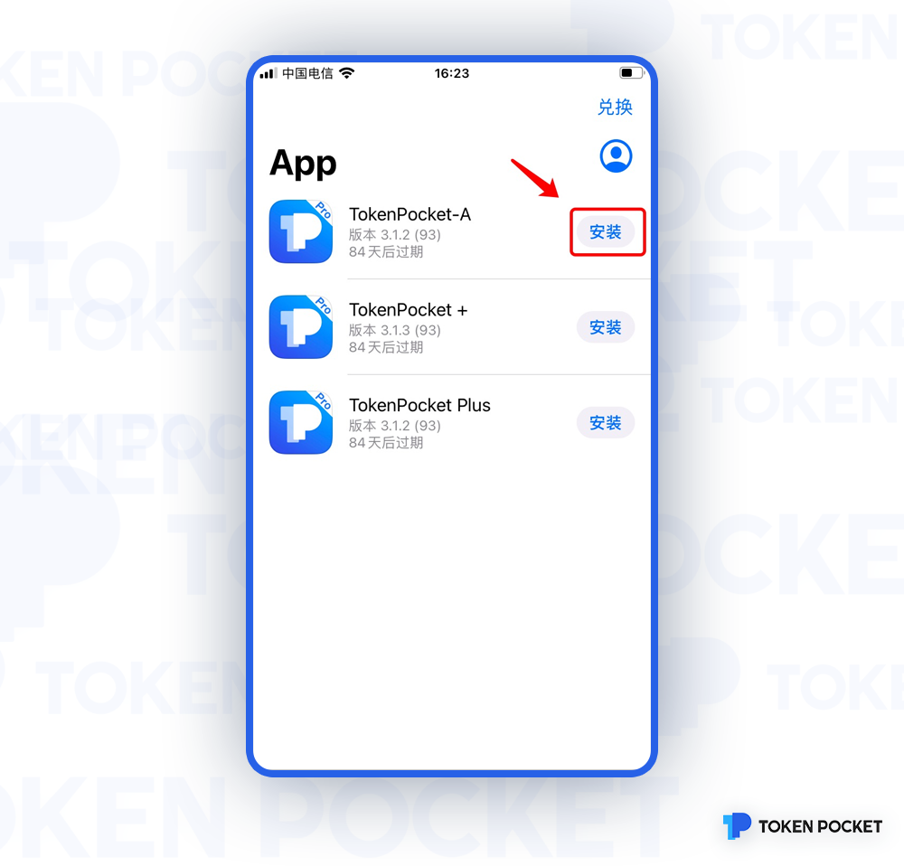

# 三步辨别真假官网 手把手教你下载TokenPocket APP

**一、PC端真假官网辨别**

以TokenPocket官网为例：

1.确认浏览器中输入的域名为：[https://tokenpocket.pro/](https://tokenpocket.pro/) 注：务必使用 https 协议访问官网，而非 http。

重要的事说三遍！！ 

**请认准**[**https://tokenpocket.pro/**](https://tokenpocket.pro/！)

**请认准**[**https://tokenpocket.pro/**](https://tokenpocket.pro/！) ****

**请认准**[**https://tokenpocket.pro/**](https://tokenpocket.pro/！)\*\*\*\*

2.确认浏览器输入框左侧有🔒或**🛡️**等安全图标；

_以 Chrome 浏览器为例，其他浏览器类似_

3.确认点击**🔒或🛡️**后的信息，显示【连接是安全的】即为安全。如果提示【不安全】等信息，则说明该网站是假网站，遇到这种情况，请通过service@tokenpocket.pro与我们联系，获取官方人员帮助。

_以 Chrome 浏览器为例，其他浏览器类似_

注：如果出现【连接不安全】提示信息，请切勿继续进行任何操作，谨防网站诈骗。

**谨记，在以上三步检查都确认无误的情况下，才可继续下载安装** **TokenPocket。**

-其他验证途径：

1.把鼠标移至官网主页二维码图案，假官网并不显示任何二维码，真官网会显示手机app下载二维码。2.谨防假官网！浏览器输入框左侧没有🔒或🛡️等安全图标，只有一个「标后，点击该网站名称，提示【连接不安全】，则该网站存在风险，并恶意冒充TokenPoctet官方网站，请马上停止使用；

2.PC端页面点击下载，真官网可直接跳转到「APP Store」或「Google Play」下载页面，假官网仅跳转至手机下载页面；

注：请勿用手机对假官网二维码进行扫描，避免手机重要信息泄漏！

**二、手机端真假官网辨别**

1.确认浏览器输入框左侧有🔒或🛡️等安全图标；点击「🔒」或「🛡️」图标后，点击官网名称，提示【链接已加密】或【连接是安全的】，则该网站安全，可继续使用；

2.谨防假官网！浏览器输入框左侧没有🔒或🛡️等安全图标，只有一个「！」图标；点击「感叹号」图标后，点击该网站名称，提示【连接不安全】，则该网站存在风险，并恶意冒充TokenPoctet官方网站，请马上停止使用；

如遇到假官网，请点击TokenPocket官网：[https://tokenpocket.pro/](https://tokenpocket.pro/右下角-【咨询客服】-把相关信息反馈给官方工作人员；) 右下角-【咨询客服】-把相关信息反馈给官方工作人员；

**注意：以上三步检查无误后，可继续下载安装TokenPocket！**

**三、下载TokenPocket APP**

1**.安卓版下载**

点击TokenPocket官网首页【手机下载】-点击【Android】即可下载安卓版TokenPocket APP.

**2.IOS版下载**

由于TokenPocket没有在APP Store大陆区上架，用户下载TokenPocket APP 可分为有海外Apple ID和没有Apple ID两种操作教程。

1.如果你手机没有海外Apple ID，可点击TokenPocket官网首页【手机下载】-点击TestFlight【前往下载】;

2.进入TestFlight下载操作页面，点击【在APP Store中查看】，下载TestFlight；

3.下载完成后，打开TestFlight，选择【安装】，即可安装TokenPocket APP.

注：通过TestFlight下载的TokenPocket APP，每三个月需要进行更新一次。**为保护您的资金安全，请注意保存好私钥和助记词！**

4.如果你手机有海外Apple ID，点击TokenPocket官网首页【手机下载】，即可进入「APP Store」下载。

注意：在 App Store 中以下这些均为假冒 TokenPocket App：

-TokenPocket-Novel 

-TokenPocket-Climb 

-TokenPocket Diary

从App Store 下载TokenPocket时，请务必切换至海外 Apple ID，并请认准开发者为**TOKENPOCKET FOUNDATION LTD.**开发的App，其他所有的均为假冒TokenPocket App。

网络骗子手段不断升级，请注意警惕和防范，增强对真假官网及真假APP的辨别能力，确保自身资金安全！

\*\*\*\*

