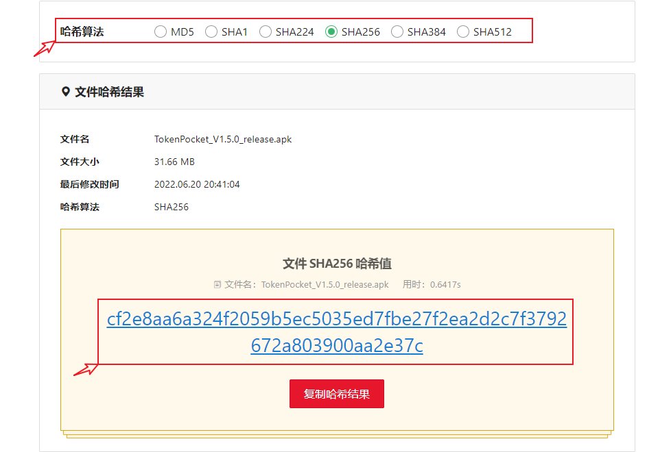
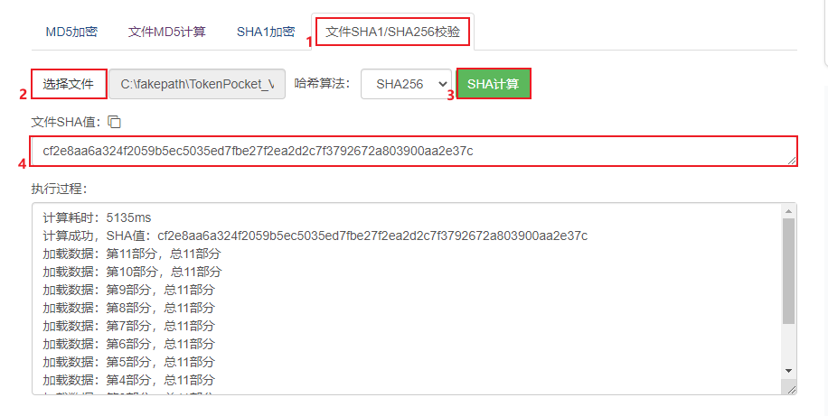
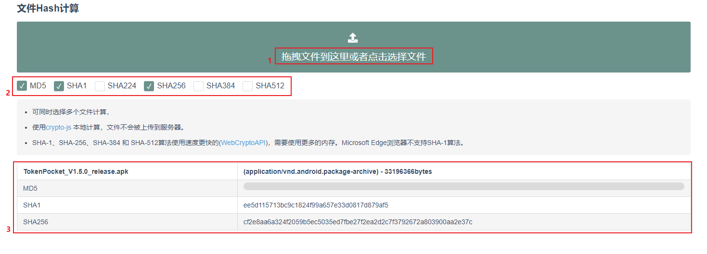

# 官网正版钱包验证方法

App Store版本验证方法：[<mark style="color:blue;">**点击查看**</mark>](AppStore.md)<mark style="color:blue;">****</mark>

Google Play版本验证方法：[<mark style="color:blue;">**点击查看**</mark>](google.md)<mark style="color:blue;">****</mark>

### <mark style="color:blue;">MD5、SHA256验证工具</mark>

文件哈希验证工具是通过计算文件内容哈希值的工具。通过工具可以快速计算文件的哈希值，计算出来的 Hash 值与官方给出的 Hash 值进行对比，可以验证文件内容是否被篡改。

### <mark style="color:blue;">MD5、SHA256验证的目的</mark>

去中心化自托管钱包是我们导入私钥或助记词以管理链上资产的平台，所以对于平台的选择和使用尤为重要。TokenPocket作为用户众多的去中心化自托管钱包自然也受到了不法分子的“惦记”，他们通过反编译的方式将正版APK中植入可以导入私钥，助记词的设置，然后打包发布到其他网站中“守株待兔”，当用户通过搜索引擎或者他人推荐的方式下载和使用了钱包，那么他的私钥助记词将发生泄露，从而丢失所有资产。

近期从邮件和社区的渠道反馈的情况来看，假钱包盗币的案例有所上升，所以我们专门制作本期教程，通过验证MD5\sha256值，利用在线工具，pc端和移动端多个平台验证，希望能提高大家的安全意识，学会合理使用工具来保护自己的链上资产安全。

请认准TokenPocket唯一官网地址：www.tokenpocket.pro

### <mark style="color:blue;">MD5和SHA256算法的区别</mark>

**相同点：**

1、都是密码散列函数，加密不可逆。

2、都可以实现对任意长度对象加密，都不能防止碰撞。

**安全性方面：**

1、SHA256（称SHA2）的安全性最高，但是耗时要其他两种多一些。

2、md5相对来说比较容易碰撞，安全性没这么高。

### <mark style="color:blue;">**官方钱包APK的MD5、SHA256参数：**</mark>

<mark style="color:blue;">****</mark>[<mark style="color:blue;">**www.tokenpocket.pro**</mark>](https://www.tokenpocket.pro)<mark style="color:blue;">****</mark>

|  版本号  |               MD5值               |                              SHA256值                             |
| :---: | :------------------------------: | :--------------------------------------------------------------: |
| 1.6.3 | 1c0dd378f9fa6cd4e3c645380ae314b9 | 3147424a71f6df65f63c3e92564cf7d55e8b748c79546d929a2938fe47ffdcb7 |
| 1.6.2 | 593210fc806f37fc9e6b979909414d52 | 77063b71a05c12b0d3328ae983417f8b27fe3d2f038a03e0a098266a31659651 |
| 1.6.1 | 2b5c73f176a895135dbfb6ab9337eabb | d959026cc4442dac8f835701c48fe75d029edd5ed9b94b8740f2022c3b8b6eda |
| 1.6.0 | 4985a5d4a8a45f98ccfdf1d039ecf926 | 761cb44ca6be823e11b6e0301fa818aa7fbb4d8b277e8c8e6ba1f7dfe0cf2ae0 |
| 1.5.9 | f4c74ec4d08e26c53ccbcfcdb20c35b3 | cc7daf17bd4a8ac52ee00f1eec49f87a4f081568b42c56280318b804ac744971 |
| 1.5.8 | 4903a5900f0e55daa2bcbb1d5207f4d0 | dfbfcf2ad563fc6aaec87380732bea159f6cf648b13f9397218fd3694b7744e3 |
| 1.5.7 | 343daaecd1618922b9ef9c2811ce61d7 | 24d46dd0a2e899b5ec047ba860375f5d07ff9d4ecc75e914d34f8a423d2af143 |
| 1.5.6 | b90aca7a51d0b01d21530d987ed5d564 | 1861aa2a7afdc5430f2517e9286a65ccbd1a8de42e9d6596b687ae8aa4b43da3 |
| 1.5.5 | 0e2668727560344978dd523925a75a4b | 76bc787cd5933f6f2cd40b7cc227038995c7717985ebaf9031fa61154b0f6360 |
| 1.5.4 | f510204c4fa7533b05e729b902ebec59 | 84e5382013fd5625d684d02836f001d126c31196635e5b1630bc36710ef7afe7 |
| 1.5.3 | 4ebc793117ce677fb07602e31256e7cc | 4b35d2b8237b9708b12d1386527b3a6c233a641a989f7c63b9512cdc522af219 |
| 1.5.2 | 10e6f64debae79bf1e40bd830c6a819e | f357cf564293ad09026170949e7b69e13342b47e57880200b6575c0e596c4e99 |
| 1.5.1 | c30cbf152acc15c5cffafaf7a7a387ad | f1eb4e4571c9c1e08771ffcd896c6aaab63097e2ddda0d00232754d114dc9313 |
| 1.5.0 | aed562118bd5d8c64578f3b52a7b2460 | cf2e8aa6a324f2059b5ec5035ed7fbe27f2ea2d2c7f3792672a803900aa2e37c |
| 1.4.9 | bbe46949fcc243ad113c45ec19ce9215 | d8f605a142c6140905cf25a829f0be10d402e232ce1717013553aaec443d6946 |
| 1.4.8 | 5c5cb0676c72c8d554091ad5a7608471 | 5dedd0c8c793c5f22a3d8d4703e31a6fc5e8d483159b31a1fe64265eefc1f7c3 |
| 1.4.7 | 618c2017ce7f9f75bbdfe09ae06a4467 | 02182af2d93d3c3d63985986c2a0b8c9506223abe15a59278caf67e84f2efece |

<mark style="color:blue;">**Google Play**</mark>

|  版本号  |               MD5值               |                              SHA256值                             |
| :---: | :------------------------------: | :--------------------------------------------------------------: |
| 1.6.3 | c60ab2f42f48c379ab36f761daf3589e | b979b36df3839edf51e8c15dbedcf0367359c55008403ebb5b662a473b35f64b |
| 1.6.2 | f8df3cef27738ecd4e195e6fed7fe8d0 | dde7014d51df68b8de3905174c666331c307e1ed96dbe9cd51e0a8da00bc6abd |
| 1.6.0 | 66bceb6daeb4b40f736d15f6b38b0d9e | 003d5141a4f442772a9e8a8ede57b543054b72d746df050aa48d7a5349c3c479 |
| 1.5.9 | 88c4d55959c9da313db6acc73ea0d656 | 59ad89d7dbf09a27b5a37e94dd9063178fbb69614367e5b10dfb3944d266249a |
| 1.5.8 | f744d05688acf4a67509c14639829545 | 0c2fd1998d10f364e83749a12c388f681acc6fad85212c7441a9cb7b54649460 |
| 1.5.7 | a1ef0ae6f7a616a85e3cc2645723b07e | 6ce904535ab4035bf1a4ea5ef001c1f82baf9ead660a880b2b4a2244b48f95d8 |
| 1.5.6 | fe1eed863c1214c508d41293537944e8 | f49e4516c547d2f7a6f4d2a577332d5d63ee0b36ea5a73b7d813452d22b2ce5f |
| 1.5.5 | 10e6d8860e2b0a1253a3fc9a541ac3a9 | 95ca32929a294f90de3a2f62ceb792cc4fa442ee632e5df810a6d2bd8b44325d |
| 1.5.4 | 53936f73be5c90dce02ea06919f29fb0 | d4edad4a5277efc29fc896fcabe71a8f17de1fbf69944e340b52a0709dab9695 |
| 1.5.3 | 24a1df1bc85cdb1c34c780c217ee9c1d | 30d50fc1f9f008bbfb3bb33fd5d04f6dcd6e3fb1c9b37ab5ec1815d6c9391bed |
| 1.5.2 | 938e9252cb21fef1c40fac3c4c9492c6 | dfaf358d6f30ead51b52193a5aab8259fd52ac5d8372b47a97951c799842b988 |
| 1.5.1 | f879845afd51d51fabf42e653011da79 | a4162187fac4a623ab5762d15953ae17e659e3c6fa518615a70d8046d2f01355 |
| 1.5.0 | a951c032f8723cc1711f0d3b3256725d | c7f8b8a603d8725ba1df631cf03f2c63dc4c428b5ffe1f3ae3eec400bf3d121b |
| 1.4.9 | 4b88e2ffa2b3d84fbc2f099e1034fb86 | 37b571b7644e456be7260e3d1d93ce59d9e38f694215c85e29e4a1476b6bf634 |
| 1.4.7 | feab610e82a1ed694d24994487f3e38c | b023f39e496ac6a38cc0ef121470cc7c2142f393c75aea504bc8ab979285dffd |

### <mark style="color:blue;">**在线验证MD5、sha256工具**</mark>

在线验证md5\sha256值的工具有很多，他们的使用也都是大同小异，只需要将下载到pc上的apk文件拖入或者加载到验证平台中即可等待结果，得到的结果和TokenPocket官网公布的正版APP的md5或sha256值做比对即可验证。<mark style="color:red;">（在线工具页面中可能存在广告等内容，请使用主要验证功能，其他的不做任何推荐）</mark>

工具一：打开链接[<mark style="color:blue;">**https://www.dute.org/file-hash-validator**</mark>](https://www.dute.org/file-hash-validator) <mark style="color:blue;">****</mark> 选择哈希算法，通常使用比较广泛的是md5，最安全的算法是sha256，其他的哈希算法也可以进行尝试。在顶部选择或拖入下载的APK文件后底部会很快得到计算结果，只需要复制结果和官方公布的md5或sha256哈希值进行对比即可完成验证。

工具二：打开链接[<mark style="color:blue;">**http://www.metools.info/code/c92.html**</mark>](http://www.metools.info/code/c92.html)  <mark style="color:blue;">****</mark>  选择文件和哈希算法，点击计算，即可在结果中查看到结果。

工具三：打开链接[<mark style="color:blue;">**https://oktools.net/file-hash**</mark>](https://oktools.net/file-hash)  <mark style="color:blue;">****</mark>  这款工具可以快捷的选择多个哈希算法来验证，只需要勾选哈希算法，导入APK文件后即可查看到结果，非常方便。

### <mark style="color:blue;">**PC端MD5、SHA256验证工具**</mark>

MD5工具：打开工具的官网[<mark style="color:blue;">**https://www.winmd5.com/**</mark>](https://www.winmd5.com/) <mark style="color:blue;">****</mark> 点击【Download】下载工具

下载完成后，打开工具，此工具只可验证md5值，点击【browse】选择下载的APK文件，导入后即可看到下方提示的md5值。

SHA256工具：

这个工具是我们熟悉的压缩/解压缩工具7-Zip，通过它也可以非常便捷的得到文件的SHA256值

打开官网[<mark style="color:blue;">**https://www.7-zip.org/**</mark>](https://www.7-zip.org/) <mark style="color:blue;">****</mark> 点击【Download】下载对应的版本并安装

安装完成后，只需要在下载的APK文件上点击右键，选择【7-Zip】--【CRC SHA】--【SHA-256】

即可看到SHA256哈希值。

### <mark style="color:blue;">**移动端MD5、SHA256验证工具**</mark>

虽然在电脑端可以使用多种工具多种渠道来查看md5或sha256哈希值，但是我们日常使用最多的移动端如何进行验证呢。这里来介绍下移动端的工具。

工具一：点击这里[<mark style="color:blue;">**下载工具**</mark>](https://d-13.winudf.com/b/APK/Y29tLmdhbWUubGl0dGxldHJpY2tzdHVkaW8ubWQ1Y2hlY2tlcl8xMV9jNGNjM2U1Ng?\_fn=TUQ1IENoZWNrZXJfdjEuM19hcGtwdXJlLmNvbS5hcGs&\_p=Y29tLmdhbWUubGl0dGxldHJpY2tzdHVkaW8ubWQ1Y2hlY2tlcg\&am=PGLTTfIPJr33xxAxPVydqQ\&at=1655734447\&download\_id=otr\_1705904481071926\&k=3919882866ce239957fb9d9a76fd5b6762b1d230\&r=https%3A%2F%2Fapkpure.com%2Fcn%2Fmd5-checker%2Fcom.game.littletrickstudio.md5checker) <mark style="color:blue;">****</mark> 安装后，打开验证工具，点击选择打开系统自带的文件管理器，找到需要验证的的APK文件，导入后点击【MD5】就可以计算出md5哈希值，可以和官方提供的参数进行对比。

 (1).png>)

工具二：点击[<mark style="color:blue;">**下载工具**</mark>](https://cr5.198254.com/com.hobbyone.hashdroid.apk) <mark style="color:blue;">****</mark> 这款工具的功能更加强大，支持md5、sha256等多种哈希算法验证。同样的安装打开后，点击切换到【HASH A FILE】，点击【Select a hash function】选择例如sha256，点击【CLICK HERE TO SELECT THE FILE TO HASH】来找到需要验证的apk，加载后点击【CALCULATE】即可计算出apk的sha256哈希值用于和官方的参数进行对比。

.png>)

