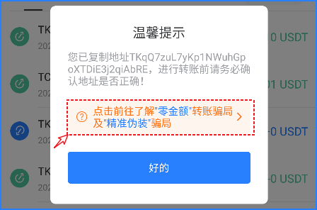
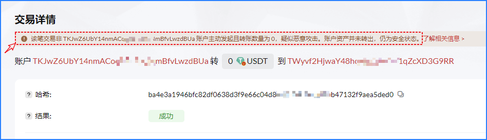
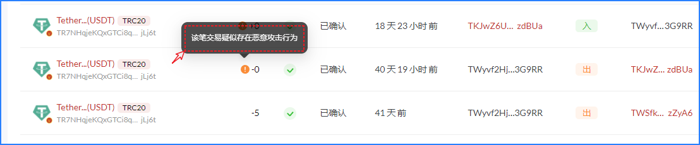

# 警惕“零金额”转账骗局

恶意授权是通过Approve操作，给某个代币授权在一定数量范围内可以调用的权限，恶意授权通常会盗取授权代币的所有余额。

**那么如果一个普通的地址没有执行过Approve操作是否也可以被调用呢？**

近期越来越多的用户反馈，在自己的USDT转账列表中会看到有“0USDT”被<mark style="color:blue;">**转入/转出**</mark>的记录，如下

<figure><figcaption></figcaption></figure>

大部分看到自己的地址被调用转出资产，第一反应会认为自己可能会有被恶意授权的风险，于是打开权限检测工具或浏览器查看自己的授权记录。

<figure><figcaption></figcaption></figure>

在授权列表中发现了一条授权记录，但是在右侧发现【已取消】的提示，点击箭头查看授权和取消的记录。授权变更记录中的内容是空白的，这个时候用户彻底陷入迷茫中。

<figure><figcaption></figcaption></figure>

**别担心!让我们一起来还原这一操作。**\
1.打开波场浏览器，找到USDT合约地址，点击【合约】--【编写合约】--【transferFrom】

<figure><figcaption></figcaption></figure>

2.在这里分别填入发送地址、接收地址和数量，然后点击【Send】利用插件钱包完成签名后就可以看到底部绿色的【true】说明执行成功。如果这里的数量设置其他，那么会提示已发送的内容，但是因为对方并没有可以调用的数量，所以无法执行成功。**这里消耗的TRX由对方来买单。**

<figure><figcaption></figcaption></figure>

3.执行成功后，我们继续查看这个地址的授权信息，果然是又增加了一条空白的记录。

<figure><figcaption></figcaption></figure>

到这里，相信大家应该对这种问题发生的原因有了充分了解，说明任何地址都可以被拿来调用，只是这种方法是徒劳的，它并不会让我们的资产有任何的风险，但他们的最终目的还是想让你使用错误的地址来触发误转账来谋取利益。和模拟相同尾号地址诈骗属于互补的一种骗局方式。[**点击查看精准伪装诈骗**](http://mp.weixin.qq.com/s?\_\_biz=MzUyNDkzNTgwMw==\&mid=2247489639\&idx=1\&sn=cd843b63936f5e7b74ffd8014c382519\&chksm=fa24ef73cd536665fd311940b3087e99be4aea4b3dbb660eefa10ea1a5b481fc4e7eb0635ee5\&scene=21#wechat\_redirect)

这种调用在其他EVM链上同样适用，之前的高仿尾号地址诈骗方式是主动转入的方式，现在的这种调用是一个转出的方式，对于触发误操作的迷惑性会更强。骗子的骗术更新很快，大家要多注意防范。

**针对大家比较疑惑的几个问题进行解读：**

**1.为什么我的资产会被调用。**

这种是直接通过USDT的 TransferFrom 功能执行操作，任何地址都可以在这里被调用并在钱包中生成一个记录，在授权记录中生成一个空白的记录。

**2.出现这种情况，我的资产还安全吗。**

这种操作目的就是为了模拟从用户地址转出的记录，结合伪装地址的方式来诱导用户误操作进行转账，它并不能对你的资产产生任何风险，但是请一定要注意这种可能误操作的执行。

一些优化进度：

TokenPocket：新版本对历史记录中复制地址进行了弹窗风险提示，近期会增加对小额地址的过滤设置功能，用户可以自主的来控制开关从而屏蔽一些“零资产”或“仿冒地址”等诈骗方式。

<figure><figcaption></figcaption></figure>

TRON官方优化:

1、增加了链上查看数据，关于“零资产”转账相关的提示内容；

<figure><figcaption></figcaption></figure>

2、交易历史记录中对“零资产”记录进行了风险提示信息。

<figure><figcaption></figcaption></figure>

### TokenPocket安全措施

您可以通过隐藏小额交易来隐藏这些伪装地址的钓鱼操作。

点击查看👉[**设置教程**](https://help.tokenpocket.pro/cn/secirity-knowledge/protective-measures/hide)
