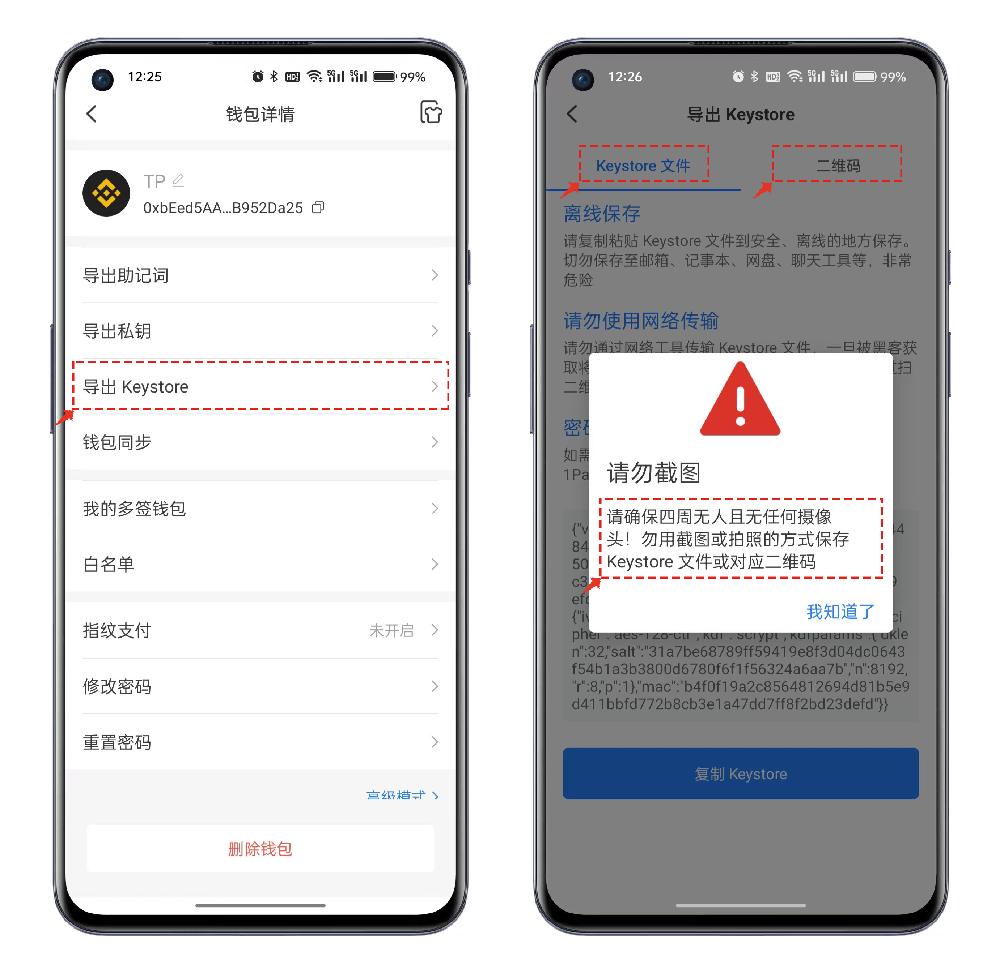

# 什么是keystore

Keystore文件是一种用于存储私钥的文件格式（通常为JSON格式）。它通过用户自定义的密码进行加密，以提供一定程度的安全保护，但加密的强度主要取决于用户选择的密码的复杂性。

请务必注意以下两个重要事项，以确保安全地使用Keystore：

1. 请使用不常用且尽可能复杂的密码来加密Keystore文件。这将增加您的钱包的安全性。
2. 一定要牢记加密Keystore文件所使用的密码。如果您忘记了密码，将无法再次访问Keystore文件。
3. TokenPocket无法帮助您找回密码。因此，请务必妥善保管好Keystore文件和密码。

通过遵循这些建议，您可以更加安全地管理您的Keystore文件和钱包。

### <mark style="color:orange;">如何导出keystore：</mark> 

打开TokenPocket，点击蓝色卡片右上角【详情】，在钱包详情界面中选择【导出keystore】，输入正确的密码后即可查看keystore数据。

数据查看支持两种类型，一种是keystore文件方式，一种是二维码方式，其密码都是当前这个地址在钱包中设置的密码，请一定牢记，否则同样无法导入钱包，管理链上资产。

<figure><figcaption></figcaption></figure>
