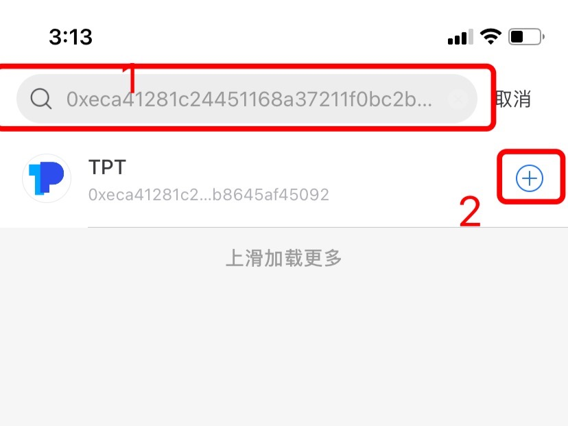

# 如何添加代币？

1、打开TokenPocket，选择你所需要添加代币的钱包，在【资产】页面点击【+】添加新的代币；

.png>)

2、输入代币的合约地址，然后点击右边的【+】完成添加代币。（此处以添加TPT为例）

**提示：如您将其他钱包地址导入后，需自行添加代币才能显示资产。**

**相关文章：**\
[如何更新和提交代币图标？](https://tphelp.gitbook.io/cn/wallet-operation/submit-token)

